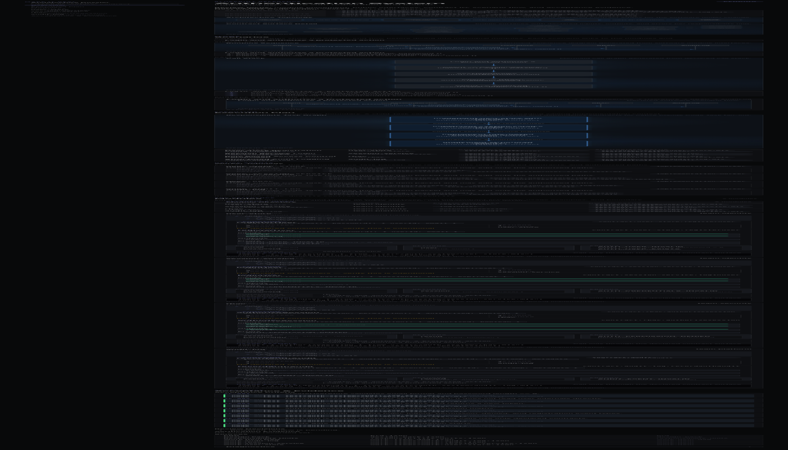
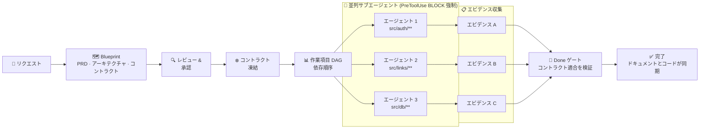

[English](README.md) · [한국어](README.ko.md) · [日本語](README.ja.md) · [中文](README.zh.md)

<div align="center">


# Make It Real

**Make It Simple. Make It Work. Make It Real.**

*Contract first. Code follows.*

<p>
  
  
  
  
</p>

<p>
  <a href="#インストール">インストール</a> ·
  <a href="#3-つのコマンド">コマンド</a> ·
  <a href="#開発の流れ">フロー</a> ·
  <a href="#docs-first-という考え方">哲学</a> ·
  <a href="docs/README.md">ドキュメント</a>
</p>

</div>

---

ほとんどの AI コーディングツールはコードから始まる。Make It Real はドキュメントから始まる。

プロダクトが**どうあるべきか** — ゴール、インターフェース、受け入れ基準、モジュール境界 — をまず書く。Make It Real はそれを機械検証可能なコントラクトとして凍結し、ドキュメントが記述した範囲だけを実装できる並列の Claude サブエージェントをディスパッチする。エージェントが終わったとき、コードとドキュメントは構造的に同期している。

---

## インストール

**必要環境:** Claude Code (最新) · Node.js ≥ 20

**ステップ 1 — マーケットプレイスを追加:**

```bash
claude plugin marketplace add 52g github:mir-makeitreal/makeitreal
```

**ステップ 2 — プラグインをインストール:**

```bash
claude plugin install makeitreal@52g
```

**確認:**

```
/mir:status
```

API キー不要。ビルド不要。別プロセス不要。

---

## 3 つのコマンド

| コマンド | 役割 |
|---------|------|
| `/mir:plan "あなたのリクエスト"` | Blueprint を生成。PRD・アーキテクチャ・コントラクト・DAG・ダッシュボード。インラインでレビュー・承認する。 |
| `/mir:launch` | 承認済み Blueprint を実行。DAG 順にサブエージェントをゲート付きループへディスパッチする。 |
| `/mir:status` | 現在のフェーズ・作業項目の状態・ブロッカー・ダッシュボード URL。 |

コアループはこれだけ：**plan → launch → status**。

すべての `/mir:` コマンドは、フルネームを好む人向けに `/makeitreal:` という等価形を持つ。パワーユーザー向けコマンド：[docs/command-reference.md](docs/command-reference.md)

---

## 開発の流れ

平易な言葉のリクエストから、検証済みで同期したコードまで — 6 つのステージ：

**ステージ 1 — 説明** · 何を作るかを平易な言葉で伝える

**ステージ 2 — Blueprint** · Claude が設計する：仕様・アーキテクチャ・コントラクト・タスクグラフ

**ステージ 3 — レビュー** · あなたが承認する。フィンガープリントがすべての成果物をロックする。

**ステージ 4 — ディスパッチ** · 並列エージェントをモジュールに割り当て、境界を強制する

**ステージ 5 — ビルド** · 各エージェントが自分のモジュールを実装し、他には触れられない

**ステージ 6 — 検証** · コントラクト適合を証明し、エビデンスを記録し、完了

<!-- SCREENSHOT: dashboard -->
<p align="center">
  
</p>

> *Architecture Dossier — `/mir:plan` が生成する。モジュールグラフ、凍結されたコントラクト、タスク依存順序、受け入れ基準。すべて相互リンクされ、すべて機械検証可能だ。*




> *コントラクトはどのエージェントが走る前にも凍結される。各エージェントは `PreToolUse` フックによって宣言されたパスに物理的に制約される。Done ゲートはすべてのエージェントが適合を証明するまでブロックする。*

詳細なウォークスルー：[docs/how-it-works.md](docs/how-it-works.md)

---

## Docs First という考え方

ほとんどのチームはコードの**後に**ドキュメントを書く。作られたものを記録するだけで、作るべきものは記録しない。結果はいつも同じだ：ドキュメントは乖離し、仕様は嘘をつき、統合のたびに想定外が起きる。

Make It Real はこれを逆転させる。**ドキュメントが唯一の真実だ。** コードはドキュメントが正しいことの証明にすぎない。

```
従来:         リクエスト → コード → (もしかすると) ドキュメント → テストが想定外を拾う
Make It Real: リクエスト → ドキュメント → 凍結コントラクト → コードがドキュメントを証明 → 想定外なし
```

これは開発者にとってより良いワークフローというだけではない。チーム**全員**のための共通言語だ：

- **PM** は自動ゲートになる受け入れ基準を書く — 忘れ去られる Jira チケットではなく
- **アーキテクト** はサブエージェントが文字通り越えられないモジュール境界を定義する
- **エンジニア** は自分が書いていないコントラクトに対して実装する。インターフェースはすでに証明済みだと分かっている
- **レビュアー** は diff ではなく Blueprint を承認する — コードが一行も書かれる前に

仕様がテストだ。コントラクトがインターフェースだ。ドキュメントとコードは常に同期している。

---

## Before / After

4 モジュール構成の認証システムを Claude Code で構築するとき、何が変わるか：

|  | Make It Real なし | Make It Real あり |
|---|---|---|
| **計画** | 即コーディングに入る | Blueprint をまず生成：PRD・モジュールマップ・コントラクト・DAG。コードが一行書かれる前に承認する。 |
| **境界** | エージェント 1 本がすべてに触る。Auth が DB 層に入り込む。 | 各サブエージェントは `allowedPaths` を持つ。フックは宣言されたモジュール外への書き込みを**拒否**する。 |
| **コントラクト** | 最後にうまく合うことを祈る | OpenAPI スペックと型付きインターフェースを実装前に凍結。サブエージェントはそれに対して実装する。 |
| **並列性** | 逐次実行、または互いを踏み合う `Task` 呼び出し | クレーム・リース・リトライ付きの DAG スケジュールサブエージェント。依存順序を強制。 |
| **統合** | 「自分のブランチでは動く」→ マージコンフリクト | ユニットレベルのコントラクト適合が統合を証明する。別途の統合フェーズは不要。 |
| **エビデンス** | 「たぶん完成してると思います」 | 各作業項目に構造化された検証エビデンス。証明が揃うまで Done ゲートがブロックする。 |
| **ドキュメント–コード同期** | 数日でドキュメントが乖離 | ドキュメントが真実の源。コードが証明。両者は乖離できない。 |

---

## なぜ機能するのか

**424 テスト。依存関係ゼロ。**

エンジンは純粋な Node.js バリデーションロジックだ。ネットワーク呼び出しなし、API キーなし、外部サービスなし。Claude Code のランタイム内で、オフラインで、限界コストゼロで動く。

**コントラクトはドキュメントではない。強制力だ。**

コントラクトは OpenAPI 3.x 仕様か、型付きモジュールサーフェスだ。エンジンは生成時に完全性を検証する：すべてのパスにオペレーションがあるか、すべてのオペレーションに `operationId` があるか、すべての非 GET エンドポイントにリクエストボディスキーマがあるか、すべての成功レスポンスに JSON スキーマがあるか、すべてのエラーケースが宣言されているか。サブエージェントのテストが通れば、コントラクトを実装したことが証明される。統合は別フェーズではない — 適合の副産物として手に入る。

**パス境界は提案ではない。フックが強制する。**

`PreToolUse` フックはサブエージェントのすべての `Write`・`Edit` 呼び出しをインターセプトし、対象パスを `allowedPaths` と照合する。宣言された境界を越えたエージェントは即座に失敗する — コードレビューでも、マージ時でもなく、その場で。

**承認フィンガープリンティングが静かな乖離を防ぐ。**

Blueprint フィンガープリントは全成果物の SHA-256 だ。承認後にコントラクトが変われば — 一文字でも — Ready ゲートが実行を拒否し、再承認を要求する。レビューしていない Blueprint に対して実装を始める方法はない。

詳細：[Contracts](docs/concepts/contracts.md) · [Responsibility Units](docs/concepts/responsibility-units.md) · [Blueprints](docs/concepts/blueprints.md) · [Orchestration](docs/concepts/orchestration.md)

---

## 他のツールとの比較

|  | Make It Real | Vanilla Claude Code | Superpowers | Spec Kit | GSD |
|---|:---:|:---:|:---:|:---:|:---:|
| コードの前にアーキテクチャ | ✅ | ❌ | ✅ | ✅ | ✅ |
| 機械検証可能なコントラクト | ✅ | ❌ | ❌ | ⚠️ | ❌ |
| コントラクト→テスト生成 | ✅ | ❌ | ❌ | ❌ | ❌ |
| DAG スケジュール並列エージェント | ✅ | ⚠️ | ✅ | ⚠️ | ✅ |
| パス境界の強制（フック） | ✅ | ❌ | ❌ | ❌ | ❌ |
| 承認フィンガープリンティング | ✅ | ❌ | ❌ | ❌ | ❌ |
| 品質ゲート（エンジン強制） | ✅ | ❌ | ⚠️ | ⚠️ | ⚠️ |
| インタラクティブダッシュボード | ✅ | ❌ | ❌ | ❌ | ❌ |
| ランタイム依存関係ゼロ | ✅ | ✅ | ✅ | ❌ | ⚠️ |
| ドキュメント–コード同期保証 | ✅ | ❌ | ❌ | ⚠️ | ❌ |

⚠️ = 部分的またはオプション · 完全な比較：[docs/comparison.md](docs/comparison.md)

---

## コントリビューション

バグを発見した？アイデアがある？[Issue を開く](https://github.com/mir-makeitreal/makeitreal/issues)。

```bash
git clone https://github.com/mir-makeitreal/makeitreal && cd makeitreal
node --test          # 424 テストをすべて実行、約 12 秒
```

ビルドステップなし。依存関係のインストールも不要。クローンしてテストを回すだけ。

PR を開く前に [CONTRIBUTING.md](CONTRIBUTING.md) を読んでほしい。重要なルール：**すべての変更はまずドキュメント化されなければならない。** 機能のドキュメントを書けないなら、その機能はまだ作る準備ができていない。

---

## ライセンス

MIT — [LICENSE](LICENSE) 参照。

---

<div align="center">

**[はじめる →](docs/getting-started.md)**
&nbsp;&nbsp;·&nbsp;&nbsp;
[ドキュメントを読む](docs/README.md)
&nbsp;&nbsp;·&nbsp;&nbsp;
[Issue を報告する](https://github.com/mir-makeitreal/makeitreal/issues)

*ドキュメントを書く。そして現実にする。*

</div>
