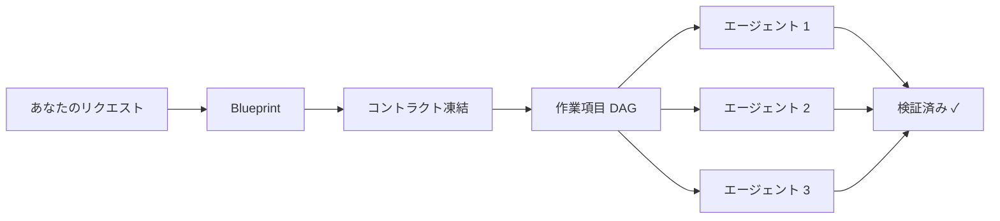

[English](README.md) · [한국어](README.ko.md) · [日本語](README.ja.md) · [中文](README.zh.md)

# Make It Real

**Make It Simple. Make It Work. Make It Real.**

*Contract first. Code follows.*

<p align="center">
  
  
  
  
</p>

<p align="center">
  <a href="#60秒で試す">試してみる</a> •
  <a href="#beforeafter">Before / After</a> •
  <a href="#どう動くのか">仕組み</a> •
  <a href="docs/README.md">ドキュメント</a>
</p>

---

## 60秒で試す

インストール不要。クローンしてすぐ動く：

```bash
git clone https://github.com/mir-makeitreal/makeitreal && cd makeitreal
node bin/harness.mjs demo rest-api --pretty
```

PRD・コントラクト・作業項目 DAG・ダッシュボード HTML を含む Blueprint 一式が一時ディレクトリに出力される。ダッシュボードで確認：

```bash
# runDir はデモ出力に表示されます
open <runDir>/preview/index.html
```

Claude Code 内なら一行で済む：

```
/mir:demo rest-api
```

テンプレートは 3 種類：`todo-app`（シンプル）・`rest-api`（中規模）・`auth-system`（複雑）。

---

## Docs First という考え方

> 「まずドキュメントを書く。コードはその後だ。」

これは単なる「Blueprint ファーストの Claude Code プラグイン」ではない。もっと根本的な考え方だ。

**PM・アーキテクト・エンジニアが同じ言語で話す。**

従来の開発では、要件定義・設計書・実装がそれぞれ別の場所に存在し、気づけば乖離している。Make It Real ではドキュメントが唯一の真実だ。コードはドキュメントに従う。逆はない。

| 原則 | 意味 |
|------|------|
| **仕様 = テスト** | OpenAPI コントラクトと型付きインターフェースがそのまま適合性テストになる。テストが通れば、仕様を満たしていることが機械的に証明される。 |
| **コントラクト = インターフェース** | モジュール境界は「ドキュメント」ではなく「実行可能な制約」だ。サブエージェントはコントラクトに対して実装する。 |
| **承認なし = 実装なし** | Blueprint を承認するまでコードは一行も書かれない。承認にはフィンガープリントが付与され、成果物が変わると再承認が必要になる。 |

この哲学の詳細：[コンセプト: Blueprints](docs/concepts/blueprints.md) · [コンセプト: Contracts](docs/concepts/contracts.md)

---

## Before / After

4 モジュール構成の認証システムを Claude Code で構築するとき、何が変わるか：

|  | Make It Real なし | Make It Real あり |
|---|---|---|
| **計画** | 即コーディングに入る | モジュール境界・コントラクト・依存グラフを含む Blueprint を生成。コードを書く前にレビューして承認する。 |
| **境界** | エージェント 1 本がすべてに触る。Auth が DB 層に入り込む。 | 各サブエージェントは `allowedPaths` を持ち、自分のモジュール外のファイルを物理的に編集できない。 |
| **コントラクト** | 最後にうまく合うことを祈る | OpenAPI スペックと型付きインターフェースを実装前に凍結。サブエージェントはそれに対して実装する。 |
| **並列性** | 逐次実行、または手動で `Task` ツールを呼ぶ | クレーム・リース・リトライ付きの DAG スケジュールでサブエージェントを並列実行する。 |
| **統合** | 「自分のブランチでは動く」→ マージコンフリクト | コントラクト適合テストが通る → 統合はすでに証明済み。 |
| **証拠** | 「たぶん完成してると思います」 | 各作業項目に構造化された検証エビデンスが付く。証明が揃うまでゲートが「完了」をブロックする。 |

---

## どう動くのか



1. **やりたいことを書く。** 一文で十分。
2. **エンジンが Blueprint を生成する。** PRD・アーキテクチャ・モジュールインターフェース・OpenAPI コントラクト・責任境界・作業項目 DAG — すべてコードより先に生成・検証される。
3. **あなたが承認する。** Blueprint をレビューし、変更を要求するか却下することもできる。承認にはフィンガープリントが付く。成果物が変わればゲートは再承認まで処理をブロックする。
4. **サブエージェントが並列でビルドする。** 各エージェントは責任単位を 1 つ担当し、凍結済みコントラクトに対して実装する。アクセスできるファイルは宣言された `allowedPaths` 内のみだ。
5. **ゲートが完了を強制する。** Ready ゲートは Blueprint が正常になるまでローンチをブロック。Done ゲートは検証エビデンスが揃うまで完了をブロック。「たぶん終わった」では通らない。

詳細なパイプラインのウォークスルー：[How It Works](docs/how-it-works.md)

---

## 3 つのコマンド

| コマンド | 役割 |
|---------|------|
| `/mir:plan "あなたのリクエスト"` | リクエストから Blueprint を生成し、インラインでレビュー・承認する。 |
| `/mir:launch` | 承認済み Blueprint を実行 — DAG 順にサブエージェントをディスパッチする。 |
| `/mir:status` | 現在のフェーズ・作業項目の状態・ブロッカー・ダッシュボード URL。 |

コアループはこれだけ：**plan → launch → status**。

追加コマンドは [コマンドリファレンス](docs/command-reference.md) を参照。

すべての `/mir:` コマンドは `/makeitreal:` という長い形式でも使える。

---

## 生成されるもの

```
.makeitreal/runs/<run-id>/
├── prd.json                    # ゴール・受け入れ基準・非ゴール
├── design-pack.json            # アーキテクチャトポロジー・API・境界
├── responsibility-units.json   # allowedPaths 付き所有権境界
├── work-item-dag.json          # コントラクトエッジ付き依存グラフ
├── blueprint-review.json       # フィンガープリント付き承認状態
├── contracts/                  # 凍結されたインターフェース仕様
│   ├── *.openapi.json          #   例付き OpenAPI 3.x
│   └── *.json                  #   モジュールサーフェスシグネチャ
├── work-items/                 # 検証コマンド付き項目別タスク
├── evidence/                   # 検証 + wiki 同期エビデンス
├── preview/                    # ダッシュボード HTML
└── board.json                  # 全作業項目の Kanban 状態
```

---

## なぜ機能するのか

**424 テスト。依存関係ゼロ。**

エンジンは純粋な Node.js バリデーションロジックだ。ネットワーク呼び出しなし、API キーなし、外部サービスなし。Claude Code のランタイム内で完結する。

**コントラクトはドキュメントではない。** 機械検証可能なインターフェース仕様（OpenAPI 3.x + 型付きモジュールサーフェス）であり、そのまま適合性テストを生成する。サブエージェントのテストが通れば、コントラクトを正しく実装していることが証明される。統合は別フェーズではなく、コントラクト適合の副産物として手に入る。

**パス境界は提案ではない。** エンジンは、サブエージェントが `allowedPaths` 外のファイルに触れていないことを検証する。`src/auth/**` 担当のエージェントが `src/database/schema.ts` を編集すれば、検証は失敗する。

詳細：[Contracts](docs/concepts/contracts.md) · [Responsibility Units](docs/concepts/responsibility-units.md) · [Blueprints](docs/concepts/blueprints.md)

---

## 要件

- Claude Code（最新版）
- Node.js ≥ 20

---

## 他のツールとの比較

|  | Make It Real | Vanilla Claude Code | Superpowers | Spec Kit | GSD |
|---|:---:|:---:|:---:|:---:|:---:|
| コードの前にアーキテクチャ | ✅ | ❌ | ✅ | ✅ | ✅ |
| 機械検証可能なコントラクト | ✅ | ❌ | ❌ | ⚠️ | ❌ |
| DAG スケジュール並列エージェント | ✅ | ⚠️ | ✅ | ⚠️ | ✅ |
| パス境界の強制 | ✅ | ❌ | ❌ | ❌ | ❌ |
| 品質ゲート（エンジン強制） | ✅ | ❌ | ⚠️ | ⚠️ | ⚠️ |
| インタラクティブダッシュボード | ✅ | ❌ | ❌ | ❌ | ❌ |
| ランタイム依存関係ゼロ | ✅ | ✅ | ✅ | ❌ | ⚠️ |

各ツールが勝る点・負ける点の正直な比較：[docs/comparison.md](docs/comparison.md)

---

## コントリビューション

バグを発見した？アイデアがある？[Issue を開く](https://github.com/mir-makeitreal/makeitreal/issues)。

```bash
git clone https://github.com/mir-makeitreal/makeitreal && cd makeitreal
node --test          # 424 テストをすべて実行、約 12 秒
```

ビルドステップなし。依存関係のインストールも不要。クローンしてテストを回すだけ。

---

## ライセンス

MIT — [LICENSE](LICENSE) 参照。

---

<p align="center">
  <a href="docs/getting-started.md"><strong>はじめる →</strong></a>
  &nbsp;&nbsp;·&nbsp;&nbsp;
  <a href="docs/README.md">ドキュメントを読む</a>
  &nbsp;&nbsp;·&nbsp;&nbsp;
  <a href="https://github.com/mir-makeitreal/makeitreal/issues">Issue を報告する</a>
</p>
