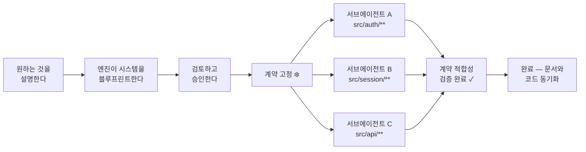

[English](README.md) · [한국어](README.ko.md) · [日本語](README.ja.md) · [中文](README.zh.md)

<div align="center">

# Make It Real

**Make It Simple. Make It Work. Make It Real.**

*Contract first. Code follows.*

<p>
  
  
  
  
</p>

<p>
  <a href="#60초-퀵스타트">시작하기</a> ·
  <a href="#문서-우선-철학">철학</a> ·
  <a href="#동작-방식">동작 방식</a> ·
  <a href="#before--after">Before / After</a> ·
  <a href="docs/README.md">문서</a>
</p>

</div>

---

대부분의 AI 코딩 도구는 코드에서 시작한다. Make It Real은 문서에서 시작한다.

제품이 **어떻게 동작해야 하는지** — 목표, 인터페이스, 인수 기준, 모듈 경계 — 를 먼저 문서로 정의한다. Make It Real은 이를 기계적으로 검증 가능한 계약(contract)으로 고정한 뒤, 그 범위 안에서만 구현할 수 있는 병렬 Claude 서브에이전트를 디스패치한다. 에이전트 실행이 끝나면 코드와 문서는 구조적으로 동기화된 상태다.

---

## 설치

**요구 사항:** Claude Code (최신 버전) · Node.js ≥ 20

```bash
claude plugin install makeitreal@52g
```

설치 확인:

```
/mir:status
```

API 키 불필요. 빌드 단계 불필요. 별도 프로세스 불필요.

> 이미 Claude Code를 사용 중이라면? 설치 직후 `/mir:` 커맨드가 즉시 등록된다.

---

## 60초 퀵스타트

설치 불필요. API 키 불필요. 클론 후 바로 실행:

```bash
git clone https://github.com/mir-makeitreal/makeitreal && cd makeitreal
node bin/harness.mjs demo rest-api --pretty
```

전체 아키텍처 블루프린트 — PRD, 계약, 작업 DAG, 인터랙티브 대시보드 — 가 임시 디렉토리에 생성된다. 열어보자:

```bash
# 경로는 데모 출력의 "runDir" 항목에 나온다
open <runDir>/preview/index.html
```

Claude Code 안에서는 한 줄이면 된다:

```
/mir:demo rest-api
```

데모 템플릿 세 종류: `todo-app` (간단) · `rest-api` (중간) · `auth-system` (복잡)

---

## 문서 우선 철학

대부분의 팀은 코드를 짠 **후에** 문서를 쓴다. 만들어진 것을 문서화하지, 만들어야 할 것을 문서화하지 않는다. 결과는 항상 같다: 문서는 코드에서 멀어지고, 스펙은 거짓말하고, 통합마다 예상치 못한 문제가 터진다.

Make It Real은 이 순서를 뒤집는다. **문서가 진실의 원천이다.** 코드는 문서가 맞다는 증명일 뿐이다.

```
전통적 방식:  요청 → 코드 → (어쩌면) 문서 → 테스트가 버그를 발견
Make It Real: 요청 → 문서 → 계약 고정 → 코드가 문서를 증명 → 놀라움 없음
```

이건 개발자만을 위한 더 나은 워크플로우가 아니다. **팀 전체**가 같은 언어로 대화하는 방법이다:

- **PM**은 자동화된 게이트로 직결되는 인수 기준을 정의한다 — Jira에 묻히는 티켓이 아니라
- **아키텍트**는 서브에이전트가 물리적으로 넘을 수 없는 모듈 경계를 선언한다
- **개발자**는 사전에 검증된 인터페이스 계약에 맞춰 구현한다 — 인터페이스는 이미 결정된 상태다
- **리뷰어**는 코드 diff 대신 블루프린트를 승인한다 — 코드 한 줄이 쓰이기 전에

스펙이 테스트다. 계약이 인터페이스다. 문서와 코드는 항상 동기화된다.

---

## 동작 방식



**1단계 — 원하는 것을 설명한다.**
한 문장이면 충분하다. 인테이크 시스템이 검토 가능한 플랜을 만들 수 있을 만큼 정보를 모을 때까지 핵심 질문을 하나씩 던진다.

**2단계 — 엔진이 시스템을 블루프린트한다.**
코드를 쓰기 전에: 인수 기준이 담긴 PRD, 모듈 경계를 포함한 아키텍처, 모든 인터페이스를 위한 OpenAPI 계약, 전체 작업 항목의 의존성 그래프(DAG), 그리고 인터랙티브 대시보드. 이 모두가 교차 검증된다.

**3단계 — 검토하고 승인한다.**
블루프린트를 검토한다. 수정을 요청할 수 있다. 승인 내용은 핑거프린트로 고정된다 — 이후 어떤 아티팩트라도 변경되면 재승인 전까지 게이트가 블로킹한다. 모르는 사이에 드리프트되는 일은 없다.

**4단계 — 계약이 고정된다.**
모듈 간 모든 인터페이스가 이제 불변이다. 서브에이전트는 계약을 입력으로 받는다. 자신이 무엇을 구현해야 하고 무엇에 의존할 수 있는지 정확히 안다.

**5단계 — 서브에이전트가 병렬로 구현한다.**
각 에이전트는 하나의 책임 단위를 소유하고, 고정된 계약에 맞춰 구현하며, 선언된 경로 밖의 파일에는 물리적으로 접근이 차단된다. `src/auth/**`를 맡은 에이전트가 `src/database/schema.ts`를 수정하려 하면 훅이 즉시 거부한다.

**6단계 — 게이트가 완료를 강제한다.**
Done 게이트가 검증 커맨드를 실행한다. 에이전트가 스스로 "완료"를 선언하는 것은 불가능하다. 계약 적합성을 증명해야 한다. 증거는 디스크에 기록된다.

전체 워크플로우: [docs/how-it-works.md](docs/how-it-works.md)

---

## Before / After

"4-모듈 인증 시스템을 만들어줘" — Make It Real 없이, 그리고 있을 때:

| | Make It Real 없이 | Make It Real 있을 때 |
|---|---|---|
| **계획** | 즉시 코딩 시작 | 블루프린트 먼저: PRD, 모듈 맵, 계약, DAG. 코드 한 줄 쓰기 전에 승인. |
| **경계** | 에이전트 하나가 모든 것을 건드린다. Auth가 DB 레이어를 직접 호출한다. | 각 서브에이전트는 `allowedPaths`를 가진다. 훅이 선언된 모듈 밖의 쓰기를 **거부**한다. |
| **계약** | 마지막에 모듈이 맞기를 바란다 | OpenAPI 스펙과 타입 인터페이스가 구현 전에 고정된다. 서브에이전트가 이에 맞춰 구현한다. |
| **병렬성** | 순차 실행, 혹은 서로 충돌하는 `Task` 호출 | 클레임·리스·재시도를 갖춘 DAG 스케줄 서브에이전트. 의존 순서 강제. |
| **통합** | "내 브랜치에선 됐는데" → 머지 충돌 | 단위 수준의 계약 적합성이 통합을 증명한다. 별도 통합 단계 없음. |
| **증거** | "됐다고 생각해요" | 모든 작업 항목에 구조화된 검증 증거. Done 게이트가 증거 없이는 블로킹한다. |
| **문서-코드 동기화** | 며칠 내로 문서가 드리프트 | 문서가 진실의 원천. 코드가 증명. 둘은 벌어질 수 없다. |

---

## 핵심 커맨드 세 가지

| 커맨드 | 하는 일 |
|---------|---------|
| `/mir:plan "요청 내용"` | 블루프린트 생성. PRD, 아키텍처, 계약, DAG, 대시보드. 인라인으로 검토·승인. |
| `/mir:launch` | 승인된 블루프린트를 실행. DAG 순서로 서브에이전트를 게이트된 루프로 디스패치. |
| `/mir:status` | 현재 페이즈, 작업 항목 상태, 블로커, 대시보드 URL. |

핵심 루프: **plan → launch → status**

모든 `/mir:` 커맨드는 전체 이름인 `/makeitreal:` 으로도 사용 가능하다. 파워유저 커맨드: [docs/command-reference.md](docs/command-reference.md)

---

## 무엇이 생성되는가

```
.makeitreal/runs/<run-id>/
├── prd.json                    # 목표, 인수 기준, 비목표
├── design-pack.json            # 아키텍처 토폴로지, API, 모듈 인터페이스
├── responsibility-units.json   # 허용 파일 경로를 포함한 책임 경계
├── work-item-dag.json          # 계약 타입의 엣지를 가진 의존성 그래프
├── blueprint-review.json       # 승인 상태, 핑거프린트, 검토자 정보
├── contracts/
│   ├── auth-api.openapi.json   # 스키마와 예제를 포함한 OpenAPI 3.x
│   └── session-store.json      # 타입 모듈 표면 시그니처
├── work-items/                 # 검증 커맨드를 포함한 항목별 작업
├── evidence/                   # 계약 적합성 + 위키 동기화 증거
├── preview/
│   └── index.html              # 인터랙티브 대시보드 — 보드, DAG, 계약
└── board.json                  # 모든 작업 항목의 칸반 상태
```

모든 아티팩트는 서로 교차 참조된다. 엔진은 Ready 게이트에서 — 어떤 에이전트가 실행되기 전에 — 모든 참조를 양방향으로 검증한다. 고아 트레이스와 끊어진 계약 엣지는 그 자리에서 잡힌다.

---

## 왜 작동하는가

**433개 테스트. 의존성 제로.**

엔진은 순수 Node.js 검증 로직이다. 네트워크 호출 없음, API 키 없음, 외부 서비스 없음. Claude Code 런타임 안에서, 오프라인으로, 추가 비용 없이 실행된다.

**계약은 문서가 아니다. 강제 집행 수단이다.**

계약은 OpenAPI 3.x 스펙이거나 타입 모듈 표면이다. 엔진은 생성 시점에 완전성을 검증한다: 모든 경로에 오퍼레이션이 있는지, 모든 오퍼레이션에 `operationId`가 있는지, 모든 비-GET 엔드포인트에 요청 바디 스키마가 있는지, 모든 성공 응답에 JSON 스키마가 있는지, 모든 에러 케이스가 선언되어 있는지. 서브에이전트의 테스트가 통과하면 그 에이전트가 계약을 구현했다는 것이 증명된다. 통합은 별도 단계가 아니다 — 적합성에서 자연히 따라온다.

**경로 경계는 제안이 아니다. 훅이 강제한다.**

`PreToolUse` 훅이 서브에이전트의 모든 `Write`·`Edit` 호출을 가로채 대상 경로를 `allowedPaths`와 대조한다. 선언된 경계를 벗어나는 에이전트는 즉시 실패한다 — 코드 리뷰에서가 아니라, 머지할 때가 아니라, 바로 그 순간에.

**승인 핑거프린팅이 조용한 드리프트를 막는다.**

블루프린트 핑거프린트는 모든 아티팩트의 SHA-256이다. 승인 후에 계약이 변경되면 — 문자 하나라도 — Ready 게이트가 실행을 거부하고 재승인을 요구한다. 검토하지 않은 블루프린트로 구현을 시작할 방법은 없다.

더 읽기: [계약](docs/concepts/contracts.md) · [책임 단위](docs/concepts/responsibility-units.md) · [블루프린트](docs/concepts/blueprints.md) · [오케스트레이션](docs/concepts/orchestration.md)

---

## 다른 도구와 비교

| | Make It Real | Vanilla Claude Code | Superpowers | Spec Kit | GSD |
|---|:---:|:---:|:---:|:---:|:---:|
| 코드 전에 아키텍처 | ✅ | ❌ | ✅ | ✅ | ✅ |
| 기계 검증 가능한 계약 | ✅ | ❌ | ❌ | ⚠️ | ❌ |
| 계약→테스트 생성 | ✅ | ❌ | ❌ | ❌ | ❌ |
| DAG 스케줄된 병렬 에이전트 | ✅ | ⚠️ | ✅ | ⚠️ | ✅ |
| 경로 경계 강제 (훅) | ✅ | ❌ | ❌ | ❌ | ❌ |
| 승인 핑거프린팅 | ✅ | ❌ | ❌ | ❌ | ❌ |
| 품질 게이트 (엔진 강제) | ✅ | ❌ | ⚠️ | ⚠️ | ⚠️ |
| 인터랙티브 대시보드 | ✅ | ❌ | ❌ | ❌ | ❌ |
| 런타임 의존성 제로 | ✅ | ✅ | ✅ | ❌ | ⚠️ |
| 문서-코드 동기화 보장 | ✅ | ❌ | ❌ | ⚠️ | ❌ |

⚠️ = 부분적 또는 선택적 · 전체 비교: [docs/comparison.md](docs/comparison.md)

---

## 요구 사항

- Claude Code (최신 버전)
- Node.js ≥ 20

---

## 기여하기

버그를 발견했나? 아이디어가 있나? [이슈를 열어라](https://github.com/mir-makeitreal/makeitreal/issues).

```bash
git clone https://github.com/mir-makeitreal/makeitreal && cd makeitreal
node --test          # 433개 테스트 전부 실행, 약 12초
```

빌드 단계 없음. 설치할 의존성 없음. 클론하고 테스트하면 된다.

PR을 열기 전에 [CONTRIBUTING.md](CONTRIBUTING.md)를 읽어달라. 핵심 규칙: **모든 변경은 문서를 먼저 작성해야 한다.** 기능을 문서로 설명할 수 없다면, 그 기능은 아직 만들 준비가 안 된 것이다.

---

## 라이선스

MIT — [LICENSE](LICENSE) 참조.

---

<div align="center">

**[시작하기 →](docs/getting-started.md)**
&nbsp;&nbsp;·&nbsp;&nbsp;
[문서 읽기](docs/README.md)
&nbsp;&nbsp;·&nbsp;&nbsp;
[이슈 리포트](https://github.com/mir-makeitreal/makeitreal/issues)

*문서를 먼저 써라. 그러면 현실이 된다.*

</div>
