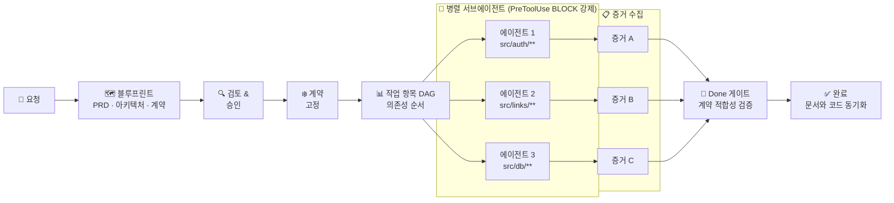

[English](README.md) · [한국어](README.ko.md) · [日本語](README.ja.md) · [中文](README.zh.md)

<div align="center">


# Make It Real

**Make It Simple. Make It Work. Make It Real.**

*Contract first. Code follows.*

<p>
  <a href="https://github.com/mir-makeitreal/makeitreal/stargazers"></a>
  <a href="https://github.com/mir-makeitreal/makeitreal/blob/main/LICENSE"></a>
  
  
</p>

<p>
  <a href="#설치">설치</a> ·
  <a href="#핵심-커맨드-세-가지">커맨드</a> ·
  <a href="#개발-흐름">흐름</a> ·
  <a href="#문서-우선-철학">철학</a> ·
  <a href="docs/README.md">문서</a>
</p>

</div>

---

대부분의 AI 코딩 도구는 코드에서 시작한다. Make It Real은 문서에서 시작한다.

제품이 **어떻게 동작해야 하는지** — 목표, 인터페이스, 인수 기준, 모듈 경계 — 를 먼저 문서로 정의한다. Make It Real은 이를 기계적으로 검증 가능한 계약(contract)으로 고정한 뒤, 그 범위 안에서만 구현할 수 있는 병렬 Claude 서브에이전트를 디스패치한다. 에이전트 실행이 끝나면 코드와 문서는 구조적으로 동기화된 상태다.

---

## 설치

**요구 사항:** Claude Code (최신) · Node.js ≥ 20

**1단계 — 마켓플레이스 추가:**

```bash
claude plugin marketplace add 52g github:mir-makeitreal/makeitreal
```

**2단계 — 플러그인 설치:**

```bash
claude plugin install makeitreal@52g
```

**설치 확인:**

```
/mir:status
```

API 키 불필요. 빌드 단계 없음. 별도 프로세스 없음.

---

## 핵심 커맨드 세 가지

| 커맨드 | 하는 일 |
|---------|---------|
| `/mir:plan "요청 내용"` | 블루프린트 생성. PRD, 아키텍처, 계약, DAG, 대시보드. 인라인으로 검토·승인. |
| `/mir:launch` | 승인된 블루프린트를 실행. DAG 순서로 서브에이전트를 게이트된 루프로 디스패치. |
| `/mir:status` | 현재 단계, 작업 항목 상태, 블로커, 대시보드 URL. |
| `/mir:wiki` | 브라우저에서 라이브 위키 열기 — 검증된 모든 작업 항목을 탐색 가능한 뷰로. |

핵심 루프: **plan → launch → status**

모든 `/mir:` 커맨드는 전체 이름인 `/makeitreal:` 으로도 사용 가능하다. 파워유저 커맨드: [docs/command-reference.md](docs/command-reference.md)

---

## 개발 흐름

평범한 자연어 요청에서 검증되고 동기화된 코드까지 — 여섯 단계:

**1단계 — 설명** · 무엇을 만들지 자연어로 말한다

**2단계 — 블루프린트** · Claude가 설계한다: 스펙, 아키텍처, 계약, 작업 그래프

**3단계 — 검토** · 당신이 승인한다. 핑거프린트가 모든 아티팩트를 잠근다.

**4단계 — 디스패치** · 병렬 에이전트가 모듈에 배정되고, 경계가 강제된다

**5단계 — 빌드** · 각 에이전트가 자기 모듈을 구현하고, 다른 모듈은 건드릴 수 없다

**6단계 — 검증** · 계약 적합성이 증명되고, 증거가 기록되고, 완료

<!-- SCREENSHOT: dashboard -->
<p align="center">
  
</p>

> *Architecture Dossier — `/mir:plan`이 생성한다. 모듈 그래프, 고정된 계약, 작업 의존 순서, 인수 기준. 모두 교차 링크되어 있고, 모두 기계 검증 가능하다.*




> *계약은 어떤 에이전트가 실행되기 전에 고정된다. 각 에이전트는 `PreToolUse` 훅에 의해 선언된 경로로 물리적으로 제한된다. Done 게이트는 모든 에이전트가 적합성을 증명할 때까지 블로킹한다.*

전체 워크스루: [docs/how-it-works.md](docs/how-it-works.md)

---

## 문서 우선 철학

대부분의 팀은 코드를 짠 **후에** 문서를 쓴다. 만들어진 것을 문서화하지, 만들어야 할 것을 문서화하지 않는다. 결과는 항상 같다: 문서는 코드에서 멀어지고, 스펙은 거짓말하고, 통합마다 예상치 못한 문제가 터진다.

Make It Real은 이 순서를 뒤집는다. **문서가 진실의 원천이다.** 코드는 문서가 맞다는 증명일 뿐이다.

```
전통적 방식:  요청 → 코드 → (어쩌면) 문서 → 테스트가 버그를 발견
Make It Real: 요청 → 문서 → 계약 고정 → 코드가 문서를 증명 → 놀라움 없음
```

이건 개발자만을 위한 더 나은 워크플로우가 아니다. **팀 전체**가 같은 언어로 대화하는 방법이다:

- **PM**은 자동화된 게이트로 직결되는 인수 기준을 정의한다 — Jira에 묻히는 티켓이 아니라
- **아키텍트**는 서브에이전트가 물리적으로 넘을 수 없는 모듈 경계를 선언한다
- **개발자**는 사전에 검증된 인터페이스 계약에 맞춰 구현한다 — 인터페이스는 이미 결정된 상태다
- **리뷰어**는 코드 diff 대신 블루프린트를 승인한다 — 코드 한 줄이 쓰이기 전에

스펙이 테스트다. 계약이 인터페이스다. 문서와 코드는 항상 동기화된다.

---

## Before / After

"4-모듈 인증 시스템을 만들어줘" — Make It Real 없이, 그리고 있을 때:

| | Make It Real 없이 | Make It Real 있을 때 |
|---|---|---|
| **계획** | 즉시 코딩 시작 | 블루프린트 먼저: PRD, 모듈 맵, 계약, DAG. 코드 한 줄 쓰기 전에 승인. |
| **경계** | 에이전트 하나가 모든 것을 건드린다. Auth가 DB 레이어를 직접 호출한다. | 각 서브에이전트는 `allowedPaths`를 가진다. 훅이 선언된 모듈 밖의 쓰기를 **거부**한다. |
| **계약** | 마지막에 모듈이 맞기를 바란다 | OpenAPI 스펙과 타입 인터페이스가 구현 전에 고정된다. 서브에이전트가 이에 맞춰 구현한다. |
| **병렬성** | 순차 실행, 혹은 서로 충돌하는 `Task` 호출 | 클레임·리스·재시도를 갖춘 DAG 스케줄 서브에이전트. 의존 순서 강제. |
| **통합** | "내 브랜치에선 됐는데" → 머지 충돌 | 단위 수준의 계약 적합성이 통합을 증명한다. 별도 통합 단계 없음. |
| **증거** | "됐다고 생각해요" | 모든 작업 항목에 구조화된 검증 증거. Done 게이트가 증거 없이는 블로킹한다. |
| **문서-코드 동기화** | 며칠 내로 문서가 드리프트 | 문서가 진실의 원천. 코드가 증명. 둘은 벌어질 수 없다. |

---

## 왜 작동하는가

**424개 테스트. 의존성 제로.**

엔진은 순수 Node.js 검증 로직이다. 네트워크 호출 없음, API 키 없음, 외부 서비스 없음. Claude Code 런타임 안에서, 오프라인으로, 추가 비용 없이 실행된다.

**계약은 문서가 아니다. 강제 집행 수단이다.**

계약은 OpenAPI 3.x 스펙이거나 타입 모듈 표면이다. 엔진은 생성 시점에 완전성을 검증한다: 모든 경로에 오퍼레이션이 있는지, 모든 오퍼레이션에 `operationId`가 있는지, 모든 비-GET 엔드포인트에 요청 바디 스키마가 있는지, 모든 성공 응답에 JSON 스키마가 있는지, 모든 에러 케이스가 선언되어 있는지. 서브에이전트의 테스트가 통과하면 그 에이전트가 계약을 구현했다는 것이 증명된다. 통합은 별도 단계가 아니다 — 적합성에서 자연히 따라온다.

**경로 경계는 제안이 아니다. 훅이 강제한다.**

`PreToolUse` 훅이 서브에이전트의 모든 `Write`·`Edit` 호출을 가로채 대상 경로를 `allowedPaths`와 대조한다. 선언된 경계를 벗어나는 에이전트는 즉시 실패한다 — 코드 리뷰에서가 아니라, 머지할 때가 아니라, 바로 그 순간에.

**승인 핑거프린팅이 조용한 드리프트를 막는다.**

블루프린트 핑거프린트는 모든 아티팩트의 SHA-256이다. 승인 후에 계약이 변경되면 — 문자 하나라도 — Ready 게이트가 실행을 거부하고 재승인을 요구한다. 검토하지 않은 블루프린트로 구현을 시작할 방법은 없다.

더 읽기: [계약](docs/concepts/contracts.md) · [책임 단위](docs/concepts/responsibility-units.md) · [블루프린트](docs/concepts/blueprints.md) · [오케스트레이션](docs/concepts/orchestration.md)

---

## 다른 도구와 비교

| | Make It Real | Vanilla Claude Code | Superpowers | Spec Kit | GSD |
|---|:---:|:---:|:---:|:---:|:---:|
| 코드 전에 아키텍처 | ✅ | ❌ | ✅ | ✅ | ✅ |
| 기계 검증 가능한 계약 | ✅ | ❌ | ❌ | ⚠️ | ❌ |
| 계약→테스트 생성 | ✅ | ❌ | ❌ | ❌ | ❌ |
| DAG 스케줄된 병렬 에이전트 | ✅ | ⚠️ | ✅ | ⚠️ | ✅ |
| 경로 경계 강제 (훅) | ✅ | ❌ | ❌ | ❌ | ❌ |
| 승인 핑거프린팅 | ✅ | ❌ | ❌ | ❌ | ❌ |
| 품질 게이트 (엔진 강제) | ✅ | ❌ | ⚠️ | ⚠️ | ⚠️ |
| 인터랙티브 대시보드 | ✅ | ❌ | ❌ | ❌ | ❌ |
| 런타임 의존성 제로 | ✅ | ✅ | ✅ | ❌ | ⚠️ |
| 문서-코드 동기화 보장 | ✅ | ❌ | ❌ | ⚠️ | ❌ |

⚠️ = 부분적 또는 선택적 · 전체 비교: [docs/comparison.md](docs/comparison.md)

---

## 기여하기

버그를 발견했나? 아이디어가 있나? [이슈를 열어라](https://github.com/mir-makeitreal/makeitreal/issues).

```bash
git clone https://github.com/mir-makeitreal/makeitreal && cd makeitreal
node --test          # 424개 테스트 전부 실행, 약 12초
```

빌드 단계 없음. 설치할 의존성 없음. 클론하고 테스트하면 된다.

PR을 열기 전에 [CONTRIBUTING.md](CONTRIBUTING.md)를 읽어달라. 핵심 규칙: **모든 변경은 문서를 먼저 작성해야 한다.** 기능을 문서로 설명할 수 없다면, 그 기능은 아직 만들 준비가 안 된 것이다.

---

## 라이선스

MIT — [LICENSE](LICENSE) 참조.

---

<div align="center">

**[시작하기 →](docs/getting-started.md)**
&nbsp;&nbsp;·&nbsp;&nbsp;
[문서 읽기](docs/README.md)
&nbsp;&nbsp;·&nbsp;&nbsp;
[이슈 리포트](https://github.com/mir-makeitreal/makeitreal/issues)

*문서를 먼저 써라. 그러면 현실이 된다.*

</div>
