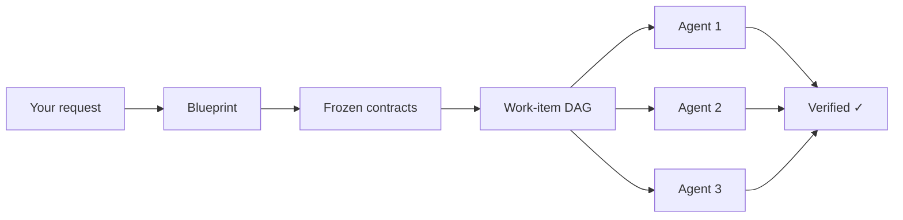

# Make It Real

**Claude Code builds your code. This plugin makes sure it builds the *right* code.**

Make It Real is a Claude Code plugin that forces architecture-first development: blueprint the system, freeze contracts between modules, then launch parallel sub-agents that can't touch each other's files. When tests pass, integration is already proven.

<p align="center">
  
  
  
  
</p>

<p align="center">
  <a href="#try-it-in-60-seconds">Try It</a> •
  <a href="#before--after">Before / After</a> •
  <a href="#how-it-works">How It Works</a> •
  <a href="docs/README.md">Docs</a>
</p>

---

## Try it in 60 seconds

No install needed. Clone and run a demo blueprint:

```bash
git clone https://github.com/52g-tools/dev-harness && cd dev-harness
node bin/harness.mjs demo rest-api --pretty
```

That generates a full architecture blueprint (PRD, contracts, work-item DAG, dashboard) into a temp directory. Open the dashboard HTML to see it:

```bash
# path is printed in the demo output under "runDir"
open <runDir>/preview/index.html
```

Inside Claude Code, the same thing is one command:

```
/mir:demo rest-api
```

Three templates available: `todo-app` (simple), `rest-api` (medium), `auth-system` (complex).

## Before / After

What happens when you ask Claude Code to build a 4-module auth system:

| | Without Make It Real | With Make It Real |
|---|---|---|
| **Planning** | Starts coding immediately | Generates a blueprint with module boundaries, contracts, and a dependency graph. You review and approve before any code is written. |
| **Boundaries** | One agent touches everything. Auth reaches into the database layer. | Each sub-agent gets `allowedPaths` — it literally cannot edit files outside its module. |
| **Contracts** | Hope modules fit together at the end | OpenAPI specs and typed interfaces are frozen before implementation. Sub-agents implement against them. |
| **Parallelism** | Sequential, or manual `Task` tool | DAG-scheduled sub-agents with claims, leases, and retry. |
| **Integration** | "Works on my branch" → merge conflicts | Contract conformance tests pass → integration is already proven. |
| **Evidence** | "I think it's done" | Structured verification evidence for every work item. Gates block "done" until proof exists. |

## How It Works



1. **You describe what you want.** One sentence is enough.
2. **The engine blueprints it.** PRD, architecture, module interfaces, OpenAPI contracts, responsibility boundaries, work-item DAG — all generated and validated before any code.
3. **You approve.** Review the blueprint, ask for changes, or reject it. The approval is fingerprinted — if any artifact changes, the gate blocks until you re-approve.
4. **Sub-agents build in parallel.** Each agent owns one responsibility unit, implements against frozen contracts, and can only touch its declared file paths.
5. **Gates enforce completion.** Ready gate blocks launch until the blueprint is sound. Done gate blocks completion until verification evidence exists. No self-declaring "done."

Full pipeline walkthrough: [How It Works](docs/how-it-works.md)

## Three commands to know

| Command | What it does |
|---------|-------------|
| `/mir:plan "your request"` | Generate a blueprint from your request. Review and approve inline. |
| `/mir:launch` | Execute the approved blueprint — dispatches sub-agents in DAG order. |
| `/mir:status` | Current phase, work-item states, blockers, dashboard URL. |

That's the core loop: **plan → launch → status**. There are more commands for power users — see the [full command reference](docs/command-reference.md).

Every `/mir:` command has a long form `/makeitreal:` equivalent.

## Why this works

**433 tests. Zero dependencies.**

The engine is pure Node.js validation logic — no network calls, no API keys, no external services. It runs inside Claude Code's runtime.

Contracts aren't documentation. They're machine-checkable interface specifications (OpenAPI 3.x + typed module surfaces) that generate conformance tests. When a sub-agent's tests pass, it has proven it implements the contract correctly. Integration isn't a separate phase — it falls out of contract conformance.

Path boundaries aren't suggestions. The engine validates that no sub-agent touched files outside its `allowedPaths`. An agent assigned to `src/auth/**` that edits `src/database/schema.ts` fails verification.

Read more: [Contracts](docs/concepts/contracts.md) · [Responsibility Units](docs/concepts/responsibility-units.md) · [Blueprints](docs/concepts/blueprints.md)

## What gets generated

```
.makeitreal/runs/<run-id>/
├── prd.json                    # Goals, acceptance criteria, non-goals
├── design-pack.json            # Architecture topology, APIs, boundaries
├── responsibility-units.json   # Ownership boundaries with allowed paths
├── work-item-dag.json          # Dependency graph with contract edges
├── blueprint-review.json       # Approval status with fingerprint
├── contracts/                  # Frozen interface specifications
│   ├── *.openapi.json          #   OpenAPI 3.x with examples
│   └── *.json                  #   Module surface signatures
├── work-items/                 # Per-item tasks with verification commands
├── evidence/                   # Verification + wiki sync evidence
├── preview/                    # Dashboard HTML
└── board.json                  # Kanban state for all work items
```

## Requirements

- Claude Code (latest)
- Node.js ≥ 20

## Compared to alternatives

| | Make It Real | Vanilla Claude Code | Superpowers | Spec Kit | GSD |
|---|:---:|:---:|:---:|:---:|:---:|
| Architecture before code | ✅ | ❌ | ✅ | ✅ | ✅ |
| Machine-checkable contracts | ✅ | ❌ | ❌ | ⚠️ | ❌ |
| DAG-scheduled parallel agents | ✅ | ⚠️ | ✅ | ⚠️ | ✅ |
| Path boundary enforcement | ✅ | ❌ | ❌ | ❌ | ❌ |
| Quality gates (engine-enforced) | ✅ | ❌ | ⚠️ | ⚠️ | ⚠️ |
| Interactive dashboard | ✅ | ❌ | ❌ | ❌ | ❌ |
| Zero runtime deps | ✅ | ✅ | ✅ | ❌ | ⚠️ |

Full honest comparison with where each tool wins: [docs/comparison.md](docs/comparison.md)

## Contributing

Found a bug? Have an idea? [Open an issue](https://github.com/52g-tools/dev-harness/issues).

```bash
git clone https://github.com/52g-tools/dev-harness && cd dev-harness
node --test          # runs all 433 tests, takes ~12s
```

No build step. No dependencies to install. Clone and test.

## License

MIT — see [LICENSE](LICENSE).

---

<p align="center">
  <a href="docs/getting-started.md"><strong>Get started →</strong></a>
  &nbsp;&nbsp;·&nbsp;&nbsp;
  <a href="docs/README.md">Read the docs</a>
  &nbsp;&nbsp;·&nbsp;&nbsp;
  <a href="https://github.com/52g-tools/dev-harness/issues">Report an issue</a>
</p>
