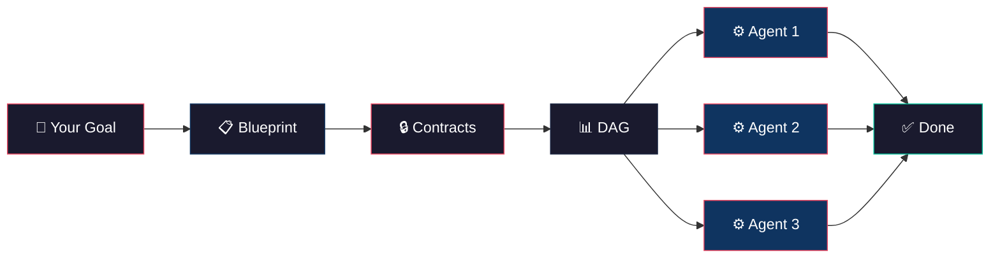
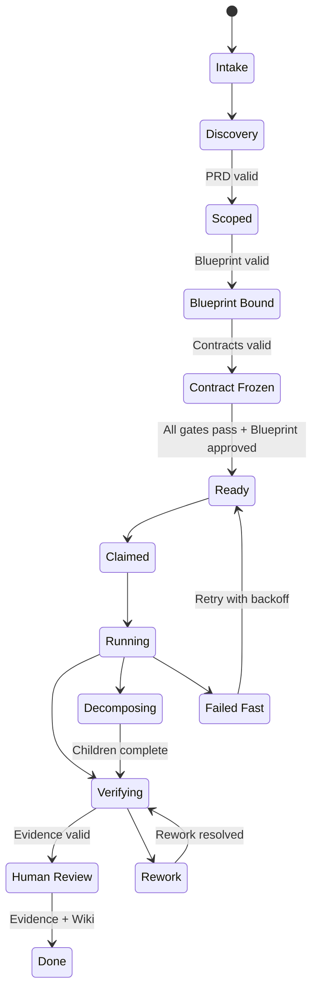
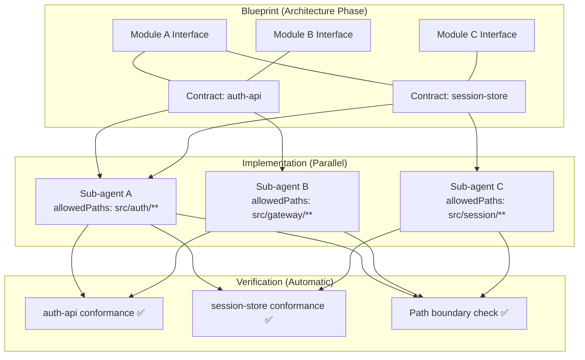

<p align="center">
  <strong>Make It Real</strong><br>
  <em>Contract-based parallel implementation for Claude Code</em>
</p>

<p align="center">
  <a href="#quick-start">Quick Start</a> •
  <a href="#how-it-works">How It Works</a> •
  <a href="#why-contracts">Why Contracts</a> •
  <a href="docs/getting-started.md">Docs</a> •
  <a href="#comparison">Comparison</a>
</p>

---

## The Problem

You ask Claude Code to build something ambitious. It starts coding immediately — no architecture, no boundaries, no integration plan. Halfway through, modules conflict. State leaks across boundaries. The auth layer calls the database directly. You end up debugging AI-generated spaghetti that passed no design review.

**AI can write code fast. But speed without structure produces bugs, not software.**

## The Solution

Make It Real forces Claude Code to **architect before it implements**. When you describe what you want, it generates a Blueprint — a full architecture with module boundaries, interface contracts, and a dependency graph. You review and approve. Then it decomposes the work into parallel sub-agents, each locked to their own responsibility boundary, implementing against frozen contracts.

The contracts become tests. When every sub-agent's tests pass, integration is already guaranteed.

```
You: "Build a user auth system with OAuth, session management, and role-based access"

Make It Real:
  1. Architects the solution → Blueprint with 4 responsibility units
  2. Freezes contracts      → OpenAPI specs, module interfaces, IO signatures
  3. Generates test stubs   → From contracts, before any implementation
  4. Launches sub-agents    → Each implements ONE unit, passes contract tests
  5. Verifies integration   → Contracts already enforced, evidence collected
```

> **Other plugins help Claude code faster. Make It Real helps Claude code correctly.**

## Quick Start

```bash
# Install from Claude Code marketplace
claude install makeitreal@52g

# Plan your feature — interactive intake asks clarifying questions
/makeitreal:plan "REST API for user management with JWT auth"

# Review the generated Blueprint, approve when ready
# (the plan command asks for approval inline)

# Launch parallel implementation
/makeitreal:launch

# Check progress on the live dashboard
/makeitreal:status
```

90 seconds from install to your first Blueprint. See the [Getting Started guide](docs/getting-started.md) for the full walkthrough.

## How It Works



### The Pipeline

| Phase | What Happens | Gate |
|-------|-------------|------|
| **Plan** | PRD generated from your request. Goals, acceptance criteria, non-goals. | PRD valid |
| **Blueprint** | Architecture designed. Modules, contracts, responsibility boundaries, DAG. | Design pack valid |
| **Freeze** | Contracts locked. OpenAPI specs, module interfaces, IO signatures frozen. | Contracts valid |
| **Review** | You approve (or reject/revise) the Blueprint. Human in the loop. | Blueprint approved |
| **Ready** | All gates pass: PRD traces, contract completeness, path boundaries, verification plans. | Ready gate |
| **Launch** | Sub-agents dispatched in DAG order. Each works in their responsibility unit. | — |
| **Verify** | Contract tests run. Evidence collected. Path boundaries enforced. | Verification pass |
| **Done** | Wiki sync, evidence audit, all gates green. | Done gate |

### The Kanban Flow

Every work item follows a strict state machine with gate-enforced transitions:



## Why Contracts

This is the core insight. Every other Claude Code plugin treats implementation as a single stream — one agent, one pass, hope for the best. Make It Real treats it as a **distributed systems problem**.

### The Contract Guarantee

When you build a system with multiple modules, the interfaces between them are the failure points. Make It Real:

1. **Extracts contracts before implementation** — OpenAPI specs, module interfaces with typed signatures (inputs, outputs, errors), dependency declarations
2. **Freezes them** — contracts become immutable before any sub-agent starts
3. **Generates conformance tests** — from the frozen contracts, automatically
4. **Enforces boundaries** — sub-agents can only touch files in their `allowedPaths`
5. **Validates on completion** — every sub-agent must pass contract conformance checks



**Unit Test = QA.** Because contracts generate the tests and sub-agents implement to pass them, passing unit tests proves integration correctness. No integration testing phase needed.

Read the full [Contracts deep-dive](docs/concepts/contracts.md).

## Commands

| Command | Purpose |
|---------|---------|
| `/makeitreal:plan <request>` | Generate Blueprint from a feature request (interactive intake if no request given) |
| `/makeitreal:plan approve` | Approve the current Blueprint |
| `/makeitreal:plan reject` | Reject and discard the current Blueprint |
| `/makeitreal:launch` | Execute the approved Blueprint through gated implementation |
| `/makeitreal:status` | Show run phase, blockers, evidence, dashboard |
| `/makeitreal:setup` | Bootstrap project config, select existing run |
| `/makeitreal:verify` | Run verification evidence for current work items |
| `/makeitreal:doctor` | Diagnose plugin health, hooks, run state |
| `/makeitreal:config` | View or modify project configuration |

Short aliases available via the `mir` plugin: `/mir:plan`, `/mir:launch`, `/mir:status`, etc.

## What Gets Generated

When you run `/makeitreal:plan`, the engine creates a complete run packet:

```
.makeitreal/runs/<run-id>/
├── prd.json                    # Product requirements document
├── design-pack.json            # Full architecture: topology, state flow,
│                               #   API specs, responsibility boundaries,
│                               #   module interfaces, call stacks, sequences
├── responsibility-units.json   # Ownership boundaries with allowed paths
├── work-item-dag.json          # Dependency graph (nodes + contract edges)
├── blueprint-review.json       # Approval status with fingerprint
├── work-items/                 # Individual work item definitions
│   ├── auth-service.json       #   with contractIds, allowedPaths,
│   └── session-manager.json    #   verificationCommands, prdTrace
├── contracts/                  # Frozen interface specifications
│   ├── auth-api.openapi.json   #   OpenAPI 3.x with examples
│   └── session-store.json      #   Module surface signatures
├── evidence/                   # Verification and wiki sync evidence
├── preview/                    # Dashboard HTML + model
└── board.json                  # Kanban state for all work items
```

## Comparison

| Feature | **Make It Real** | spec-kit | superpowers | get-shit-done |
|---------|:---:|:---:|:---:|:---:|
| Architecture-first planning | ✅ | ❌ | ❌ | Partial |
| Contract generation | ✅ OpenAPI + module interfaces | ❌ | ❌ | ❌ |
| Parallel sub-agents | ✅ DAG-ordered | ❌ | ❌ | ✅ |
| Responsibility boundaries | ✅ Path-enforced | ❌ | ❌ | ❌ |
| Contract conformance tests | ✅ Automatic | ❌ | ❌ | ❌ |
| PRD traceability | ✅ Acceptance criteria → work items | Partial | ❌ | ❌ |
| Gate-enforced state machine | ✅ 16 lanes, typed transitions | ❌ | ❌ | Partial |
| Blueprint approval (HITL) | ✅ | ❌ | ❌ | ❌ |
| Live dashboard | ✅ | ❌ | ✅ | ❌ |
| Retry with backoff | ✅ | ❌ | ❌ | ✅ |
| Zero dependencies | ✅ Node.js only | ❌ | ✅ | ❌ |

## Key Concepts

- **[Blueprints](docs/concepts/blueprints.md)** — Architecture-first documents generated before any code is written
- **[Contracts](docs/concepts/contracts.md)** — Module interfaces that become enforceable conformance tests
- **[Responsibility Units](docs/concepts/responsibility-units.md)** — Ownership boundaries that sub-agents cannot cross
- **[Orchestration](docs/concepts/orchestration.md)** — DAG-based parallel execution with gates, retry, and evidence

## Architecture

Make It Real is a Claude Code plugin backed by a zero-dependency Node.js engine:

```
Plugin Layer (commands/ + skills/)     ← Claude Code slash commands
  │
  ▼
Engine (src/)                          ← Pure logic, no AI dependencies
  ├── domain/     ← PRD, design pack, DAG, evidence, path policy
  ├── blueprint/  ← Review, approval, fingerprinting
  ├── board/      ← Kanban store, claims, dependency graph, boundaries
  ├── kanban/     ← State machine (lanes + transitions)
  ├── gates/      ← Ready gate, Done gate (all validations)
  ├── orchestrator/ ← Tick loop, native Task dispatch, retry, runtime state
  ├── adapters/   ← OpenAPI contract/conformance, module surface, path boundary
  ├── preview/    ← Dashboard model + renderer
  ├── wiki/       ← Live documentation sync
  └── io/         ← JSON persistence
```

The engine is pure validation logic with no network calls, no AI API keys, no external services. It runs entirely inside Claude Code's Node.js runtime.

## Requirements

- Claude Code (latest)
- Node.js ≥ 20

## License

MIT

---

<p align="center">
  <em>Built by <a href="https://github.com/52g-tools">Make It Real</a></em><br>
  <sub>Architecture-first AI engineering</sub>
</p>
