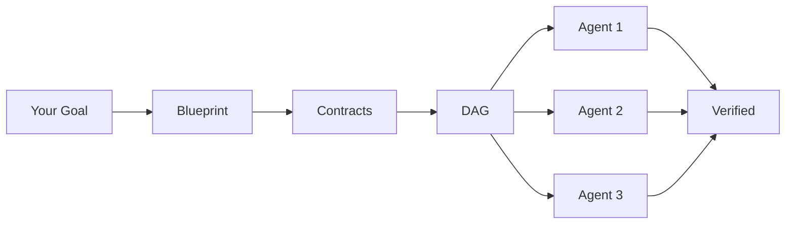
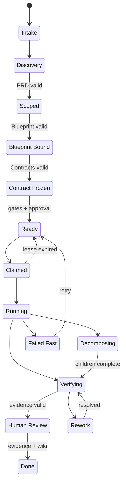
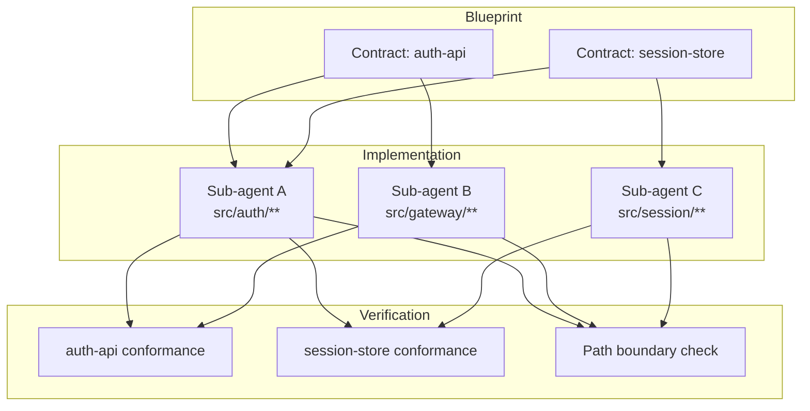

<p align="center">
  <strong>Make It Real</strong><br>
  <em>The architect for Claude Code — design before you code, parallel agents enforce the contract.</em>
</p>

<p align="center">
  
  
  
  
  
</p>

<p align="center">
  <a href="#quick-start">Quick Start</a> •
  <a href="#demo">Demo</a> •
  <a href="#how-it-works">How It Works</a> •
  <a href="#why-contracts">Why Contracts</a> •
  <a href="docs/getting-started.md">Docs</a>
</p>

---

## The Problem

You ask Claude Code to build something ambitious. It starts coding immediately — no architecture, no boundaries, no integration plan. Halfway through, modules conflict. State leaks across seams. The auth layer reaches into the database. You spend the night debugging AI-generated spaghetti that passed no design review.

**AI writes code fast. Speed without structure produces bugs, not software.**

## The Solution

Make It Real forces Claude Code to **architect before it implements**. From your one-line request it generates a Blueprint — module boundaries, interface contracts, a dependency graph. You review and approve. Then it decomposes the work into parallel sub-agents, each locked to one responsibility, implementing against frozen contracts.

The contracts become tests. When every sub-agent's tests pass, integration is already proven.

```
You: "Build user auth with OAuth, sessions, and role-based access"

Make It Real:
  1. Architects        → Blueprint with 4 responsibility units
  2. Freezes contracts → OpenAPI specs, module interfaces, IO signatures
  3. Generates tests   → From contracts, before any implementation
  4. Launches agents   → Each owns ONE unit, must pass contract tests
  5. Verifies          → Boundaries enforced, evidence collected, done.
```

> **Other plugins make Claude code faster. Make It Real makes Claude code correctly.**

## Quick Start

Install through the Claude Code plugin marketplace:

```text
/plugin marketplace add 52g-tools/dev-harness
/plugin install makeitreal@52g
```

Then drive a feature end-to-end:

```text
/makeitreal:plan "REST API for user management with JWT auth"
# review the generated Blueprint inline
/makeitreal:plan approve
/makeitreal:launch
/makeitreal:status
```

Short namespace also available: `/mir:plan`, `/mir:launch`, `/mir:status`. See the [Getting Started guide](docs/getting-started.md) for the full walkthrough.

## Demo

No project? Try a built-in template — generates a full Blueprint into a temp directory in under a minute:

```text
/makeitreal:demo todo-app       # simple: CRUD todo module
/makeitreal:demo rest-api       # medium: books API with JWT auth
/makeitreal:demo auth-system    # complex: 4-unit auth with RBAC
```

Run from the repo directly without the plugin:

```bash
git clone https://github.com/52g-tools/dev-harness && cd dev-harness
node bin/harness.mjs demo rest-api
```

The demo prints the run directory, the dashboard URL, and the Ready-gate status.

## How It Works



| Phase | What Happens | Gate |
|-------|-------------|------|
| **Plan** | PRD generated from your request: goals, acceptance criteria, non-goals. | PRD valid |
| **Blueprint** | Architecture designed: modules, contracts, boundaries, DAG. | Design pack valid |
| **Freeze** | Contracts locked: OpenAPI specs, module interfaces, IO signatures. | Contracts valid |
| **Review** | You approve, reject, or revise. Human in the loop. | Blueprint approved |
| **Ready** | All gates pass: PRD trace, contract completeness, boundaries, verify plans. | Ready gate |
| **Launch** | Sub-agents dispatched in DAG order, each in their responsibility unit. | — |
| **Verify** | Contract tests run, evidence collected, path boundaries enforced. | Verification pass |
| **Done** | Wiki sync, evidence audit, all gates green. | Done gate |

### The Kanban Flow

Every work item moves through a 16-lane state machine with gate-enforced transitions:



`Blocked` and `Cancelled` are terminal off-ramps from any active lane.

## Why Contracts

This is the core insight. Most Claude Code plugins treat implementation as a single stream — one agent, one pass, hope for the best. Make It Real treats it as a **distributed systems problem**.

1. **Extract contracts before implementation** — OpenAPI specs, module interfaces with typed signatures, dependency declarations.
2. **Freeze them** — contracts become immutable before any sub-agent starts.
3. **Generate conformance tests** — from the frozen contracts, automatically.
4. **Enforce boundaries** — sub-agents can only touch files in their `allowedPaths`.
5. **Validate on completion** — every sub-agent must pass contract conformance.



**Unit test = QA.** Because contracts generate the tests and sub-agents implement to pass them, green tests prove integration. No integration phase needed.

Read the full [Contracts deep-dive](docs/concepts/contracts.md).

## Commands

| Command | Purpose |
|---------|---------|
| `/makeitreal:plan <request>` | Generate Blueprint from a request (interactive if blank) |
| `/makeitreal:plan approve` | Approve the current Blueprint |
| `/makeitreal:plan reject` | Reject and discard the current Blueprint |
| `/makeitreal:launch` | Execute the approved Blueprint through gated implementation |
| `/makeitreal:demo [template]` | Generate a sample Blueprint from a built-in template |
| `/makeitreal:status` | Run phase, blockers, evidence, dashboard URL |
| `/makeitreal:verify` | Run verification evidence for current work items |
| `/makeitreal:setup` | Bootstrap project config, select an existing run |
| `/makeitreal:doctor` | Diagnose plugin health, hooks, run state |
| `/makeitreal:config` | View or modify project configuration |

Short aliases: `/mir:*` mirrors every command above.

## What Gets Generated

```
.makeitreal/runs/<run-id>/
├── prd.json                    # Goals, acceptance criteria, non-goals
├── design-pack.json            # Topology, state flow, APIs, boundaries,
│                               #   module interfaces, sequences
├── responsibility-units.json   # Ownership boundaries with allowed paths
├── work-item-dag.json          # Dependency graph (nodes + contract edges)
├── blueprint-review.json       # Approval status with fingerprint
├── work-items/                 # Per-item contractIds, allowedPaths,
│   └── *.json                  #   verificationCommands, prdTrace
├── contracts/                  # Frozen interface specifications
│   ├── *.openapi.json          #   OpenAPI 3.x with examples
│   └── *.json                  #   Module surface signatures
├── evidence/                   # Verification + wiki sync evidence
├── preview/                    # Dashboard HTML + model
└── board.json                  # Kanban state for all work items
```

## Architecture

A Claude Code plugin backed by a zero-dependency Node.js engine:

```
Plugin Layer (commands/ + skills/)   ← Slash commands
  │
  ▼
Engine (src/)                        ← Pure logic, no AI dependencies
  ├── domain/        PRD, design pack, DAG, evidence, path policy
  ├── blueprint/     Review, approval, fingerprinting
  ├── board/         Kanban store, claims, dependency graph, boundaries
  ├── kanban/        State machine (16 lanes, typed transitions)
  ├── gates/         Ready gate, Done gate validations
  ├── orchestrator/  Tick loop, native Task dispatch, retry, runtime state
  ├── adapters/      OpenAPI conformance, module surface, path boundary
  ├── preview/       Dashboard model + renderer
  ├── wiki/          Live documentation sync
  └── io/            JSON persistence
```

Pure validation logic — no network calls, no API keys, no external services. Runs inside Claude Code's Node.js runtime. 373 tests, zero runtime dependencies.

## Key Concepts

- **[Blueprints](docs/concepts/blueprints.md)** — Architecture-first documents generated before any code.
- **[Contracts](docs/concepts/contracts.md)** — Module interfaces that become enforceable conformance tests.
- **[Responsibility Units](docs/concepts/responsibility-units.md)** — Ownership boundaries sub-agents cannot cross.
- **[Orchestration](docs/concepts/orchestration.md)** — DAG-based parallel execution with gates, retry, and evidence.

## Requirements

- Claude Code (latest)
- Node.js ≥ 20

## License

MIT — see [LICENSE](LICENSE).

---

<p align="center">
  <em>Architecture-first AI engineering.</em>
</p>
