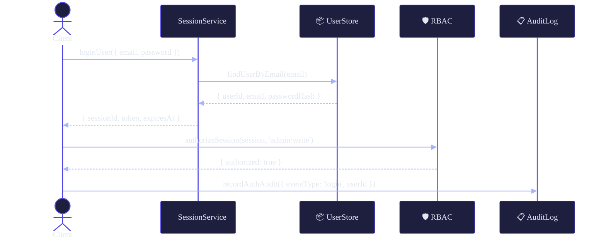
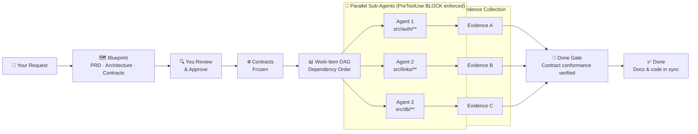

[English](README.md) · [한국어](README.ko.md) · [日本語](README.ja.md) · [中文](README.zh.md)

<div align="center">


# Make It Real

**Make It Simple. Make It Work. Make It Real.**

*Contract first. Code follows.*

<p>
  
  
  
  
</p>

<p>
  <a href="#installation">Install</a> ·
  <a href="#three-commands-to-know">Commands</a> ·
  <a href="#the-development-flow">Flow</a> ·
  <a href="#the-docs-first-philosophy">Philosophy</a> ·
  <a href="docs/README.md">Docs</a>
</p>

</div>

---

Most AI coding tools start with the code. Make It Real starts with the docs.

You write what the product **should** be — goals, interfaces, acceptance criteria, module boundaries. Make It Real freezes those as machine-checkable contracts, then dispatches parallel Claude sub-agents that can only implement what the docs describe. When the agents finish, the code and the docs are in sync by construction.

---

## Installation

**Requirements:** Claude Code (latest) · Node.js ≥ 20

**Step 1 — Add the marketplace:**

```bash
claude plugin marketplace add 52g github:mir-makeitreal/makeitreal
```

**Step 2 — Install the plugin:**

```bash
claude plugin install makeitreal@52g
```

**Verify:**

```
/mir:status
```

No API keys. No build step. No separate process.

---

## Three Commands to Know

| Command | What it does |
|---------|-------------|
| `/mir:plan "your request"` | Generate a blueprint. PRD, architecture, contracts, DAG, dashboard. Review and approve inline. |
| `/mir:launch` | Execute the approved blueprint. Dispatches sub-agents in DAG order through the gated loop. |
| `/mir:status` | Current phase, work-item states, blockers, dashboard URL. |

That's the core loop: **plan → launch → status**.

Every `/mir:` command has a `/makeitreal:` equivalent for those who prefer the full name. Power-user commands: [docs/command-reference.md](docs/command-reference.md)

---

## The Development Flow

From a plain-language request to verified, in-sync code — six stages:

**Stage 1 — Describe** · Tell it what to build in plain language

**Stage 2 — Blueprint** · Claude designs: spec, architecture, contracts, task graph

**Stage 3 — Review** · You approve. Fingerprint locks every artifact.

**Stage 4 — Dispatch** · Parallel agents assigned to modules, boundaries enforced

**Stage 5 — Build** · Each agent implements its module, cannot touch others

**Stage 6 — Verify** · Contract conformance proven, evidence written, Done

**Generated from `/mir:plan auth-system` — Authentication System blueprint**

Module dependency graph:


Scenario: login and authorize a protected action:



> *Both diagrams are auto-generated from the blueprint. Contracts are frozen before any agent runs.*




> *Contracts are frozen before any agent runs. Each agent is physically constrained to its declared paths by the `PreToolUse` hook. The Done gate blocks until every agent has proven conformance.*

Full walkthrough: [docs/how-it-works.md](docs/how-it-works.md)

---

## The Docs-First Philosophy

Most teams write docs **after** the code. They document what was built, not what should be built. The result: docs that drift, specs that lie, and integrations that surprise.

Make It Real inverts this. **The docs are the source of truth.** Code is just the proof that the docs are correct.

```
Traditional:  request → code → (maybe) docs → tests catch surprises
Make It Real: request → docs → frozen contracts → code proves docs → no surprises
```

This isn't just a better workflow for developers. It's a shared language for **everyone** on the team:

- **PMs** write acceptance criteria that become automated gates — not Jira tickets that get forgotten
- **Architects** define module boundaries that sub-agents literally cannot cross
- **Engineers** implement against contracts they didn't write, knowing the interface is already proven
- **Reviewers** approve a blueprint, not a diff — before a single line of code is written

The spec is the test. The contract is the interface. The docs and the code are always in sync.

---

## Before / After

The same request — "build a 4-module auth system" — with and without Make It Real:

| | Without Make It Real | With Make It Real |
|---|---|---|
| **Planning** | Starts coding immediately | Blueprint generated first: PRD, module map, contracts, DAG. You approve before a line of code is written. |
| **Boundaries** | One agent touches everything. Auth calls into the DB layer. | Each sub-agent has `allowedPaths`. The hook **rejects** writes outside the declared module. |
| **Contracts** | Hope modules fit together at the end | OpenAPI specs and typed interfaces are frozen before implementation. Sub-agents implement against them. |
| **Parallelism** | Sequential, or `Task` calls that step on each other | DAG-scheduled sub-agents with claims, leases, and retry. Dependency order enforced. |
| **Integration** | "Works on my branch" → merge conflicts | Contract conformance at the unit level proves integration. No separate integration phase. |
| **Evidence** | "I think it's done" | Structured verification evidence for every work item. The Done gate blocks until proof exists. |
| **Docs–code sync** | Docs drift within days | Docs are the source of truth. Code is the proof. They can't diverge. |

---

## Why It Works

**424 tests. Zero dependencies.**

The engine is pure Node.js validation logic. No network calls, no API keys, no external services. It runs inside Claude Code's runtime, offline, at zero marginal cost.

**Contracts aren't documentation. They're enforcement.**

A contract is an OpenAPI 3.x specification or a typed module surface. The engine validates completeness at generation time: every path has an operation, every operation has an `operationId`, every non-GET endpoint has a request body schema, every success response has a JSON schema, every error case is declared. When a sub-agent's tests pass, it has proven it implements the contract. Integration isn't a separate phase — it falls out of conformance.

**Path boundaries aren't suggestions. They're enforced by a hook.**

The `PreToolUse` hook intercepts every `Write` and `Edit` call from a sub-agent and checks the target path against `allowedPaths`. An agent that steps outside its declared boundary fails immediately — not at code review, not at merge time.

**Approval fingerprinting prevents silent drift.**

The blueprint fingerprint is a SHA-256 of all artifacts. If a contract changes after approval — even one character — the Ready gate rejects the run and demands re-approval. There is no way to start implementation against a blueprint you didn't review.

Read more: [Contracts](docs/concepts/contracts.md) · [Responsibility Units](docs/concepts/responsibility-units.md) · [Blueprints](docs/concepts/blueprints.md) · [Orchestration](docs/concepts/orchestration.md)

---

## Compared to Alternatives

| | Make It Real | Vanilla Claude Code | Superpowers | Spec Kit | GSD |
|---|:---:|:---:|:---:|:---:|:---:|
| Architecture before code | ✅ | ❌ | ✅ | ✅ | ✅ |
| Machine-checkable contracts | ✅ | ❌ | ❌ | ⚠️ | ❌ |
| Contract-to-test generation | ✅ | ❌ | ❌ | ❌ | ❌ |
| DAG-scheduled parallel agents | ✅ | ⚠️ | ✅ | ⚠️ | ✅ |
| Path boundary enforcement (hook) | ✅ | ❌ | ❌ | ❌ | ❌ |
| Approval fingerprinting | ✅ | ❌ | ❌ | ❌ | ❌ |
| Quality gates (engine-enforced) | ✅ | ❌ | ⚠️ | ⚠️ | ⚠️ |
| Interactive dashboard | ✅ | ❌ | ❌ | ❌ | ❌ |
| Zero runtime deps | ✅ | ✅ | ✅ | ❌ | ⚠️ |
| Docs–code sync guarantee | ✅ | ❌ | ❌ | ⚠️ | ❌ |

⚠️ = partial or optional · Full honest comparison: [docs/comparison.md](docs/comparison.md)

---

## Contributing

Found a bug? Have an idea? [Open an issue](https://github.com/mir-makeitreal/makeitreal/issues).

```bash
git clone https://github.com/mir-makeitreal/makeitreal && cd makeitreal
node --test          # runs all 424 tests, ~12s
```

No build step. No dependencies to install. Clone and test.

Please read [CONTRIBUTING.md](CONTRIBUTING.md) before opening a PR. The key rule: **every change must be documented first.** If you can't write the docs for a feature, the feature isn't ready to be built.

---

## License

MIT — see [LICENSE](LICENSE).

---

<div align="center">

**[Get started →](docs/getting-started.md)**
&nbsp;&nbsp;·&nbsp;&nbsp;
[Read the docs](docs/README.md)
&nbsp;&nbsp;·&nbsp;&nbsp;
[Report an issue](https://github.com/mir-makeitreal/makeitreal/issues)

*Write the docs. Then make it real.*

</div>
