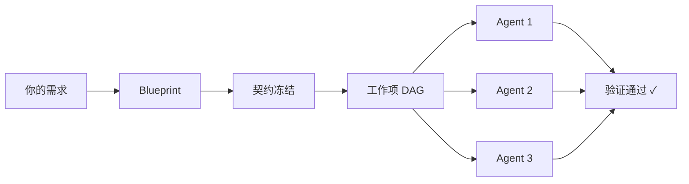

[English](README.md) · [한국어](README.ko.md) · [日本語](README.ja.md) · [中文](README.zh.md)

# Make It Real

**Make It Simple. Make It Work. Make It Real.**

*Contract first. Code follows.*

<p align="center">
  
  
  
  
</p>

<p align="center">
  <a href="#60-秒快速上手">快速上手</a> •
  <a href="#前后对比">前后对比</a> •
  <a href="#工作原理">工作原理</a> •
  <a href="docs/README.md">文档</a>
</p>

---

## 安装

**环境要求：** Claude Code（最新版）· Node.js ≥ 20

```bash
claude plugin install makeitreal@52g
```

验证安装：

```
/mir:status
```

无需 API 密钥，无需构建步骤，无需独立进程。

> 已经安装了 Claude Code？插件安装完成后 `/mir:` 命令立即可用。

---

## 60 秒快速上手

无需安装，克隆仓库直接跑演示：

```bash
git clone https://github.com/mir-makeitreal/makeitreal && cd makeitreal
node bin/harness.mjs demo rest-api --pretty
```

这条命令会把完整的架构 Blueprint（PRD、契约、工作项 DAG、仪表盘 HTML）输出到临时目录。用以下命令打开仪表盘：

```bash
# runDir 路径会在演示输出中打印出来
open <runDir>/preview/index.html
```

在 Claude Code 里，一条斜杠命令搞定：

```
/mir:demo rest-api
```

三个内置模板：`todo-app`（简单）、`rest-api`（中等）、`auth-system`（复杂）。

---

## Docs First 理念

> 「先把产品文档写好，然后 Make It Real。」

这不只是一个「Blueprint 优先的 Claude Code 插件」，而是一套完整的工程哲学。

**让 PM、架构师和工程师说同一种语言。**

传统开发中，需求文档、设计文档和代码分散在不同地方，随时间推移不断漂移。在 Make It Real 里，文档是唯一可信来源——代码跟着文档走，永远不会反过来。

| 原则 | 含义 |
|------|------|
| **规格即测试** | OpenAPI 契约和类型化接口直接驱动一致性测试。测试通过，意味着规格已被机器验证为满足。 |
| **契约即接口** | 模块边界不是「文档」，而是「可执行约束」。子 Agent 针对契约来实现，不靠猜测接口。 |
| **未经批准不写代码** | Blueprint 批准之前，一行代码都不会产生。批准操作会记录指纹——产物一旦变更，必须重新批准。 |

深入了解这套理念：[概念：Blueprints](docs/concepts/blueprints.md) · [概念：Contracts](docs/concepts/contracts.md)

---

## 前后对比

同样是让 Claude Code 构建一个 4 模块认证系统，有没有 Make It Real 的差距在这里：

|  | 没有 Make It Real | 有 Make It Real |
|---|---|---|
| **规划** | 直接开始写代码 | 先生成包含模块边界、契约和依赖图的 Blueprint，你审查并批准后才有任何代码产生。 |
| **边界** | 单个 Agent 碰所有东西，Auth 层直接打穿数据库层。 | 每个子 Agent 有独立的 `allowedPaths`，物理上无法编辑自己模块之外的文件。 |
| **契约** | 祈祷最后模块能拼到一起 | OpenAPI 规格和类型化接口在实现前就已冻结，子 Agent 对着规格实现。 |
| **并行度** | 顺序执行，或手动调用 `Task` 工具 | DAG 调度器带 Claims、Lease、重试机制，自动并行调度子 Agent。 |
| **集成** | "在我分支上能跑" → 合并冲突 | 契约一致性测试通过 → 集成已被证明。 |
| **证据** | "我觉得应该好了" | 每个工作项都有结构化验证证据，没有证据，完成门不放行。 |

---

## 工作原理



1. **描述你想要什么。** 一句话就够。
2. **引擎生成 Blueprint。** PRD、架构、模块接口、OpenAPI 契约、责任边界、工作项 DAG——全部在任何代码产生前就已生成并验证。
3. **你来审批。** 检查 Blueprint，要求修改，或者直接拒绝。批准操作记录指纹——任何产物变更后，门控会要求重新批准。
4. **子 Agent 并行构建。** 每个 Agent 负责一个责任单元，针对冻结契约实现，只能操作自己声明的文件路径。
5. **门控强制把关。** Ready 门在 Blueprint 通过健全性检查前阻止启动；Done 门在验证证据存在前阻止完成——没有自我声明的「完成」。

完整流水线说明：[How It Works](docs/how-it-works.md)

---

## 三条核心命令

| 命令 | 作用 |
|---------|------|
| `/mir:plan "你的需求"` | 从需求生成 Blueprint，内联审查并批准。 |
| `/mir:launch` | 执行已批准的 Blueprint，按 DAG 顺序调度子 Agent。 |
| `/mir:status` | 查看当前阶段、工作项状态、阻塞项和仪表盘 URL。 |

核心循环就是：**plan → launch → status**。

更多高级命令见 [命令参考](docs/command-reference.md)。

所有 `/mir:` 命令都有对应的完整形式 `/makeitreal:` 等价命令。

---

## 生成的产物

```
.makeitreal/runs/<run-id>/
├── prd.json                    # 目标、验收标准、非目标
├── design-pack.json            # 架构拓扑、API、边界
├── responsibility-units.json   # 带 allowedPaths 的所有权边界
├── work-item-dag.json          # 带契约边的依赖图
├── blueprint-review.json       # 带指纹的批准状态
├── contracts/                  # 冻结的接口规格
│   ├── *.openapi.json          #   带示例的 OpenAPI 3.x
│   └── *.json                  #   模块表面签名
├── work-items/                 # 带验证命令的逐项任务
├── evidence/                   # 验证 + wiki 同步证据
├── preview/                    # 仪表盘 HTML
└── board.json                  # 所有工作项的看板状态
```

---

## 为什么它有效

**424 个测试，零依赖。**

引擎是纯 Node.js 验证逻辑——无网络调用，无 API 密钥，无外部服务，直接跑在 Claude Code 的运行时里。

**契约不是文档。** 它是机器可检查的接口规格（OpenAPI 3.x + 类型化模块表面），可以直接生成一致性测试。子 Agent 的测试通过了，就证明它正确实现了契约。集成不是独立的阶段——它是契约一致性的自然结果。

**路径边界不是建议。** 引擎会验证没有子 Agent 越界操作 `allowedPaths` 之外的文件。分配到 `src/auth/**` 的 Agent 如果动了 `src/database/schema.ts`，验证直接失败。

延伸阅读：[Contracts](docs/concepts/contracts.md) · [Responsibility Units](docs/concepts/responsibility-units.md) · [Blueprints](docs/concepts/blueprints.md)

---

## 系统要求

- Claude Code（最新版）
- Node.js ≥ 20

---

## 与其他工具的对比

|  | Make It Real | Vanilla Claude Code | Superpowers | Spec Kit | GSD |
|---|:---:|:---:|:---:|:---:|:---:|
| 代码之前先做架构 | ✅ | ❌ | ✅ | ✅ | ✅ |
| 机器可检查的契约 | ✅ | ❌ | ❌ | ⚠️ | ❌ |
| DAG 调度并行 Agent | ✅ | ⚠️ | ✅ | ⚠️ | ✅ |
| 路径边界强制执行 | ✅ | ❌ | ❌ | ❌ | ❌ |
| 质量门控（引擎强制） | ✅ | ❌ | ⚠️ | ⚠️ | ⚠️ |
| 交互式仪表盘 | ✅ | ❌ | ❌ | ❌ | ❌ |
| 零运行时依赖 | ✅ | ✅ | ✅ | ❌ | ⚠️ |

各工具的诚实横评：[docs/comparison.md](docs/comparison.md)

---

## 参与贡献

发现 Bug 或有新想法？[提 Issue](https://github.com/mir-makeitreal/makeitreal/issues)。

```bash
git clone https://github.com/mir-makeitreal/makeitreal && cd makeitreal
node --test          # 运行全部 424 个测试，约 12 秒
```

无需构建步骤，无需安装依赖，克隆即可测试。

---

## 许可证

MIT — 详见 [LICENSE](LICENSE)。

---

<p align="center">
  <a href="docs/getting-started.md"><strong>开始使用 →</strong></a>
  &nbsp;&nbsp;·&nbsp;&nbsp;
  <a href="docs/README.md">阅读文档</a>
  &nbsp;&nbsp;·&nbsp;&nbsp;
  <a href="https://github.com/mir-makeitreal/makeitreal/issues">报告问题</a>
</p>
