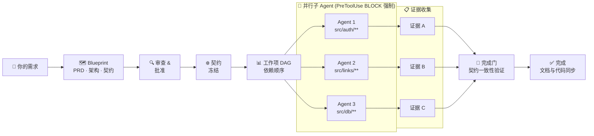

[English](README.md) · [한국어](README.ko.md) · [日本語](README.ja.md) · [中文](README.zh.md)

<div align="center">


# Make It Real

**Make It Simple. Make It Work. Make It Real.**

*Contract first. Code follows.*

<p>
  
  
  
  
</p>

<p>
  <a href="#安装">安装</a> ·
  <a href="#三条核心命令">命令</a> ·
  <a href="#开发流程">流程</a> ·
  <a href="#docs-first-理念">理念</a> ·
  <a href="docs/README.md">文档</a>
</p>

</div>

---

大多数 AI 编码工具从代码开始。Make It Real 从文档开始。

你先写清楚产品**应该**是什么样 — 目标、接口、验收标准、模块边界。Make It Real 把这些冻结成机器可检查的契约，然后派发只能实现文档所描述内容的并行 Claude 子 Agent。Agent 跑完时，代码和文档在结构上就是同步的。

---

## 安装

**环境要求:** Claude Code (最新版) · Node.js ≥ 20

**第一步 — 添加插件市场:**

```bash
claude plugin marketplace add 52g github:mir-makeitreal/makeitreal
```

**第二步 — 安装插件:**

```bash
claude plugin install makeitreal@52g
```

**验证安装:**

```
/mir:status
```

无需 API 密钥。无需构建。无需独立进程。

---

## 三条核心命令

| 命令 | 作用 |
|---------|------|
| `/mir:plan "你的需求"` | 生成 Blueprint。PRD、架构、契约、DAG、仪表盘。内联审查并批准。 |
| `/mir:launch` | 执行已批准的 Blueprint。按 DAG 顺序通过门控循环派发子 Agent。 |
| `/mir:status` | 当前阶段、工作项状态、阻塞项、仪表盘 URL。 |

核心循环就是：**plan → launch → status**。

所有 `/mir:` 命令都有对应的完整形式 `/makeitreal:` 等价命令，供偏好完整名称的人使用。高级命令：[docs/command-reference.md](docs/command-reference.md)

---

## 开发流程

从一句大白话需求，到验证过、与文档同步的代码 — 六个阶段：

**阶段 1 — 描述** · 用大白话说清楚要构建什么

**阶段 2 — Blueprint** · Claude 来设计：规格、架构、契约、任务图

**阶段 3 — 审查** · 你来批准。指纹锁定每一份产物。

**阶段 4 — 派发** · 并行 Agent 被分配到各模块，边界被强制执行

**阶段 5 — 构建** · 每个 Agent 实现自己的模块，碰不到别人的

**阶段 6 — 验证** · 契约一致性被证明，证据被写入，完成

<!-- SCREENSHOT: dashboard -->
<p align="center">
  
</p>

> *Architecture Dossier — 由 `/mir:plan` 生成。模块图、冻结的契约、任务依赖顺序、验收标准。全部交叉链接，全部机器可检查。*




> *契约在任何 Agent 运行之前就被冻结。每个 Agent 都被 `PreToolUse` 钩子物理约束在声明的路径内。完成门会一直阻塞，直到每个 Agent 都证明了一致性。*

完整流水线说明：[docs/how-it-works.md](docs/how-it-works.md)

---

## Docs First 理念

大多数团队在写完代码**之后**才补文档。他们记录的是已经做出来的东西，而不是应该做的东西。结果总是一样：文档漂移、规格说谎、每次集成都冒出意外。

Make It Real 把这个顺序倒过来。**文档是唯一可信来源。** 代码只是文档正确的证明。

```
传统方式：     需求 → 代码 →（也许）文档 → 测试撞出意外
Make It Real： 需求 → 文档 → 冻结契约 → 代码证明文档 → 没有意外
```

这不只是给开发者的一套更好的工作流。它是团队**每个人**的共同语言：

- **PM** 写下直接变成自动化门控的验收标准 — 而不是被遗忘在 Jira 里的工单
- **架构师** 定义子 Agent 在物理上无法跨越的模块边界
- **工程师** 针对自己没写的契约来实现，因为接口早已被证明
- **审查者** 批准的是 Blueprint，而不是 diff — 在一行代码写出来之前

规格即测试。契约即接口。文档和代码永远同步。

---

## 前后对比

同样是让 Claude Code 构建一个 4 模块认证系统，有没有 Make It Real 的差距在这里：

|  | 没有 Make It Real | 有 Make It Real |
|---|---|---|
| **规划** | 直接开始写代码 | 先生成 Blueprint：PRD、模块图、契约、DAG。在一行代码写出来之前你就批准。 |
| **边界** | 单个 Agent 碰所有东西，Auth 层直接打穿数据库层。 | 每个子 Agent 有独立的 `allowedPaths`。钩子**拒绝**写入声明模块之外的文件。 |
| **契约** | 祈祷最后模块能拼到一起 | OpenAPI 规格和类型化接口在实现前就已冻结，子 Agent 对着规格实现。 |
| **并行度** | 顺序执行，或互相踩脚的 `Task` 调用 | 带 Claims、Lease、重试的 DAG 调度子 Agent，强制依赖顺序。 |
| **集成** | "在我分支上能跑" → 合并冲突 | 单元级的契约一致性证明集成。没有单独的集成阶段。 |
| **证据** | "我觉得应该好了" | 每个工作项都有结构化验证证据。没有证据，完成门不放行。 |
| **文档–代码同步** | 几天内文档就漂移 | 文档是唯一可信来源。代码是证明。两者无法分叉。 |

---

## 为什么它有效

**424 个测试，零依赖。**

引擎是纯 Node.js 验证逻辑——无网络调用，无 API 密钥，无外部服务。它跑在 Claude Code 的运行时里，离线运行，边际成本为零。

**契约不是文档，是强制约束。**

契约是 OpenAPI 3.x 规格，或类型化的模块表面。引擎在生成时就验证完整性：每条路径都有操作，每个操作都有 `operationId`，每个非 GET 端点都有请求体 schema，每个成功响应都有 JSON schema，每个错误情况都已声明。子 Agent 的测试通过了，就证明它实现了契约。集成不是独立的阶段——它是一致性的自然结果。

**路径边界不是建议，是钩子强制执行的。**

`PreToolUse` 钩子拦截子 Agent 的每一次 `Write` 和 `Edit` 调用，把目标路径对照 `allowedPaths` 检查。越出声明边界的 Agent 会立刻失败——不是在代码审查时，不是在合并时,而是当场。

**批准指纹阻止悄无声息的漂移。**

Blueprint 指纹是所有产物的 SHA-256。批准之后契约一旦变更——哪怕一个字符——Ready 门就会拒绝运行并要求重新批准。你无法基于一份没审查过的 Blueprint 开始实现。

延伸阅读：[Contracts](docs/concepts/contracts.md) · [Responsibility Units](docs/concepts/responsibility-units.md) · [Blueprints](docs/concepts/blueprints.md) · [Orchestration](docs/concepts/orchestration.md)

---

## 与其他工具的对比

|  | Make It Real | Vanilla Claude Code | Superpowers | Spec Kit | GSD |
|---|:---:|:---:|:---:|:---:|:---:|
| 代码之前先做架构 | ✅ | ❌ | ✅ | ✅ | ✅ |
| 机器可检查的契约 | ✅ | ❌ | ❌ | ⚠️ | ❌ |
| 契约→测试生成 | ✅ | ❌ | ❌ | ❌ | ❌ |
| DAG 调度并行 Agent | ✅ | ⚠️ | ✅ | ⚠️ | ✅ |
| 路径边界强制执行（钩子） | ✅ | ❌ | ❌ | ❌ | ❌ |
| 批准指纹 | ✅ | ❌ | ❌ | ❌ | ❌ |
| 质量门控（引擎强制） | ✅ | ❌ | ⚠️ | ⚠️ | ⚠️ |
| 交互式仪表盘 | ✅ | ❌ | ❌ | ❌ | ❌ |
| 零运行时依赖 | ✅ | ✅ | ✅ | ❌ | ⚠️ |
| 文档–代码同步保证 | ✅ | ❌ | ❌ | ⚠️ | ❌ |

⚠️ = 部分或可选 · 完整诚实横评：[docs/comparison.md](docs/comparison.md)

---

## 参与贡献

发现 Bug 或有新想法？[提 Issue](https://github.com/mir-makeitreal/makeitreal/issues)。

```bash
git clone https://github.com/mir-makeitreal/makeitreal && cd makeitreal
node --test          # 运行全部 424 个测试，约 12 秒
```

无需构建步骤，无需安装依赖，克隆即可测试。

提 PR 前请先读 [CONTRIBUTING.md](CONTRIBUTING.md)。核心规则：**每一处变更都必须先写文档。** 如果你写不出一个功能的文档，那这个功能还没准备好被构建。

---

## 许可证

MIT — 详见 [LICENSE](LICENSE)。

---

<div align="center">

**[开始使用 →](docs/getting-started.md)**
&nbsp;&nbsp;·&nbsp;&nbsp;
[阅读文档](docs/README.md)
&nbsp;&nbsp;·&nbsp;&nbsp;
[报告问题](https://github.com/mir-makeitreal/makeitreal/issues)

*先写文档，然后让它成真。*

</div>
