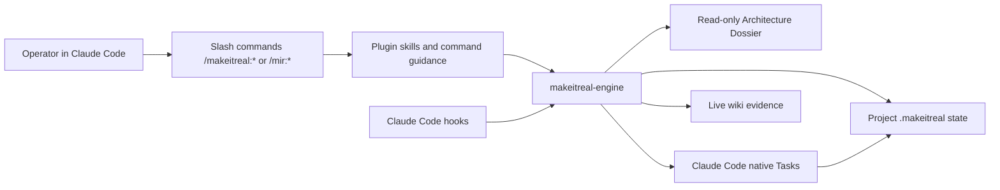
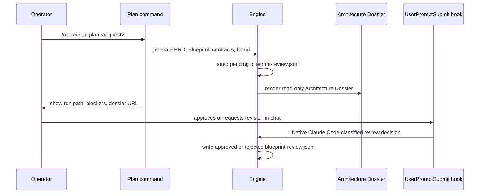

# Make It Real Architecture

Make It Real is a Claude Code plugin plus a local deterministic engine. The
plugin is the user-facing surface. The engine owns state, gates, evidence, and
runner orchestration.

The core invariant is simple: implementation may not start until a reviewable
Blueprint exists and has explicit approval evidence. That Blueprint must define
responsibility boundaries, module public surfaces, input/output/error
signatures, contracts, allowed paths, verification commands, and Kanban work
items.

## System Shape



## Runtime Layers

| Layer | Location | Responsibility |
| --- | --- | --- |
| Marketplace | `.claude-plugin/marketplace.json` | Publishes the `52g` marketplace with `makeitreal` and `mir` plugins. |
| Canonical plugin | `plugins/makeitreal/` | Owns slash commands, skills, hooks, and bundled engine files. |
| Alias plugin | `plugins/mir/` | Exposes `/mir:*` commands and depends on `makeitreal@52g`; it does not register duplicate hooks. |
| Engine CLI | `bin/harness.mjs` | Internal command router used by slash commands and tests. |
| Domain modules | `src/domain/`, `src/gates/`, `src/kanban/` | Validate PRDs, design packs, transitions, contracts, paths, and errors. |
| Board/orchestrator | `src/board/`, `src/orchestrator/` | Claims work, dispatches runner attempts, records runtime state, handles retry/reconcile, completes verified work. |
| Hooks | `hooks/claude/*.mjs` | Enforce boundaries during Claude Code sessions without becoming noisy when inactive. |
| Preview / Architecture Dossier | `src/preview/`, `src/dashboard/` | Render read-only Blueprint reference documentation, module contracts, scenario flows, diagnostics, and evidence views. |
| Project state | `.makeitreal/` in each target project | Stores config, current run pointer, run packets, evidence, workspaces, and live wiki output. |

## Public Command Surface

Normal workflow:

- `/makeitreal:plan <request>`
- `/makeitreal:launch`
- `/makeitreal:status`

Ralph-like entrypoint:

- `/makeitreal:launch <request>`

When `launch` receives a request and no run is active, it must run the planning
flow first and stop at Blueprint review. It must not execute implementation
until approval is recorded.

Advanced workflow:

- `/makeitreal:setup`
- `/makeitreal:verify`
- `/makeitreal:config`
- `/makeitreal:doctor`

Internal engine commands such as `gate`, `board claim`, `orchestrator tick`,
`orchestrator complete`, `wiki sync`, and `hooks install` are not normal
user-facing commands. Slash commands may invoke them internally.

Public slash commands present semantic operator workflows. Internal engine
commands remain deterministic, scriptable, and JSON-oriented. The LLM may
classify natural-language operator intent, but writes must pass through typed
engine flags or named profiles; it must not edit `.makeitreal/config.json`
directly or expose raw `features.*` keys as the normal workflow.

## Project State Layout

Each target project gets local runtime state under `.makeitreal/`. This path is
automatically added to `.gitignore` by `plan` and `setup`.

```text
.makeitreal/
  config.json
  current-run.json
  runs/
    <run-id>/
      prd.json
      design-pack.json
      responsibility-units.json
      work-item-dag.json
      blueprint-review.json
      trust-policy.json
      native-role-mapping.json
      board.json
      runtime-state.json
      contracts/
        *.openapi.json
      work-items/
        work.<id>.json
      agent-packets/
        work.<id>.implementation.json
      preview/
        index.html
        preview-model.json
        operator-status.json
      evidence/
        *.verification.json
        *.wiki-sync.json
      attempts/
        *.json
      workspaces/
        work.<id>/             # scripted fixture/legacy runner only
          .makeitreal/
            handoff.json
            prompt.md
            source/
```

`current-run.json` is only a pointer. The run packet under `runs/<run-id>/` is
the source of truth for gates and execution.

## Responsibility DAG Authority

`work-item-dag.json` is the canonical execution graph. It declares every graph
node, node kind, responsibility unit, required-for-Done flag, and dependency
edge. `board.workItemDAG` is only a regenerated projection for board
compatibility and must not become the authority for graph-aware gates.

Ready and Done gates validate every `requiredForDone` DAG node. The legacy
`designPack.workItemId` field is display metadata for the primary slice; it must
not be used as graph authority once a run has multiple responsibility nodes.

## Native Project Root Rule

Native Claude Code Tasks edit the real project root under parent-session hooks.
`.makeitreal/runs/*/workspaces/*` is legacy scripted-simulator state only and
must not receive native implementation edits. Native completion rejects reports
that claim project work while changed files are under run workspaces.

## Planning Pipeline



Planning creates:

- PRD with goals, non-goals, acceptance criteria, and verification intent.
- Design pack with architecture, state flow, API/IO specs, module interfaces,
  boundaries, call stack, and sequence diagrams.
- Responsibility units with exactly one owner per executable work item.
- Boundary contracts and contract IDs used by work items.
- Kanban work items with dependencies, allowed paths, and verification commands.
- Canonical `work-item-dag.json` plus the `board.workItemDAG` projection.
- Trust policy for the selected runner mode.
- Pending Blueprint review evidence.
- Read-only Architecture Dossier preview.

If the incoming request spans multiple detected responsibility domains, planning
does not collapse the work into one broad owner. It returns
`HARNESS_RESPONSIBILITY_BOUNDARY_AMBIGUOUS`, a public `nextAction`, and
machine-readable `suggestedBoundaries` with proposed owner, allowed paths,
contract ID, responsibility, and verification command. The operator or LLM
planner must review that proposal and rerun planning with explicit boundaries.
If the caller already supplies an explicit owner, allowed paths, and verification
command for a vertical slice, planning may proceed as one responsibility unit.

The prompt layer follows a small set of workflow rules inspired by production
engineering skill packs without expanding the slash-command surface: conditional
clarification, shared project language, vertical slices, contract-first slicing,
selective context for scoped workers, stop-the-line debugging, and zoom-out
status reports.

## Blueprint Approval Model

Blueprint approval is evidence, not a conversational assumption.

Approval can be recorded in three ways:

- The plan command's Claude Code question UI can send the operator's answer to
  the internal `blueprint review` command, where the same native Claude Code review protocol classifies
  it as approval, rejection, revision request, or no decision.
- Conversational review through `UserPromptSubmit`, where the same native Claude Code review protocol
  classifies the latest user reply with the previous assistant Blueprint report
  as context.
- Explicit/scriptable control via `/makeitreal:plan approve` or
  `/makeitreal:plan reject`.

The native Claude Code review judge is only invoked while `blueprint-review.json` is pending. Once the
Blueprint is approved or rejected, ordinary chat is ignored by the hook.

## Kanban State Model

Work moves through a constrained state machine:

```text
Intake
  -> Discovery
  -> Scoped
  -> Blueprint Bound
  -> Contract Frozen
  -> Ready
  -> Claimed
  -> Running
  -> Verifying
  -> Human Review
  -> Done
```

Failure/recovery lanes:

```text
Running -> Failed Fast -> Ready
Verifying -> Rework -> Verifying
Claimed -> Ready when lease expires
```

Key gate rules:

- `Contract Frozen -> Ready` requires design, contract, responsibility, and
  Blueprint approval gates.
- `Human Review -> Done` requires verification evidence and wiki evidence, or
  explicit wiki-skip evidence when live wiki is disabled.
- `Rework -> Verifying` requires explicit recovery evidence from the completion
  gate. This lets a fixed environment or resolved review issue retry
  work-item verification without relaunching the implementation worker.
- `Running` cannot jump directly to `Done`.

## Responsibility And Contract Boundaries

Every executable work item has one responsibility owner. That owner is the only
authority for the declared allowed paths and declared contract IDs.

Every design pack also declares `moduleInterfaces`. Each interface binds a
responsibility unit to its module name, owned paths, public surfaces, accepted
inputs, produced outputs, and error contract. This is the SDK/API-doc-like
handoff surface: adjacent teams and scoped agents should be able to work from
these signatures without reading the provider implementation.

Boundary checks happen in multiple places:

- Plan generation rejects unsafe allowed path patterns.
- Ready gate validates design, contracts, responsibility ownership, and Blueprint
  approval.
- `PreToolUse` blocks edits outside allowed paths for an active run.
- Native Claude Code launch gives the parent session a scoped Task handoff with
  the relevant contract, allowed paths, and verification plan. Scripted
  workspace staging remains only for fixtures and legacy runner evidence.
- Native completion verifies that implementation evidence came from the
  parent-session Task path and the real project root.

This intentionally rejects undeclared fallback behavior. If a dependency, SDK,
API, or module violates its contract, the harness should fail fast and record
evidence rather than hide the mismatch with local fallback logic.

## Hook Lifecycle

Make It Real registers three Claude Code hooks:

| Hook | Active responsibility | Inactive behavior |
| --- | --- | --- |
| `UserPromptSubmit` | Inject the pending Blueprint review protocol so the current Claude Code session can classify and record the decision natively. | Return `continue: true` and `suppressOutput: true`. |
| `PreToolUse` | Block mutating tools before Blueprint approval and outside active run boundaries; allow bootstrap/control commands like plan/setup/doctor/approve. | Allow read-only tools and non-mutating bootstrap commands. |
| `Stop` | During active execution, require Done-gate evidence before the session can stop. | Return `continue: true` and `suppressOutput: true`. |

The hooks should not make ordinary Claude Code chat feel hijacked. With no
current Make It Real run, ordinary Claude Code work is allowed. Once a project
has a selected `current-run.json`, implementation edits are blocked until the
Blueprint approval evidence is approved, while read-only tools and Make It Real
control commands remain available so the operator can approve, reject, revise,
diagnose, or replan. After approval, `PreToolUse` enforces edit boundaries when
one of these is true:

- the tool input explicitly carries a Make It Real `runDir`
- the process environment contains the scoped runner context
  `MAKEITREAL_BOARD_DIR` and `MAKEITREAL_WORK_ITEM_ID`
- the current run has active execution state and exactly one active work item can
  be inferred

This preserves the intended fan-out model: Make It Real launch-created
subagents receive scoped work item context and are constrained to their declared
allowed paths, while unrelated Claude Code subagents can still perform ordinary
work outside Make It Real launch mode.

## Launch And Runner Execution

Launch resolves the current run, verifies Ready-gate prerequisites, promotes
eligible work, then prepares a Claude Code native `Task` handoff for the next
ready work item.

For real Claude Code execution, the trust policy uses `runnerMode:
"claude-code"` and `realAgentLaunch: "enabled"`. The engine does not spawn a
second Claude CLI process. Instead, it records a parent-session native attempt
and returns:

- a `nativeTasks[]` batch, one item per launchable responsibility node
- an `agentPacketPath` for each work item
- hook-visible `hookContext` carrying run and work-item scope
- reviewer prompts mapped by `native-role-mapping.json` for `spec-reviewer`,
  `quality-reviewer`, and `verification-reviewer`
- the current work item, allowed paths, contract IDs, dependency artifacts, and
  verification command
- Blueprint review evidence and the current project root

Task output is structured evidence. Success requires a successful native Task
attempt, approved reviewer reports, and engine-owned verification. The native
subagent edits the real project under the same Claude Code UI and Make It Real
hooks; unsupported tool calls, missing input, malformed reports, failed
commands, boundary violations, or failed verification keep the item out of Done.

## Verification And Done Evidence

Verification commands are declared during planning. They are structured
commands, not shell strings. The engine writes verification evidence under
`evidence/`.

Done requires:

- successful implementation attempt provenance
- passing verification evidence
- board completion evidence
- live wiki sync evidence, or explicit wiki-skip evidence when the feature flag
  disables live wiki

The Stop hook and Done gate both treat missing evidence as a blocker.

## Architecture Dossier Preview

The browser preview is a read-only Architecture Dossier, not a control panel.
It is shaped like SDK/API documentation so reviewers can understand the planned
software without opening implementation files. It shows:

- approval scope: required work items, authorized paths, required contracts, and
  Blueprint fingerprint
- system placement for the modules under change
- task DAG and dependency contracts for native Task fan-out
- worker topology mapping work items to planned native evidence roles
- responsibility owners and owned file trees
- public contract surfaces with input/output/error schemas
- scenario indexes and detailed Mermaid/workflow-style flows
- review decisions that need human attention
- verification evidence
- source artifacts such as `prd.json`, `design-pack.json`, contracts, and
  evidence files
- diagnostics for current phase, board state, blockers, and run artifacts

The preview must not include mutating controls for approval, launch, retry,
reconcile, wiki sync, or Done transitions. Claude Code conversation, hooks, and
engine commands remain the control plane. Kanban and runtime details belong in
Diagnostics; they are not the primary review surface.

## Configuration

Project config is read from `.makeitreal/config.json` when present and falls
back to defaults otherwise.

Important feature flags:

- live wiki enabled/disabled
- Architecture Dossier auto-open
- Architecture Dossier refresh on launch/verify

Disabling a feature must not weaken gates. For example, disabling live wiki
requires explicit skip evidence before Done.

## Diagnostics

`/makeitreal:doctor` is read-only. It checks:

- plugin files
- hook assets
- config
- current run pointer
- Architecture Dossier preview
- Claude Code CLI availability

If no current run exists, doctor points to `/makeitreal:plan <request>`, not
`setup`, because setup is optional.

## Testing And Release Gates

Deterministic local verification:

```bash
npm run check
npm run plugin:validate
```

Real Claude Code execution is not driven by a child CLI process. Use
`/makeitreal:launch` or `/mir:launch` inside Claude Code so implementation and
review run through native `Task` subagents in the visible parent session.

`npm run check` covers engine tests plus the canonical Ready/Done gate chain.
`npm run plugin:validate` validates the canonical plugin, alias plugin, and
marketplace manifest with Claude Code.

## Extension Points

The intended extension surfaces are:

- new adapters under `src/adapters/`
- new evidence kinds under `src/domain/evidence.mjs`
- additional contract validators
- richer plan generation inputs
- additional read-only Architecture Dossier projections
- new config flags that preserve gate semantics

Avoid adding new public slash commands for internal state transitions unless the
operation is a genuine operator workflow. The product should stay small at the
surface and strict underneath.
