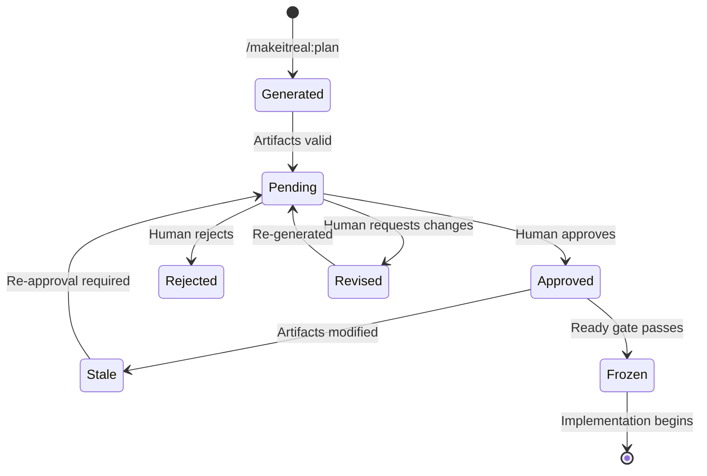

# Blueprints

A Blueprint is Make It Real's architecture-first planning document. It's generated before any code is written, reviewed by a human, and frozen before implementation begins.

## What's in a Blueprint

A Blueprint is not a single file — it's a validated packet of interconnected artifacts:

| Artifact | File | Purpose |
|----------|------|---------|
| PRD | `prd.json` | Goals, acceptance criteria, non-goals, user-visible behavior |
| Design Pack | `design-pack.json` | Architecture topology, state flow, API specs, responsibility boundaries, module interfaces, call stacks, sequences |
| Responsibility Units | `responsibility-units.json` | Ownership boundaries with file path patterns and contract provisions |
| Work Item DAG | `work-item-dag.json` | Dependency graph with typed nodes and contract edges |
| Work Items | `work-items/*.json` | Individual tasks with contract bindings, verification commands, PRD traces |
| Contracts | `contracts/*.json` | Frozen interface specifications (OpenAPI, module surfaces) |
| Blueprint Review | `blueprint-review.json` | Approval status, fingerprint, reviewer identity |

Every artifact cross-references the others. The engine validates all references bidirectionally.

## Blueprint Lifecycle



## Approval and Fingerprinting

When you approve a Blueprint, the engine:

1. Computes a cryptographic fingerprint of all Blueprint artifacts
2. Records the approval with reviewer identity and timestamp
3. Binds the approval to the specific run ID, work item ID, and PRD ID

If any artifact changes after approval, the fingerprint becomes stale. The Ready gate blocks execution until the Blueprint is re-approved. This prevents drift between what was reviewed and what gets implemented.

```json
{
  "schemaVersion": "1.0",
  "runId": "feature-auth",
  "workItemId": "auth-system",
  "prdId": "prd-auth",
  "blueprintFingerprint": "sha256:a1b2c3...",
  "status": "approved",
  "reviewSource": "makeitreal:plan approve",
  "reviewedBy": "operator:slash-command",
  "reviewedAt": "2026-05-19T10:30:00.000Z"
}
```

## The Design Pack

The design pack is the richest artifact. It contains seven validated sections:

### 1. Architecture (topology)
Nodes represent modules. Edges represent dependencies with optional contract references.

### 2. State Flow
Lanes and transitions describing the system's runtime behavior — not the kanban board, but the actual software's state machine.

### 3. API Specs
References to OpenAPI contracts. Each spec declares a `contractId`, `kind` (openapi or none), and path. If a module has no API, it must declare `kind: "none"` with a `reason`.

### 4. Responsibility Boundaries
Maps responsibility unit IDs to their scope. Cross-referenced with module interfaces.

### 5. Module Interfaces
The most important section for contracts. Each module declares:
- `responsibilityUnitId` — which unit owns it
- `moduleName` — human-readable name
- `publicSurfaces` — exported functions/endpoints with:
  - `name` and `kind`
  - `contractIds` — which contracts this surface fulfills
  - `signature` — typed `inputs`, `outputs`, `errors` arrays
- `imports` — dependencies on other modules, declaring `contractId` and `providerResponsibilityUnitId`

### 6. Call Stacks
How modules invoke each other at runtime.

### 7. Sequences
Interaction diagrams showing the flow of data through the system.

## Validation

The Blueprint is validated at multiple levels:

**PRD validation:**
- Required fields: `schemaVersion`, `id`, `title`
- Required arrays: `goals`, `userVisibleBehavior`, `acceptanceCriteria`, `nonGoals`
- Each acceptance criterion must have `id` and `statement`

**Design pack validation:**
- All 7 sections present and non-empty
- Architecture edges reference declared contracts
- Module interfaces reference declared responsibility units
- Import dependencies reference valid providers who actually expose the contract
- Public surface contract IDs exist in API specs

**DAG validation:**
- Acyclic (topological sort must include all nodes)
- All node IDs have matching work items
- Node kinds: `implementation`, `domain-pm`, `integration-evidence`
- Edge kinds: `contract-dependency`, `coordination`, `integration-proof`
- Contract edges validated bidirectionally: provider exposes contract, consumer declares dependency
- No path overlaps between sibling work items

**PRD trace validation:**
- Every work item traces to the PRD via `prdId`
- Every acceptance criterion is covered
- No duplicate or orphaned traces

## Interactive Planning

When you run `/makeitreal:plan` without a request, the intake system uses dynamic questioning:

1. Reads your project structure for context
2. Asks one focused question at a time
3. Each question targets the current highest-ambiguity area
4. Stops as soon as a reviewable plan can be generated
5. Builds a canonical request capturing behavior, criteria, boundaries, contracts, and verification

This is not a fixed questionnaire — questions are derived from what's already known vs. what's still ambiguous.

## Next

- [Contracts](contracts.md) — how interfaces become enforceable tests
- [Responsibility Units](responsibility-units.md) — ownership boundaries
- [Orchestration](orchestration.md) — how the DAG drives execution
