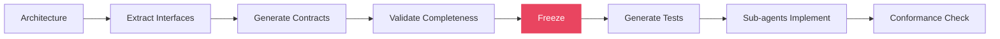
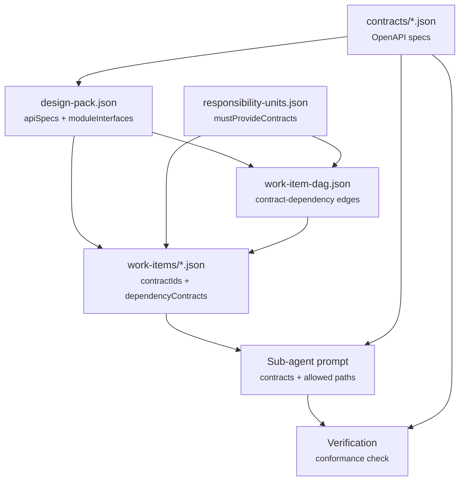

# Contracts

Contracts are Make It Real's key differentiator. They are the mechanism that makes parallel AI implementation actually work.

## The Core Insight

When multiple sub-agents implement different parts of a system simultaneously, the interfaces between those parts are where bugs happen. Traditional approaches hope that a single AI will keep everything consistent. Make It Real makes consistency **structural** — defined before implementation, frozen, and automatically verified.

**Contracts turn integration risk into compile-time guarantees.**

## What Is a Contract

A contract is a formal specification of an interface between two modules. It declares:
- What inputs the interface accepts
- What outputs it returns
- What errors it can produce
- Examples of valid request/response pairs

Two types of contracts exist in Make It Real:

### OpenAPI Contracts

Full OpenAPI 3.x specifications for HTTP interfaces:

```json
{
  "openapi": "3.0.3",
  "info": { "title": "Auth API", "version": "1.0.0" },
  "paths": {
    "/auth/login": {
      "post": {
        "operationId": "loginUser",
        "requestBody": {
          "required": true,
          "content": {
            "application/json": {
              "schema": {
                "type": "object",
                "required": ["email", "password"],
                "properties": {
                  "email": { "type": "string" },
                  "password": { "type": "string" }
                }
              },
              "examples": {
                "valid": {
                  "value": { "email": "user@example.com", "password": "secret" }
                }
              }
            }
          }
        },
        "responses": {
          "200": {
            "content": {
              "application/json": {
                "schema": {
                  "type": "object",
                  "required": ["accessToken", "refreshToken"],
                  "properties": {
                    "accessToken": { "type": "string" },
                    "refreshToken": { "type": "string" }
                  }
                }
              }
            }
          },
          "401": {
            "content": {
              "application/json": {
                "schema": {
                  "type": "object",
                  "required": ["error"],
                  "properties": {
                    "error": { "type": "string" }
                  }
                }
              }
            }
          }
        }
      }
    }
  }
}
```

The engine validates:
- OpenAPI 3.x version declared
- `info` and `paths` objects present
- Every path has at least one operation
- Every operation has an `operationId`
- Non-GET operations have required request body with JSON schema
- At least one success response (200/201/204) with schema
- At least one error response (4xx/5xx)
- Examples validate against their schemas (type checking, required fields, enum/const constraints, nested objects/arrays)

### Module Surface Contracts

Typed function signatures for non-HTTP interfaces:

```json
{
  "responsibilityUnitId": "session-manager",
  "moduleName": "SessionStore",
  "publicSurfaces": [
    {
      "name": "createSession",
      "kind": "function",
      "contractIds": ["session-store"],
      "signature": {
        "inputs": [
          { "name": "userId", "type": "string" },
          { "name": "metadata", "type": "SessionMetadata" }
        ],
        "outputs": [
          { "name": "session", "type": "Session" }
        ],
        "errors": [
          { "name": "SessionLimitExceeded", "type": "Error" }
        ]
      }
    }
  ],
  "imports": [
    {
      "contractId": "user-store",
      "providerResponsibilityUnitId": "user-service"
    }
  ]
}
```

## The Contract Lifecycle



### 1. Extract
During Blueprint generation, the engine identifies all module boundaries and the interfaces between them.

### 2. Generate
Contracts are created as formal specifications — OpenAPI for HTTP, module surfaces for function-level interfaces.

### 3. Validate
The engine validates completeness:
- Every architecture edge with a contract reference points to a declared API spec
- Every module interface's imports reference valid provider contracts
- Provider modules actually expose the contracts their consumers depend on

### 4. Freeze
Contracts become immutable. The Blueprint fingerprint includes contract content. Any change invalidates the approval.

### 5. Test Generation
Contract specifications become the basis for conformance tests. The engine checks:
- Do implementations match OpenAPI schemas?
- Do module exports match declared public surfaces?
- Are all required operations present?

### 6. Implement
Sub-agents receive their contracts as input. They know exactly what interface they must implement and what interfaces they can depend on.

### 7. Verify
After implementation, conformance checks run automatically:
- **OpenAPI conformance** — implementation matches the frozen spec
- **Module surface conformance** — exports match declared signatures
- **Baseline comparison** — no paths or operations removed from existing contracts

## Why "Unit Test = QA"

This is the key guarantee. Consider a system with modules A, B, and C:

**Without contracts:**
- Agent implements A, makes assumptions about B's interface
- Agent implements B, makes different assumptions about A
- A calls B with wrong parameters → integration bug
- Discovered only in integration testing (if at all)

**With Make It Real contracts:**
- Contract declares the exact interface between A and B
- Sub-agent A implements against the contract → tests pass
- Sub-agent B implements against the same contract → tests pass
- Both sides match the same specification → integration is guaranteed

No separate integration testing phase needed. Contract conformance at the unit level proves system-wide integration correctness.

## Contract Validation Rules

The engine enforces these rules at the Ready gate:

| Rule | Error Code |
|------|-----------|
| OpenAPI must be version 3.x | `HARNESS_OPENAPI_VERSION_INVALID` |
| Must have `info` and `paths` objects | `HARNESS_OPENAPI_SHAPE_INVALID` |
| Every path needs at least one operation | `HARNESS_OPENAPI_OPERATION_MISSING` |
| Operations must have `operationId` | `HARNESS_OPENAPI_OPERATION_ID_MISSING` |
| Non-GET operations need request schema | `HARNESS_OPENAPI_REQUEST_SCHEMA_MISSING` |
| Success response (200/201/204) required | `HARNESS_OPENAPI_SUCCESS_RESPONSE_MISSING` |
| Non-204 success needs JSON schema | `HARNESS_OPENAPI_RESPONSE_SCHEMA_MISSING` |
| At least one 4xx/5xx error response | `HARNESS_OPENAPI_ERROR_RESPONSE_MISSING` |
| Examples must match their schemas | `HARNESS_OPENAPI_EXAMPLE_INVALID` |
| Module interfaces need `responsibilityUnitId` | `HARNESS_DESIGN_PACK_INVALID` |
| Public surfaces need `contractIds` | `HARNESS_DESIGN_PACK_INVALID` |
| Signatures need `inputs`, `outputs`, `errors` | `HARNESS_DESIGN_PACK_INVALID` |
| Import contracts must exist at provider | `HARNESS_CONTRACT_REFERENCE_INVALID` |
| Architecture edges reference declared contracts | `HARNESS_CONTRACT_REFERENCE_INVALID` |

## Backward Compatibility

When a baseline contract exists (previous version), the engine also validates that:

| Rule | Error Code |
|------|-----------|
| No paths removed | `HARNESS_OPENAPI_PATH_REMOVED` |
| No operations removed | `HARNESS_OPENAPI_OPERATION_REMOVED` |
| No response status codes removed | `HARNESS_OPENAPI_RESPONSE_REMOVED` |

This prevents sub-agents from accidentally breaking existing consumers by narrowing an interface.

## How Contracts Flow Through the System



Every contract is declared in the design pack, referenced by responsibility units, bound to work items, encoded into DAG edges, passed to sub-agent prompts, and verified on completion. There is no way to implement without a contract and no way to complete without proving conformance.

## Next

- [Responsibility Units](responsibility-units.md) — the ownership boundaries that contracts connect
- [Orchestration](orchestration.md) — how the engine dispatches and verifies
- [Blueprints](blueprints.md) — the full architecture document
