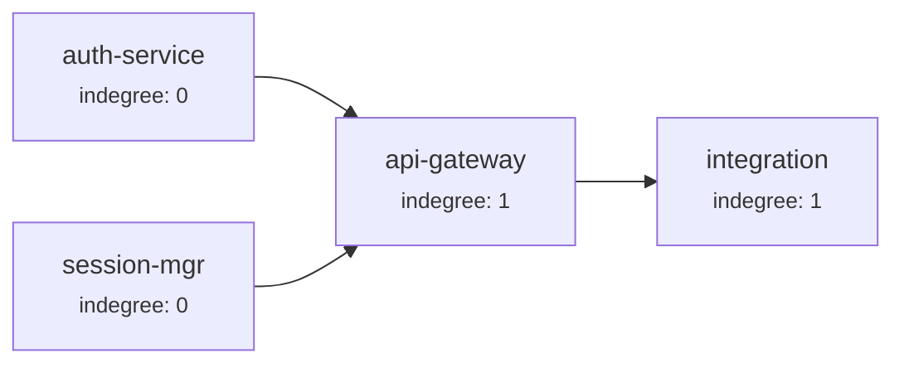

# Orchestration

The orchestrator is Make It Real's execution engine. It dispatches sub-agents in DAG order, enforces gates, handles retries, and collects evidence.

## The Kanban State Machine

Every work item follows a strict state machine with 15 lanes:

```
Intake → Discovery → Scoped → Blueprint Bound → Contract Frozen →
Ready → Claimed → Running → Verifying → Human Review → Done
```

With error/recovery paths:
```
Running → Failed Fast → Ready (retry with backoff)
Verifying → Rework → Verifying (rework resolved)
```

And terminal states: `Done`, `Blocked`, `Cancelled`.

### Gate-Enforced Transitions

Not every transition is free. Many require gates:

| Transition | Required Gates |
|-----------|----------------|
| Discovery → Scoped | `prd` |
| Scoped → Blueprint Bound | `blueprint` |
| Blueprint Bound → Contract Frozen | `contract` |
| Contract Frozen → Ready | `design`, `contract`, `responsibility`, `blueprintApproval` |
| Claimed → Ready (release) | `leaseExpired` |
| Failed Fast → Ready | `retry` |
| Verifying → Human Review | `evidence` |
| Human Review → Done | `evidence`, `wiki` |

The state engine (`canTransition`) checks that all required gates are satisfied before allowing any transition. Illegal transitions produce `HARNESS_TRANSITION_ILLEGAL`. Missing gates produce `HARNESS_GATE_REQUIRED`.

## DAG-Ordered Execution

The orchestrator uses topological sort to determine execution order:



Nodes with indegree 0 (no dependencies) can run immediately and in parallel. A node becomes eligible only when all its dependencies are satisfied.

The `getReadyWorkItems()` function returns work items in the `Ready` lane whose dependencies are all in `Done` or whose dependency edges are all satisfied.

## The Orchestrator Tick

Each tick of the orchestrator:

1. **Loads the board** and validates the dependency graph
2. **Promotes** work items from `Contract Frozen` → `Ready` if the Ready gate passes
3. **Identifies** ready work items (up to concurrency limit)
4. **For each ready item:**
   - Claims it with a lease (preventing double-dispatch)
   - Transitions to `Running`
   - Dispatches the sub-agent (scripted simulator or native Claude Code Task)
   - On success: transitions to `Verifying`
   - On failure: transitions to `Failed Fast` with backoff metadata

### Concurrency

The orchestrator respects a `concurrency` parameter that limits how many work items run simultaneously. The `status` command provides `recommendedNativeTaskConcurrency` based on unblocked responsibility units.

## Native Claude Code Task Dispatch

In production, the orchestrator dispatches Claude Code native `Task` sub-agents:

```bash
makeitreal-engine orchestrator native start <runDir> --concurrency 6
```

This returns a `nativeTasks[]` array. Each entry contains:

- `nativeSubagentType` — the Task type (defaults to `general-purpose`)
- `implementationPrompt` — the full scoped prompt for the sub-agent
- `reviewerPrompts[]` — prompts for the three reviewer sub-agents

### Sub-Agent Prompts

Each implementation sub-agent receives a prompt containing:
- Run directory and project root paths
- Work item ID and responsibility unit
- Contract IDs and dependency contracts with provider surfaces
- Allowed paths (the enforced boundary)
- Verification commands to run
- Rules: stay in boundary, implement against contracts, don't add behavior outside contracts

### Node Kinds

Different node kinds get different prompts and completion policies:

| Kind | Report Key | Requires Changed Files | Requires Verification | Required Reviewers |
|------|-----------|----------------------|----------------------|-------------------|
| `implementation` | `makeitrealReport` | Yes | Yes | spec, quality, verification |
| `domain-pm` | `makeitrealPmReport` | No | No | spec |
| `integration-evidence` | `makeitrealEvidenceReport` | No | Yes | verification |

### Completion Flow

After a sub-agent finishes:

1. The implementation report is validated (correct role, status, required fields)
2. Three reviewer Tasks run: `spec-reviewer`, `quality-reviewer`, `verification-reviewer`
3. All review reports must be `APPROVED` or `APPROVED_WITH_NOTES`
4. Changed files are checked against allowed paths
5. The combined result is recorded via `orchestrator native finish`
6. The engine runs verification commands and collects evidence
7. `orchestrator complete` runs the Done gate for the work item

## Retry Policy

When a sub-agent fails, the work item enters `Failed Fast` with:

```json
{
  "lane": "Failed Fast",
  "attemptNumber": 2,
  "nextRetryAt": "2026-05-19T10:35:00.000Z",
  "errorCode": "HARNESS_VERIFICATION_FAILED",
  "errorCategory": "verification",
  "errorReason": "npm test exited with code 1",
  "latestAttemptId": "attempt-002"
}
```

The backoff is exponential. When the retry time arrives, the work item is promoted back to `Ready` for another attempt. Each attempt is recorded in the attempt store with full provenance.

## Runtime State

The orchestrator maintains runtime state tracking:

- **Claimed** — which work items are claimed by which workers, with lease timestamps
- **Running** — which work items are actively executing, with start time and latest event
- **Retry** — which work items are waiting for retry, with due time and error details

This state is persisted to `runtime-state.json` and used by the dashboard for live progress display.

## Claims and Leases

Before dispatching a sub-agent, the orchestrator claims the work item:

```json
{
  "workItemId": "auth-service",
  "workerId": "worker-1",
  "claimedAt": "2026-05-19T10:30:00.000Z",
  "leaseMs": 60000
}
```

Claims prevent double-dispatch. If a worker crashes, the lease expires and the work item returns to `Ready`. The `Claimed → Ready` transition requires the `leaseExpired` gate.

## Evidence Model

Every completed work item produces evidence:

### Verification Evidence
```json
{
  "kind": "verification",
  "producer": "makeitreal-engine/verify",
  "ok": true,
  "workItemId": "auth-service",
  "commands": [{ "command": "npm test", "exitCode": 0, "stdout": "...", "stderr": "" }],
  "commandHashes": ["sha256:..."]
}
```

Command hashes are computed from the work item's declared verification commands and must match. This prevents sub-agents from running different commands than what was planned.

### Wiki Sync Evidence
```json
{
  "kind": "wiki-sync",
  "workItemId": "auth-service",
  "outputPath": ".makeitreal/wiki/live/work.auth-service.md"
}
```

Or, if wiki is disabled:
```json
{
  "kind": "wiki-sync",
  "workItemId": "auth-service",
  "skipped": true,
  "reason": "Wiki sync disabled in project config"
}
```

Both verification and wiki evidence are required by the Done gate. The engine does not weaken gates — it requires explicit skip evidence instead.

## Trust Policy

The orchestrator validates a trust policy before dispatch:

```bash
makeitreal-engine orchestrator native start <runDir>
```

This checks:
- Runner mode is valid (`claude-code` for native Tasks)
- Board is in a valid state
- Blueprint is approved and not stale

The trust policy prevents execution of unapproved or modified Blueprints.

## Next

- [Contracts](contracts.md) — the interfaces that sub-agents implement against
- [Responsibility Units](responsibility-units.md) — the boundaries that sub-agents respect
- [Blueprints](blueprints.md) — the architecture document that drives everything
