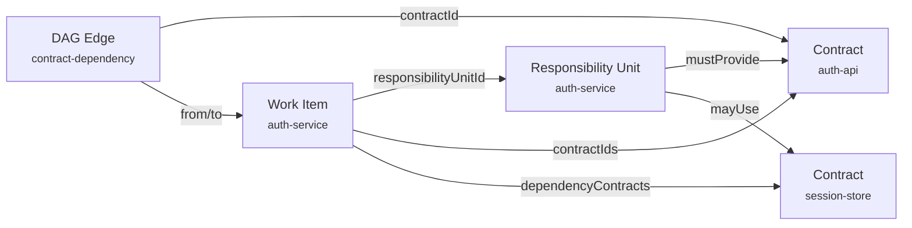

# Responsibility Units

A responsibility unit defines a module's ownership boundary — what files it can touch, what contracts it must provide, and what contracts it may consume.

## Purpose

When multiple sub-agents work in parallel, they must not step on each other's code. Responsibility units enforce this structurally:

- Each sub-agent is assigned exactly **one** responsibility unit
- Each responsibility unit has **allowed file paths** (glob patterns)
- Paths between sibling work items **cannot overlap**
- Sub-agents **cannot edit files outside their boundary**

## Structure

```json
{
  "units": [
    {
      "id": "auth-service",
      "owner": "auth-team",
      "owns": ["src/auth/**", "contracts/auth-api.openapi.json"],
      "mustProvideContracts": ["auth-api"],
      "mayUseContracts": ["user-store", "session-store"]
    },
    {
      "id": "session-manager",
      "owner": "platform-team",
      "owns": ["src/session/**", "contracts/session-store.json"],
      "mustProvideContracts": ["session-store"],
      "mayUseContracts": ["auth-api"]
    }
  ]
}
```

| Field | Purpose |
|-------|---------|
| `id` | Unique identifier, referenced by work items and DAG nodes |
| `owner` | Single owner identity (validated: exactly one per unit) |
| `owns` | File path patterns this unit controls (glob syntax with `/**`) |
| `mustProvideContracts` | Contract IDs this unit is responsible for implementing |
| `mayUseContracts` | Contract IDs this unit is allowed to consume |

## Path Enforcement

### Allowed Paths

Each work item declares its `allowedPaths` — the files it may create or modify:

```json
{
  "id": "auth-service",
  "responsibilityUnitId": "auth-service",
  "allowedPaths": ["src/auth/**", "test/auth/**", "contracts/auth-api.openapi.json"]
}
```

The engine enforces these at two levels:

1. **Ready gate** — validates that sibling work items have no overlapping paths
2. **Completion** — validates that all changed files fall within allowed paths

### Overlap Detection

The engine uses a path containment algorithm:

```
src/auth/**     vs src/auth/login.mjs    → contained (ok for same unit)
src/auth/**     vs src/session/**        → no overlap (ok)
src/auth/**     vs src/auth/utils/**     → overlap! (blocked for siblings)
```

Two patterns overlap if either is a prefix of the other. Parent-child work items (via `parentWorkItemId`) are exempt from overlap checks.

### Reserved Paths

Sub-agents cannot touch harness control-plane paths:

- `.makeitreal/runs/*/workspaces/` — legacy workspace paths
- Any path that would modify run state directly

The path boundary validator (`validateChangedPaths`) checks every file the sub-agent reports as changed against the work item's allowed paths. Files outside the boundary produce `HARNESS_PATH_BOUNDARY_VIOLATION` errors.

## How Units Connect to Contracts

Responsibility units are the link between contracts and work items:



The DAG validates this chain:
- If a DAG edge references `contractId: auth-api` from node A to node B
- Then A's responsibility unit must include `auth-api` in `mustProvideContracts`
- And B's work item must have a `dependencyContract` entry for `auth-api` from A's responsibility unit

## Validation Rules

| Rule | Error Code |
|------|-----------|
| Each responsibility unit has exactly one owner | `HARNESS_RESPONSIBILITY_OWNER_INVALID` |
| Work item references a known responsibility unit | `HARNESS_RESPONSIBILITY_OWNER_INVALID` |
| Contract usage authorized by `mayUseContracts` or path ownership | `HARNESS_CONTRACT_USAGE_UNAUTHORIZED` |
| Changed files within allowed paths | `HARNESS_PATH_BOUNDARY_VIOLATION` |
| No path overlap between sibling work items | `HARNESS_DAG_PATH_OVERLAP` |
| Allowed paths are safe project-relative patterns | `HARNESS_ALLOWED_PATH_INVALID` |
| Allowed paths don't target control-plane directories | `HARNESS_ALLOWED_PATH_RESERVED` |
| Module interfaces reference declared responsibility units | `HARNESS_RESPONSIBILITY_REFERENCE_INVALID` |

## Single Ownership Principle

Every responsibility unit must have exactly one owner. This is validated at the Ready gate and prevents:

- Ambiguous code ownership
- Multiple sub-agents claiming the same module
- Gaps where no one owns a piece of the system

The owner field is a simple string identifier. In practice it maps to the sub-agent worker that will implement this unit.

## Next

- [Contracts](contracts.md) — the interfaces between responsibility units
- [Orchestration](orchestration.md) — how the engine dispatches work to responsibility units
- [Blueprints](blueprints.md) — the full architecture document
