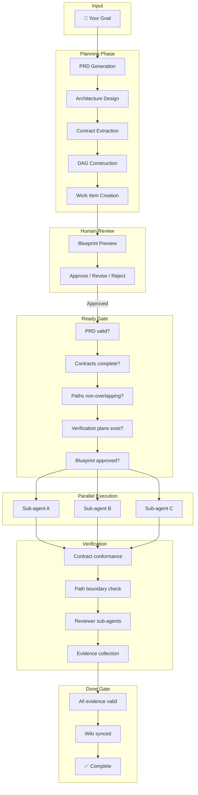
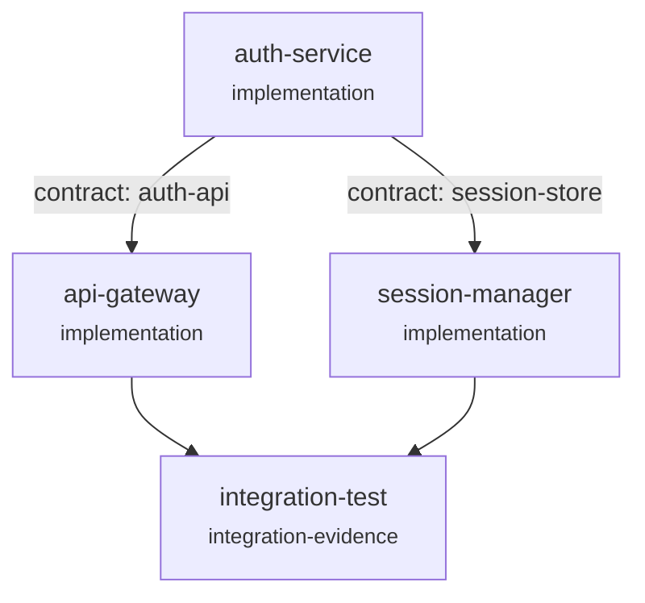

# How It Works

A visual walkthrough of the full Make It Real pipeline, from goal to done.

## The Big Picture



## Phase 1: Planning

When you run `/makeitreal:plan`, the engine builds a complete implementation packet.

### PRD Generation

Your request is transformed into a structured Product Requirements Document:

```json
{
  "schemaVersion": "1.0",
  "id": "prd-auth-system",
  "title": "JWT Authentication System",
  "goals": ["Secure user authentication with JWT tokens"],
  "userVisibleBehavior": ["Login returns access + refresh tokens"],
  "acceptanceCriteria": [
    { "id": "ac-login", "statement": "POST /auth/login returns JWT on valid credentials" },
    { "id": "ac-refresh", "statement": "POST /auth/refresh rotates tokens" }
  ],
  "nonGoals": ["OAuth provider integration", "2FA"]
}
```

Every field is validated. The PRD must have goals, user-visible behavior, acceptance criteria (each with id + statement), and explicit non-goals.

### Architecture Design (Design Pack)

The engine generates a comprehensive design pack containing:

- **Architecture topology** — nodes (modules) and edges (dependencies) with contract references
- **State flow** — lanes and transitions for the system's runtime behavior
- **API specs** — OpenAPI references or explicit "kind: none" with reason
- **Responsibility boundaries** — which module owns which paths and contracts
- **Module interfaces** — public surfaces with typed signatures (inputs, outputs, errors)
- **Call stacks** — how modules invoke each other
- **Sequences** — interaction diagrams

Every architecture edge that references a contract must point to a declared `apiSpec`. Every module interface must reference a declared responsibility unit. Cross-references are validated bidirectionally.

### Contract Freezing

Contracts are the interface specifications between modules. Two types:

1. **OpenAPI contracts** — full 3.x specs with paths, operations, request/response schemas, error responses, and examples. Every operation must have an `operationId`, request schema (for non-GET methods), success response schema, and at least one error response.

2. **Module surface contracts** — typed function signatures declaring inputs, outputs, and error shapes. Each public surface has a name, kind, contract IDs, and a signature object.

Contracts are frozen before implementation begins. They become the source of truth for integration.

### DAG Construction

Work items are organized into a Directed Acyclic Graph:



Node kinds:
- `implementation` — code-producing work
- `domain-pm` — coordination/split validation work
- `integration-evidence` — cross-module proof

Edge kinds:
- `contract-dependency` — consumer depends on provider's contract
- `coordination` — ordering without a software contract
- `integration-proof` — evidence that contracts integrate correctly

The DAG is validated: no cycles, all nodes have matching work items, all contract edges reference declared contracts, responsibility units match, and allowed paths don't overlap between sibling work items.

## Phase 2: Review

The Blueprint is presented for human review. You see:

- What will be delivered
- Scope boundaries
- Work packages with dependencies
- Contracts between modules

You decide: **approve**, **reject**, or **request changes**.

Approval is recorded with a cryptographic fingerprint of the Blueprint contents. If any artifact changes after approval, the fingerprint becomes stale and the Ready gate blocks execution until re-approval.

## Phase 3: Ready Gate

Before any sub-agent runs, the Ready gate validates the entire packet:

| Check | What It Validates |
|-------|-------------------|
| PRD validity | Schema, required fields, acceptance criteria format |
| Design pack validity | All 7 sections present, cross-references valid |
| DAG validity | Acyclic, nodes ↔ work items, contract edges valid |
| OpenAPI contracts | 3.x version, operation completeness, schema examples |
| PRD trace | Every work item traces to acceptance criteria |
| Single ownership | Each responsibility unit has exactly one owner |
| Contract completeness | Work item contracts exist in design pack |
| Verification plan | Every implementation work item has verification commands |
| Path boundaries | Allowed paths non-overlapping, no reserved paths |
| Module interfaces | Implementation nodes have frozen public surfaces |
| Blueprint approval | Approved + fingerprint matches current artifacts |
| Preview | Dashboard artifacts exist |

All checks must pass. Any failure blocks execution with a specific `HARNESS_*` error code and recovery hint.

## Phase 4: Parallel Execution

The orchestrator dispatches sub-agents in topological DAG order:

1. **Claim** — work item claimed by a worker with a lease
2. **Transition to Running** — kanban state machine enforces valid transitions
3. **Native Task dispatch** — Claude Code Task sub-agent runs with a scoped prompt containing:
   - Run directory and project root
   - Work item details and responsibility unit
   - Contract IDs and dependencies
   - Allowed paths (enforced boundary)
   - Verification commands
4. **Reviewer Tasks** — three reviewer sub-agents validate each implementation:
   - `spec-reviewer` — does it match the spec?
   - `quality-reviewer` — code quality check
   - `verification-reviewer` — do verification commands pass?

Sub-agents cannot:
- Edit files outside their `allowedPaths`
- Reference contracts not declared in their work item
- Skip verification commands
- Return without a structured report

### Retry with Backoff

If a sub-agent fails, the work item transitions to `Failed Fast` with:
- Error code and reason
- Attempt number tracking
- Exponential backoff before retry
- Automatic promotion back to `Ready` when due

## Phase 5: Verification & Done

After implementation, the engine runs the Done gate:

| Check | What It Validates |
|-------|-------------------|
| Verification evidence | Commands ran, all passed, produced by engine, hashes match |
| Wiki sync evidence | Documentation updated or explicitly skipped with reason |
| OpenAPI conformance | Implementation matches frozen OpenAPI schemas |
| Module surface conformance | Implementation exports match declared interfaces |

Evidence is persisted as JSON with full provenance:

```json
{
  "kind": "verification",
  "producer": "makeitreal-engine/verify",
  "ok": true,
  "workItemId": "auth-service",
  "commands": [
    {
      "command": "npm test",
      "exitCode": 0,
      "stdout": "...",
      "stderr": ""
    }
  ],
  "commandHashes": ["sha256:..."]
}
```

When all work items pass all gates, the run is complete.

## Next

- [Blueprints](concepts/blueprints.md) — the architecture document in detail
- [Contracts](concepts/contracts.md) — the key differentiator
- [Responsibility Units](concepts/responsibility-units.md) — ownership boundaries
- [Orchestration](concepts/orchestration.md) — execution engine internals
