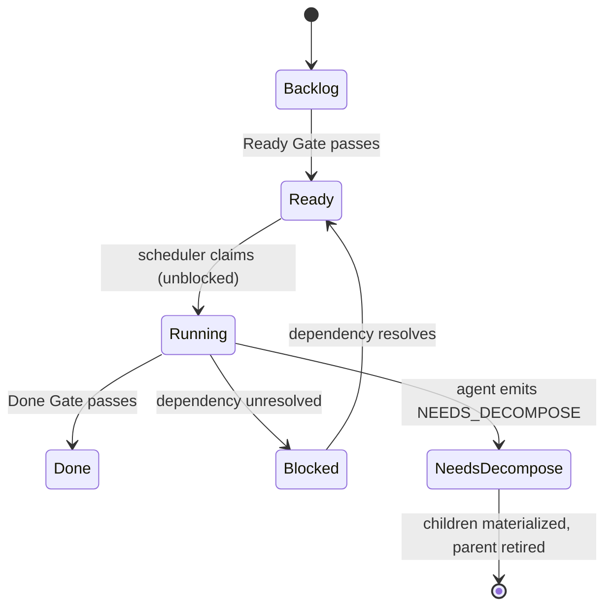
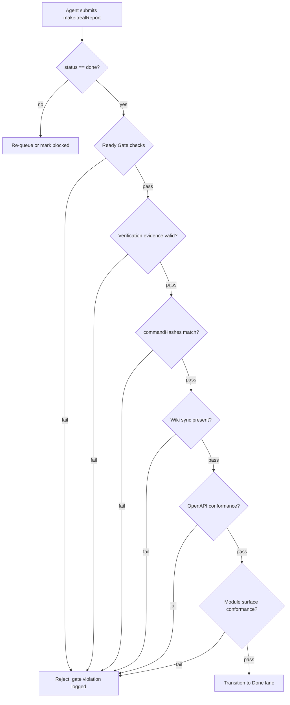

# How Make It Real Works

A technical reference for the orchestration engine, DAG scheduler, path enforcement, contract system, gate logic, and evidence model.

---

## Table of Contents

1. [Overview](#overview)
2. [Board Structure](#board-structure)
3. [DAG Scheduler](#dag-scheduler)
4. [Sub-Agent Dispatch](#sub-agent-dispatch)
5. [Path Boundary Enforcement](#path-boundary-enforcement)
6. [Contract System](#contract-system)
7. [Gate System](#gate-system)
8. [Evidence System](#evidence-system)
9. [SHA-256 Fingerprint & Drift Detection](#sha-256-fingerprint--drift-detection)
10. [Session Isolation](#session-isolation)
11. [Dynamic Decomposition (NEEDS_DECOMPOSE)](#dynamic-decomposition-needs_decompose)
12. [Differentiators](#differentiators)

---

## Overview

Make It Real (MIR) is a multi-agent software delivery harness. It takes a PRD and a design pack, generates a dependency graph of work items, and dispatches Claude Code sub-agents to execute them in parallel — each agent operating inside a hard path boundary enforced at the kernel level by a `PreToolUse` hook.

Every step from plan approval to Done is gated by structured evidence. No work item transitions to Done unless its verification commands have been re-run, its outputs conform to declared contracts, and its wiki sync has been recorded. Plan documents are fingerprinted with SHA-256 at approval time; any subsequent drift blocks all writes.

```
PRD + Design Pack
       │
       ▼
  ┌─────────────┐
  │  Ready Gate  │  (DAG acyclic, contracts implementation-grade, blueprint approved)
  └──────┬──────┘
         │ approved
         ▼
  ┌─────────────────────────────────────────┐
  │           DAG Scheduler                  │
  │  getReadyWorkItems() → claim → Running   │
  └──────────┬──────────────────────────────┘
             │  (per work item)
             ▼
  ┌──────────────────────┐
  │   Claude Code agent   │
  │  + PreToolUse hook    │  ← path boundary enforced here
  └──────────┬───────────┘
             │  makeitrealReport
             ▼
  ┌─────────────┐
  │  Done Gate   │  (evidence: verification + wiki-sync + conformance)
  └─────────────┘
```

---

## Board Structure

A MIR board is a directory with a fixed layout:

```
board/
├── board.json                   # board metadata and lane state
├── prd.json                     # product requirements document
├── design-pack.json             # component and architecture decisions
├── responsibility-units.json    # ownership assignments
├── work-item-dag.json           # dependency graph
├── contracts/
│   ├── <contractId>.json        # one file per contract
│   └── ...
└── work-items/
    ├── <workItemId>.json        # one file per work item
    └── ...
```

### work-item-dag.json

The DAG is the central scheduling artifact. It has two sections: `nodes` and `edges`.

```json
{
  "nodes": [
    {
      "id": "wi-auth-service",
      "kind": "implementation",
      "requiredForDone": true,
      "responsibilityUnitId": "ru-backend"
    }
  ],
  "edges": [
    {
      "from": "wi-auth-service",
      "to": "wi-api-gateway",
      "kind": "contract-dependency",
      "contractId": "contract-auth-api"
    },
    {
      "from": "wi-ui-shell",
      "to": "wi-dashboard",
      "kind": "coordination"
    },
    {
      "from": "wi-auth-service",
      "to": "wi-e2e-tests",
      "kind": "integration-proof"
    }
  ]
}
```

**Edge kinds:**

| Kind | Meaning |
|---|---|
| `contract-dependency` | Downstream cannot start until upstream's contract is Frozen |
| `coordination` | Sequencing hint; upstream must be Done |
| `integration-proof` | Downstream produces evidence that upstream integrates correctly |

---

## DAG Scheduler

### Dependency Resolution

`getReadyWorkItems()` computes the executable frontier:

1. Collect all work items in the **Ready** lane.
2. For each, inspect its `dependsOn[]` list — the transitive set of upstream node IDs implied by the DAG edges.
3. A work item is **blocked** if any item in `dependsOn[]` is not in the **Done** lane.
4. Return the unblocked subset.

```
Ready lane items
       │
       ▼
  for each item:
    blocked = dependsOn[].some(id => workItems[id].lane !== 'Done')
       │
    blocked? → skip
       │
    not blocked? → include in frontier
```

### Dispatch

`promoteReadyGateApprovedWork()` is the scheduler tick:

```
promoteReadyGateApprovedWork()
  └── getReadyWorkItems()
        └── .slice(0, concurrency)   ← respects parallelism ceiling
              └── for each item:
                    claim(item)       ← atomically move to Running lane
                    spawnAgent(item)  ← launch Claude Code subprocess
```

The `concurrency` setting is a board-level parameter. Claims are atomic — two scheduler ticks cannot claim the same item.



---

## Sub-Agent Dispatch

Each claimed work item launches one Claude Code sub-agent. The agent receives a structured context object:

```json
{
  "workItemId": "wi-auth-service",
  "attemptId": "attempt-3f9a",
  "implementationPrompt": "Implement the auth service...\n\nBoard: {{boardDir}}\nProject: {{projectRoot}}",
  "reviewerPrompts": [
    "Check that all endpoints match the OpenAPI spec in contracts/contract-auth-api.json"
  ],
  "scope": {
    "allowedPaths": [
      "src/auth/**",
      "tests/auth/**",
      "src/auth/index.ts"
    ]
  },
  "verificationCommands": [
    "pnpm test:auth",
    "pnpm typecheck"
  ]
}
```

`{{boardDir}}` and `{{projectRoot}}` are substituted at dispatch time to absolute paths on the current machine.

### Finish Envelope

When done (or blocked), the agent writes a `makeitrealReport` to its run directory:

```json
{
  "status": "done",
  "summary": "Implemented JWT auth service with refresh token rotation.",
  "changedFiles": [
    "src/auth/service.ts",
    "src/auth/middleware.ts",
    "tests/auth/service.test.ts"
  ],
  "tested": [
    "pnpm test:auth",
    "pnpm typecheck"
  ],
  "concerns": [],
  "blockers": []
}
```

`status` is one of: `done` | `blocked` | `needs_decompose` | `failed`.

The orchestrator reads this envelope, validates it against the Done Gate, and either transitions the work item or re-queues it.

---

## Path Boundary Enforcement

This is MIR's most distinctive mechanism. Every file system operation a sub-agent attempts is validated before it executes — not after.

### Mechanism

Claude Code exposes a `PreToolUse` hook that fires synchronously before any tool call is dispatched to the underlying system. MIR registers a hook for the following tool names:

- `Edit`
- `Write`
- `MultiEdit`
- `Bash`

The hook receives the full tool input and the current work item context (loaded from the session's run file). It extracts all file paths from the input and validates them against `workItem.allowedPaths[]`.

**Returning `{ "type": "DENY" }` from the hook aborts the tool call at the kernel level.** The agent never sees a file system error — the call simply does not happen.

### Path Extraction

For `Edit`, `Write`, and `MultiEdit`, the hook recursively scans all keys in the tool input JSON for values that look like file paths.

For `Bash`, the hook additionally parses the command string for:

- Redirect targets: `> file`, `>> file`, `2> file`
- Explicit file-touching commands: `touch`, `rm`, `mv`, `cp`, `mkdir`
- Arguments to those commands that resolve to file paths

### Pattern Matching

`allowedPaths` entries use glob-style patterns:

| Pattern | Matches |
|---|---|
| `src/auth/index.ts` | Exact file |
| `src/auth/*.ts` | All `.ts` files directly in `src/auth/` |
| `src/auth/**` | All files under `src/auth/` at any depth (prefix match) |

The `/**` suffix triggers prefix matching: a path is allowed if it starts with the prefix before `/**`.

### Overlap Validation

The DAG validator enforces that no two sibling work items (items that could run concurrently) have overlapping `allowedPaths`. This check runs at plan time, before any agent is dispatched. A plan with overlapping paths is rejected at the Ready Gate.

```
plan time:
  for each pair (A, B) where A and B may run concurrently:
    if allowedPaths(A) ∩ allowedPaths(B) ≠ ∅:
      REJECT plan
```

This means path isolation is guaranteed by construction — no runtime locking or conflict resolution is needed.

---

## Contract System

Contracts are typed interface declarations that producers freeze before consumers implement.

### Contract Types

| Type | Description | Format |
|---|---|---|
| `http` | REST API surface | OpenAPI 3.x |
| `function` | Typed module exports | Typed interface descriptor |
| `event` | Async message shape | JSON Schema |
| `component` | UI component props | Typed interface descriptor |

### Contract Lifecycle

```
Draft → Frozen
          │
          └── consumers unblocked (contract-dependency edges resolve)
```

A contract moves to the **Frozen** lane when its producer work item is Done and its conformance evidence passes. Frozen is an immutable snapshot — subsequent edits create a new contract version.

### OpenAPI Conformance Requirements

For `http` contracts, MIR enforces structural requirements before a contract is considered implementation-grade:

- Every operation must have an `operationId`
- Every mutating operation must declare a `requestBody` with a JSON schema
- Every operation must declare at least one success response (2xx)
- Every `example` value in the spec must validate against its declared schema

These checks run as part of the Ready Gate. A spec that passes Swagger linting but fails these checks will block the gate.

---

## Gate System

Gates are boolean predicates evaluated against the board state. They are not advisory — a work item cannot transition lanes without passing its gate.

### Ready Gate

Evaluated before any agent is dispatched.

| Check | What is verified |
|---|---|
| PRD valid | `prd.json` passes schema validation |
| Design pack valid | `design-pack.json` passes schema validation |
| DAG acyclic | No cycles in `work-item-dag.json`; DFS with cycle detection |
| Contracts implementation-grade | All `http` contracts pass OpenAPI structural checks |
| Blueprint approved | Human approval recorded in board state |
| Preview exists | `preview/index.html` present (design preview artifact) |

### Done Gate

Evaluated after an agent submits its `makeitrealReport`.

All Ready Gate checks, plus:

| Check | What is verified |
|---|---|
| Verification evidence | `verification.json` present; `ok: true`; `exitCode: 0` for all commands |
| Command hash match | `commandHashes[]` in evidence matches `verificationCommands` declared in work item |
| Wiki sync evidence | `wiki-sync.json` present with correct `workItemId` and `outputPath` |
| OpenAPI conformance | `openapi-conformance.json` with passing `cases[]` for all http contracts |
| Module surface conformance | Live JS import of produced module; actual exports match declared `function` contract signatures |

The Done Gate is evaluated by the orchestrator, not the agent. An agent cannot self-certify completion.

### Gate Evaluation Flow



---

## Evidence System

Every Done Gate check requires a corresponding evidence file written into the work item's run directory. Evidence files are produced by the agent (or by MIR tooling the agent calls) during execution.

### verification.json

```json
{
  "kind": "verification",
  "producer": "wi-auth-service/attempt-3f9a",
  "ok": true,
  "commands": [
    {
      "command": "pnpm test:auth",
      "exitCode": 0,
      "stdout": "...",
      "durationMs": 4312
    },
    {
      "command": "pnpm typecheck",
      "exitCode": 0,
      "stdout": "",
      "durationMs": 891
    }
  ],
  "commandHashes": [
    "sha256:a3f...",
    "sha256:b7c..."
  ]
}
```

`commandHashes` are SHA-256 hashes of the canonical command strings. The Done Gate computes hashes of the work item's declared `verificationCommands` and compares them to this array. A passing test suite run against different commands does not satisfy the gate.

### wiki-sync.json

```json
{
  "kind": "wiki-sync",
  "workItemId": "wi-auth-service",
  "outputPath": "wiki/auth-service.md"
}
```

Agents are expected to write a human-readable summary of what they built to the project wiki. The Done Gate verifies this artifact exists.

### openapi-conformance.json

```json
{
  "kind": "openapi-conformance",
  "contractId": "contract-auth-api",
  "cases": [
    {
      "operationId": "loginUser",
      "request": { "username": "alice", "password": "secret" },
      "response": { "token": "eyJ..." },
      "requestValid": true,
      "responseValid": true,
      "schemaRef": "#/components/schemas/LoginResponse"
    }
  ]
}
```

Cases are actual HTTP request/response pairs validated against the OpenAPI schema, not mock assertions. The Done Gate requires `requestValid: true` and `responseValid: true` for all cases.

### Module Surface Conformance

For `function` contracts, MIR performs a live check at Done Gate evaluation time:

1. Dynamically `import()` the module at the path declared in the contract.
2. Inspect the actual exported members.
3. Compare name, arity, and TypeScript signature (if available via `.d.ts`) against the declared interface.

This check has no evidence file — it runs inline during gate evaluation and its result is logged to the gate audit trail.

---

## SHA-256 Fingerprint & Drift Detection

Once the Ready Gate approves a plan, the orchestrator computes a SHA-256 fingerprint over the entire plan corpus:

**Inputs to the fingerprint hash:**

- `prd.json`
- `design-pack.json`
- `responsibility-units.json`
- `work-item-dag.json`
- `board.json` (with volatile fields stripped: `updatedAt`, `laneHistory`, etc.)
- `contracts/*.json` (all contract files, sorted by path)
- `work-items/*.json` (all work item files, sorted by path)

The fingerprint is stored in board state at approval time.

**On every subsequent write operation**, before any file is modified, the orchestrator re-computes the fingerprint and compares it to the stored value. If they differ, all writes are blocked and the board enters a `drift-detected` state.

This prevents the scenario where a plan is partially executed and then quietly amended — a class of failure common in long-running multi-agent runs.

```
approval time:   fingerprint = SHA-256(plan corpus)  →  stored in board.json
                                                              │
                                                              │
every write:     re-compute fingerprint                       │
                      │                                       │
                      ▼                                       ▼
                 fingerprint ──── compare ──── stored fingerprint
                      │
                 match? → allow write
                 mismatch? → BLOCK all writes, set drift-detected
```

To recover from a drift-detected state, the plan must be re-reviewed and re-approved, which resets the fingerprint.

---

## Session Isolation

Each Claude Code session that attaches to a MIR board gets its own run directory. Session state is stored in:

```
.makeitreal/current-runs/{session_id}.json
```

This file records:

- Which work item the session is executing
- The attempt ID
- The session's `allowedPaths` snapshot
- The session's blueprint state (draft vs. approved)
- Enforcement mode: `attached` | `detached`

Two sessions executing different work items simultaneously have completely separate run directories. The `PreToolUse` hook loads path boundaries from the current session's run file — it cannot see or be confused by another session's state.

**`attached`**: Session is actively executing a work item. Path enforcement is active.

**`detached`**: Session has no claimed work item. All file system operations are allowed (used for planning, review, and debugging workflows outside agent execution).

---

## Dynamic Decomposition (NEEDS_DECOMPOSE)

A sub-agent can signal during execution that a work item is too large or discovered unexpected complexity. It does this by setting `status: "needs_decompose"` in its `makeitrealReport` and including a decomposition proposal:

```json
{
  "status": "needs_decompose",
  "summary": "Auth service requires separate token store and session manager components.",
  "decompositionProposal": {
    "children": [
      {
        "id": "wi-token-store",
        "implementationPrompt": "...",
        "allowedPaths": ["src/auth/token-store/**"],
        "verificationCommands": ["pnpm test:token-store"]
      },
      {
        "id": "wi-session-manager",
        "implementationPrompt": "...",
        "allowedPaths": ["src/auth/session/**"],
        "verificationCommands": ["pnpm test:session"]
      }
    ],
    "edges": [
      { "from": "wi-token-store", "to": "wi-session-manager", "kind": "coordination" }
    ]
  }
}
```

The orchestrator:

1. Validates that the proposed children's `allowedPaths` are a subset of the parent's `allowedPaths` (no expansion of scope).
2. Validates that the new child edges do not create cycles in the DAG.
3. Materializes the children as new work items in the Backlog lane.
4. Retires the parent work item (it is never marked Done).
5. Adds edges from all of the parent's upstream dependencies to each child.

This allows the DAG to grow during execution without human intervention, while preserving scope containment and acyclicity invariants.

---

## Differentiators

These behaviors are specific to MIR and not present in comparable harnesses like OMC or ECC.

### PreToolUse Blocking

MIR's path enforcement fires *before* any tool executes. The agent receives a DENY response from the hook; no file system call is made. Comparable harnesses perform post-hoc auditing — they detect violations after the fact and attempt remediation, which is inherently racy in a multi-agent setting.

### SHA-256 Fingerprint Drift Detection

Plan documents are cryptographically bound at approval time. Mid-execution plan changes are detected and blocked automatically. Most harnesses have no equivalent mechanism and rely on process discipline.

### allowedPaths Overlap Validation at Plan Time

Concurrent work item pairs are checked for path overlap before any agent runs. This eliminates write conflicts by construction. Other harnesses rely on file locking or merge-time conflict resolution.

### commandHashes Binding

Verification evidence must prove that the *exact* declared commands were run, not just that *some* tests passed. An agent cannot substitute a lighter test suite to clear the gate.

### NEEDS_DECOMPOSE Dynamic Child Materialization

Agents can propose and trigger DAG expansion at runtime without leaving the orchestration loop. Decomposed work is automatically wired into the existing dependency graph with scope containment enforced.

### Session-Scoped Isolation

Each Claude Code session operates in a hermetic run context. Path boundaries, blueprint state, and enforcement mode are per-session — two concurrent sessions cannot interfere with each other's state.
