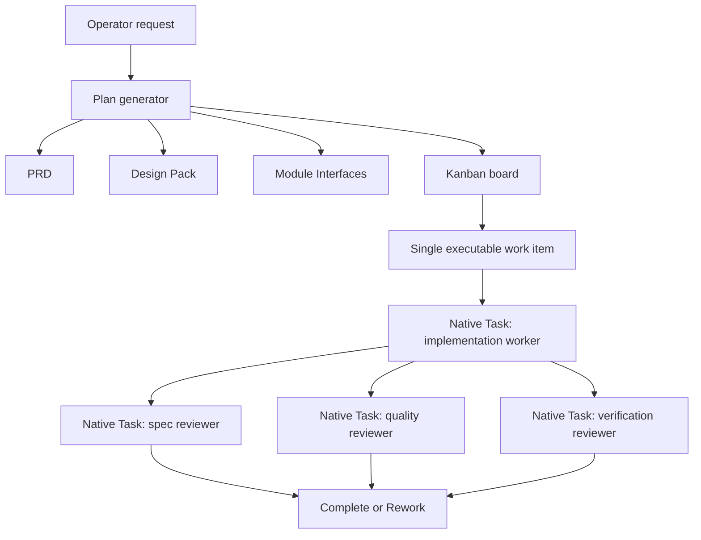
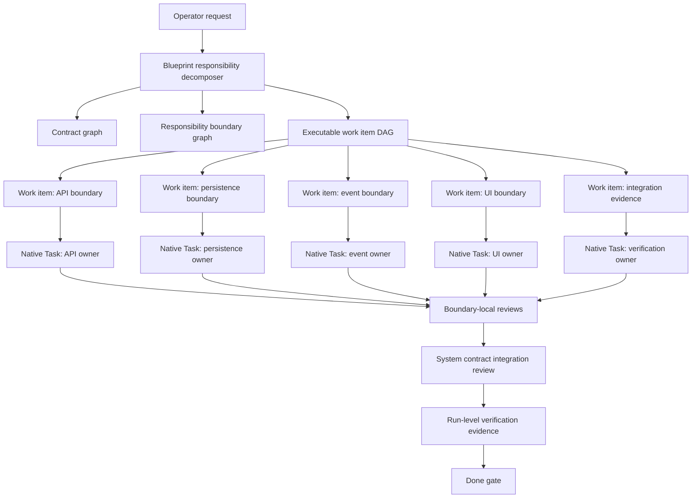

# Make It Real Responsibility DAG Native Batch Design

## Why This Exists

Make It Real currently captures the right engineering philosophy in Blueprint
artifacts: PRD, contracts, responsibility boundaries, module interfaces, gates,
and evidence. The execution model is still too small: a generated run normally
contains one executable work item, and native Claude Code launch starts one
implementation Task plus three review Tasks.

That is not enough for the intended operating model. The product should behave
like a contract-first development team: split work into the smallest units that
can be implemented without another task's context, assign each unit to a scoped
native Claude Code subagent, and integrate only through declared contracts and
evidence.

## Current Shape



Confirmed implementation anchors:

- `src/plan/plan-generator.mjs` materializes `board.workItems` from a single
  primary `workItem`.
- `src/orchestrator/orchestrator.mjs` native launch selects the first ready work
  item with `const [workItem] = getReadyWorkItems(board)`.
- `src/orchestrator/orchestrator.mjs` creates one implementation prompt and
  three reviewer prompts for that single work item.

## Target Shape



The key invariant is that each executable work item is a responsibility unit
with exactly one owner, allowed edit paths, public surfaces, contract IDs,
dependency contracts, acceptance criteria trace, and verification evidence.

## Atomic Work Item Rule

A work item is atomic when all of these are true:

1. It has one responsibility owner.
2. Its implementation can be completed using only its PRD slice, declared
   contracts, allowed paths, and dependency artifacts.
3. It does not need another work item's private implementation details.
4. Its cross-boundary calls are fully represented by contract IDs and public
   surfaces.
5. Its Done evidence can be evaluated independently before system integration.

Examples:

| Domain | Atomic Unit Example | Why It Is Atomic |
| --- | --- | --- |
| Python backend | One Flask/FastAPI blueprint | Owns routes, request/response contract, and route-local tests. |
| Data layer | One repository or migration boundary | Owns schema/persistence contract without route internals. |
| Eventing | One event publisher/subscriber contract | Owns event envelope and publish/consume behavior. |
| Frontend | One feature component boundary | Owns props/events/rendered states and visual/behavior tests. |
| Ops | One deploy/runtime adapter | Owns env, command, health, or CI contract. |

## Decomposition Algorithm

The decomposer should run after the canonical request is known and before Ready
approval.

1. Build candidate responsibility units from explicit user wording, existing
   repo paths, framework signals, and requested contracts.
2. Assign each candidate a public surface and one owner label.
3. Convert each executable responsibility unit into a work item.
4. Convert each cross-boundary use into a dependency contract edge.
5. Add integration or verification work items only when they own evidence that
   no implementation unit can own alone.
6. Reject the Blueprint when two work items would edit the same path without an
   explicit parent/child relationship.
7. Keep external SDKs/APIs as contract providers unless the request explicitly
   asks to implement them.

The first implementation should be deterministic and conservative. It should
not try to perfectly infer every domain. If the decomposer is uncertain, it
should create a reviewable boundary proposal and ask the operator through the
existing Blueprint review flow.

## Board Model Changes

The board should support multiple executable work items from the start:

```json
{
  "workItems": [
    {
      "id": "work.orders-api",
      "responsibilityUnitId": "ru.orders-api",
      "allowedPaths": ["src/api/orders/**"],
      "contractIds": ["contract.orders.create"],
      "dependsOn": ["work.orders-repository"]
    },
    {
      "id": "work.orders-repository",
      "responsibilityUnitId": "ru.orders-repository",
      "allowedPaths": ["src/data/orders/**"],
      "contractIds": ["contract.orders.persistence"],
      "dependsOn": []
    }
  ]
}
```

Dependency semantics:

- A work item may start when all `dependsOn` work items are `Done`.
- Independent work items can start in the same native batch.
- Integration work items depend on the implementation work items they verify.
- Claims remain per work item.
- Verification evidence remains per work item, then run-level Done validates the
  complete graph.

## Native Batch Launch

Real Claude Code execution should stay in the parent-session native Task path.
No `claude --print`, no hidden second Claude process, and no staged code edits
inside `.makeitreal`.

New launch behavior:

1. Run Ready gate.
2. Promote all eligible `Contract Frozen` items to `Ready`.
3. Select up to `concurrency` unblocked Ready work items.
4. Claim each selected work item.
5. Return a `nativeTasks` array, not a single `nativeTask`.
6. The slash command invokes one native Task per returned item.
7. Each Task receives only its work item packet.
8. Each implementation Task is followed by its local review Tasks.
9. Completion records each item independently.
10. Run-level completion waits for every graph node required by the Blueprint.

The user-facing default can be conservative, for example `concurrency: 4`, while
config may allow higher values such as 20. The engine must not hard-fail simply
because there are more Ready tasks than the configured concurrency; it should
dispatch the next batch after prior items finish.

## Child Work Items

Nested subagents are allowed only when the control plane can see their scope.
An implementation Task may request child work only by producing a child-work
proposal, not by silently freelancing:

```json
{
  "makeitrealChildWorkProposal": {
    "parentWorkItemId": "work.orders-api",
    "reason": "Route handler and serializer are independently editable.",
    "children": [
      {
        "id": "work.orders-api.handler",
        "allowedPaths": ["src/api/orders/handler.py"],
        "contractIds": ["contract.orders.create"]
      },
      {
        "id": "work.orders-api.serializer",
        "allowedPaths": ["src/api/orders/serializer.py"],
        "contractIds": ["contract.orders.create"]
      }
    ]
  }
}
```

The first version does not need automatic child-work execution. It only needs a
schema and a rejection rule: untracked child subagent work cannot be counted as
Make It Real evidence.

## Documentation Surface

Architecture Dossier should show the execution DAG beside the module topology:

- Responsibility units and public surfaces.
- Work item DAG with blocked/unblocked state.
- Which native Task will own each work item.
- Which contracts cross each boundary.
- Which work items are integration/evidence-only.

This replaces single-card Kanban thinking with a reviewable development-team
topology.

## Phased Implementation

### Phase 1: Multi-work-item Blueprint packets

Generate multiple work items from `moduleInterfaces` and dependency providers
when the request spans multiple responsibility units. A small task with one
true responsibility unit still becomes a one-node work-item DAG; it is not a
fallback path and must pass through the same DAG schema, gates, and evidence
rules.

### Phase 2: Native batch start

Add `orchestrator native batch-start` or extend `native start` to return
`nativeTasks`. The public launch path must consume the canonical `nativeTasks`
array. If the DAG has one runnable node, the array contains one task; no
separate single-task compatibility path is allowed.

### Phase 3: Per-item finish and graph completion

Allow native finish/complete to process each work item independently and keep
run-level Done blocked until all required work items are Done.

### Phase 4: Dossier execution topology

Render the work item DAG and native Task assignment plan in the Architecture
Dossier so operators can review how the development team will be formed before
launch.

### Phase 5: Child work proposal schema

Allow implementation workers to propose child work items and require the parent
session to route those through the board before counting them as evidence.

## Non-Goals

- Do not build a general-purpose chat swarm.
- Do not pre-create fixed agent personas for every possible role.
- Do not let workers self-expand scope from parent chat history.
- Do not require browser-side mutation controls.
- Do not replace Claude Code native Task UI.

## Acceptance Criteria

1. A multi-boundary Blueprint can produce more than one executable work item.
2. Every executable work item has one owner, allowed paths, contract IDs,
   dependency contracts, and verification evidence requirements.
3. Native launch can return and run multiple scoped Task prompts in one batch.
4. Hooks enforce allowed paths per active work item.
5. Done remains blocked until every required work item has passing evidence.
6. The Architecture Dossier shows the task DAG and contract edges clearly enough
   to review the planned agent team before implementation.
