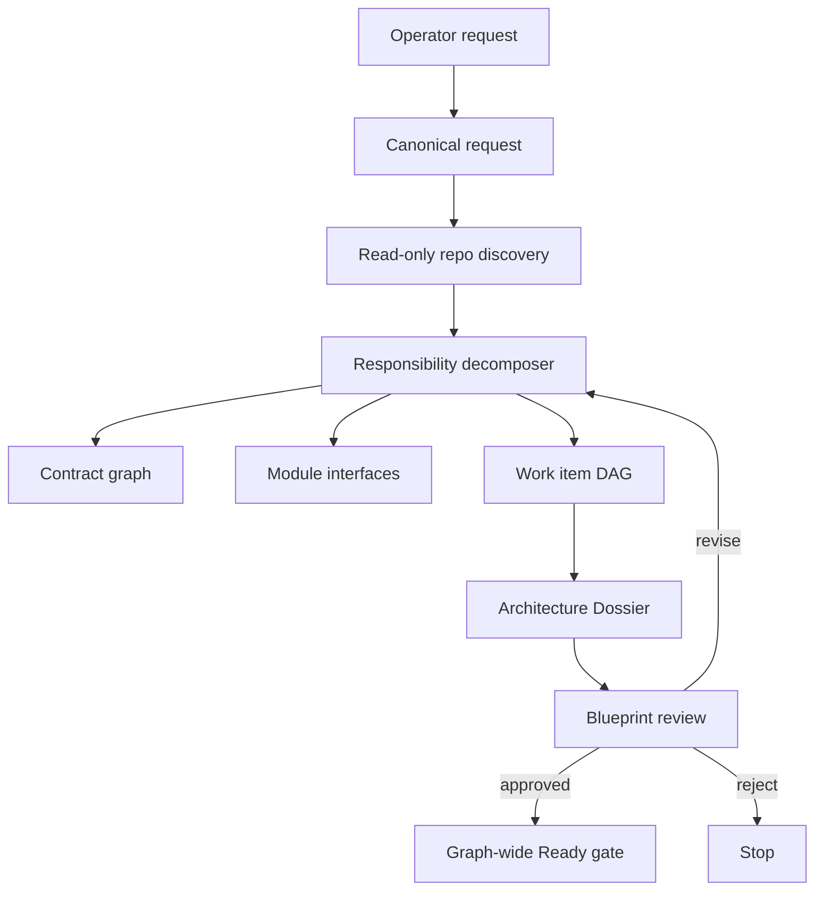
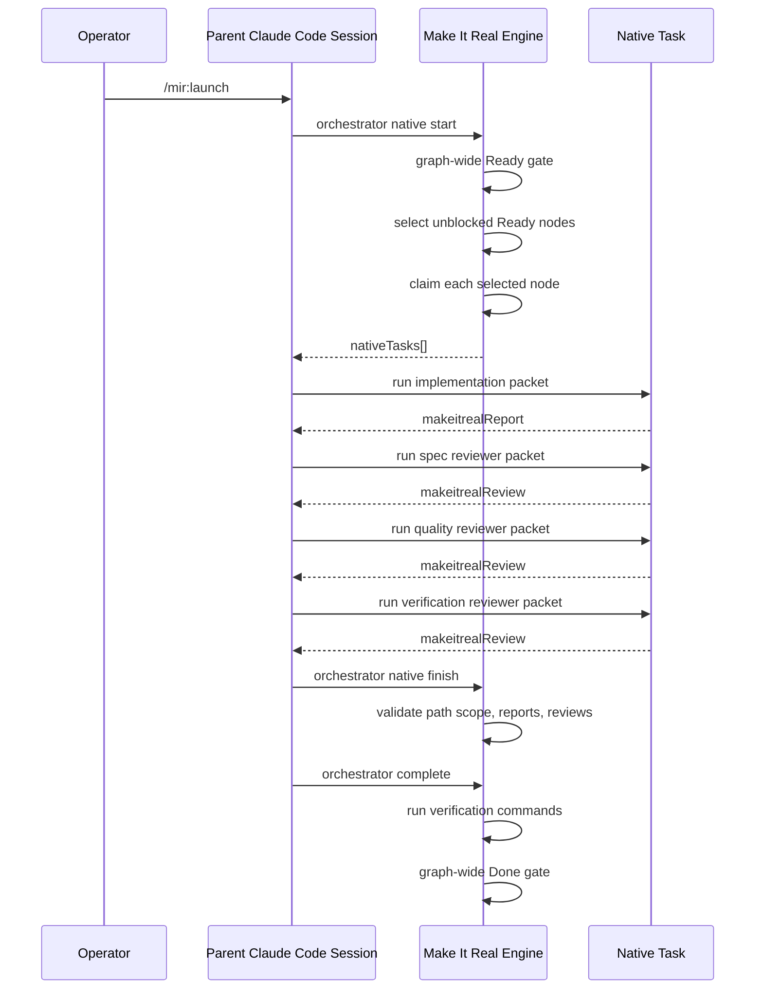

# Make It Real Responsibility DAG Native Hierarchy Design

Date: 2026-05-15
Status: Draft for user review
Scope: Make It Real contract-first Claude Code development harness

## 1. Purpose

Make It Real must become a contract-first development harness where a complete
Blueprint defines the work before implementation, decomposes the work into
language-neutral responsibility units, and dispatches native Claude Code
subagents only inside those responsibility boundaries.

The target operating model is:

1. The operator gives a feature request.
2. Make It Real generates a reviewable Blueprint containing PRD, architecture,
   state flow, contracts, module interfaces, call stacks, sequence flows,
   responsibility boundaries, verification plans, and the development-team
   topology.
3. The operator approves, requests changes, or rejects the Blueprint from the
   Claude Code conversation.
4. Launch dispatches native Claude Code Tasks from the approved Blueprint.
5. Each agent receives only a zero-context packet for its own responsibility.
6. Cross-boundary work happens only through declared contracts, as if every
   other module were an SDK or external library.
7. Done is blocked until every required graph node has implementation
   provenance, reviewer evidence, verification evidence, and wiki or explicit
   wiki-skip evidence.

The current product already has a stateful control plane, gates, contracts,
hooks, `nativeTasks[]`, and reviewer evidence. The missing layer is that the
Blueprint and gates are still centered on a single primary work item. This spec
replaces that primary-item model with a responsibility DAG.

## 2. Non-Goals

- Do not build a general-purpose swarm runtime.
- Do not create fixed agent persona files as the source of truth.
- Do not let agents discover their own scope from parent chat history.
- Do not add browser-side mutation controls.
- Do not reintroduce `claude --print` or hidden Claude CLI runners.
- Do not let native work edit project code inside `.makeitreal/workspaces`.
- Do not add fallback behavior for undeclared contracts, missing reviewer types,
  missing Blueprint information, or external SDK/API mismatches.

## 3. Current Implementation Anchors

These anchors describe what exists before this design is implemented.

| Area | Current state | Anchor |
| --- | --- | --- |
| Design pack validation | Requires `architecture`, `stateFlow`, `apiSpecs`, `responsibilityBoundaries`, `moduleInterfaces`, `callStacks`, and `sequences`. | `src/domain/design-pack.mjs` |
| Module contracts | Validates public surfaces, contract IDs, signatures, provider responsibility units, and provider-exposed contracts. | `src/domain/design-pack.mjs` |
| Plan generation | Creates `responsibilityUnitId`, `contractId`, and a single `workItemId` from the request slug. | `src/plan/plan-generator.mjs` |
| Board materialization | Materializes one primary work item and one-node launch board. | `src/plan/plan-generator.mjs` |
| DAG utilities | Board dependency graph can already reject missing dependencies/cycles and select unblocked Ready items. | `src/board/dependency-graph.mjs` |
| Native launch | Selects unblocked Ready work items up to `concurrency`, claims each one, and returns `nativeTasks[]`. | `src/orchestrator/orchestrator.mjs` |
| Native provenance | Completion requires `runner.channel: "parent-native-task"` for `claude-code` attempts. | `src/orchestrator/board-completion.mjs` |
| Review evidence | Completion requires `spec-reviewer`, `quality-reviewer`, and `verification-reviewer` approval. | `src/orchestrator/review-evidence.mjs` |
| Hooks | `PreToolUse` blocks pre-approval edits and validates changed paths against the active work item. | `hooks/claude/pre-tool-use.mjs` |
| Dossier | Renders Architecture Dossier sections from `systemDossier`, but lacks first-class task DAG and worker topology. | `src/preview/*` |

The core asymmetry is:

```text
plan/gates/status: primary work item
board/orchestrator: partly multi-work-item capable
target model: graph-wide responsibility DAG
```

## 4. Design Principles

### 4.1 Responsibility Units Are Language-Neutral

A responsibility unit is not a TypeScript file, a Next.js route, a Python class,
or a database table by default. It is the smallest software ownership boundary
that can be specified, implemented, reviewed, and verified without reading
another unit's private implementation.

Framework artifacts are derived from responsibility units only after the
Blueprint has enough information to map the domain boundary onto concrete
paths.

### 4.2 Contracts Are the Only Cross-Boundary Surface

Every cross-boundary call must be represented by a contract ID and public
surface. A worker may treat another responsibility unit as an SDK provider. It
may import or call only the declared contract surface.

This is both a prompt rule and, for Make It Real launch-created native Tasks, a
read-scope rule. Implementation workers receive `requiredReads` plus
`forbiddenReads`. During active launch, `Read`, `Grep`, `Glob`, and read-only
Bash commands that expose file paths must be checked against the packet's read
scope. If read-scope validation cannot be enforced for a tool, the worker prompt
must still state the rule, and the reviewer must check whether private provider
implementation was used. A future stricter mode may block all unscoped read-only
tools during active work.

If the contract is insufficient, wrong, or contradicted by implementation, the
worker must stop with `NEEDS_CONTEXT` or `BLOCKED`. The correct recovery is
Blueprint revision, not fallback logic.

### 4.3 Native Agents Are Dynamic Assignments, Not Global Personas

Make It Real should not require pre-created `.claude/agents/*` files. The
engine-generated packet is the authority. A Claude Code subagent type may be
used as an execution adapter, but it is never the source of scope, contracts, or
Done authority.

Evidence roles and actual Claude Code subagent types are separate fields:

```json
{
  "evidenceRole": "spec-reviewer",
  "nativeSubagentType": "oh-my-claudecode:critic"
}
```

If no configured native subagent type can run an evidence role, launch must fail
fast. It must not silently retry with a generic type.

### 4.4 PM Agents Coordinate Through the Control Plane

Domain PM agents exist to decompose, coordinate, and review. They do not edit
implementation files. A PM agent may propose child work items, but the parent
session and Make It Real engine must validate and materialize those child items
before any implementation Task runs.

This preserves the user's desired "development team" model without allowing
hidden free-form child work.

### 4.5 One Node Is Still a DAG

A simple one-module task is represented as a one-node responsibility DAG. There
is no separate single-task compatibility path. This prevents code paths from
diverging and keeps gates uniform.

## 5. Target Control-Plane Artifacts

### 5.0 Canonical DAG Authority

`work-item-dag.json` is the canonical DAG artifact.

`board.workItemDAG` may remain only as a denormalized projection for status and
legacy UI compatibility. It must be regenerated from `work-item-dag.json`.

Drift rules:

- `loadRunArtifacts()` must load `work-item-dag.json`.
- Blueprint fingerprinting must include `work-item-dag.json`.
- Ready gate must compare `work-item-dag.json` with `board.workItems[]`.
- Every DAG node must have a matching work item.
- Every board work item required for launch must have a matching DAG node.
- DAG edge parity must hold: `edge.from -> edge.to` implies
  `workItem[to].dependsOn` includes `edge.from`.
- Any drift blocks Ready with a recoverable gate error.

Canonical schema:

```json
{
  "schemaVersion": "1.0",
  "runId": "feature-orders",
  "nodes": [
    {
      "id": "work.orders-api.handler",
      "kind": "implementation",
      "responsibilityUnitId": "ru.orders-api",
      "requiredForDone": true
    }
  ],
  "edges": [
    {
      "from": "work.orders-repository",
      "to": "work.orders-api.handler",
      "contractId": "contract.orders.persistence"
    }
  ]
}
```

The existing `designPack.workItemId` field becomes display/backward-compatibility
metadata only. It must not be used as Ready or Done authority for graph-aware
runs.

### 5.1 Responsibility Unit

`responsibility-units.json` remains the ownership registry but becomes graph
authoritative.

```json
{
  "schemaVersion": "1.1",
  "units": [
    {
      "id": "ru.orders-api",
      "owner": "orders-api-owner",
      "kind": "implementation",
      "owns": ["src/api/orders/**", "test/api/orders/**"],
      "publicSurfaces": ["POST /orders"],
      "mayUseContracts": ["contract.orders.persistence"],
      "mustProvideContracts": ["contract.orders.create"]
    }
  ]
}
```

Required invariants:

- `id` is unique.
- `owner` is present for every executable unit.
- `owns` contains only safe project-relative patterns.
- `mayUseContracts` references declared contracts.
- `mustProvideContracts` references contracts exposed by the unit's module
  interface.

### 5.2 Module Interface

`design-pack.json.moduleInterfaces[]` remains the SDK/API-style handoff surface.

Each module interface must declare:

- `responsibilityUnitId`
- `moduleName`
- `purpose`
- `owns`
- `publicSurfaces`
- `imports`

Each public surface must include:

- `name`
- `kind`
- `contractIds`
- `signature.inputs[]`
- `signature.outputs[]`
- `signature.errors[]`
- optional `examples[]`

Every `imports[]` entry must point to a provider responsibility unit and a
contract exposed by that provider.

### 5.3 Work Item

Every executable work item is atomic.

```json
{
  "schemaVersion": "1.1",
  "id": "work.orders-api.handler",
  "title": "Implement the orders API handler",
  "kind": "implementation",
  "responsibilityUnitId": "ru.orders-api",
  "parentWorkItemId": "work.orders-api.pm",
  "lane": "Contract Frozen",
  "contractIds": ["contract.orders.create"],
  "dependencyContracts": [
    {
      "contractId": "contract.orders.persistence",
      "providerResponsibilityUnitId": "ru.orders-repository",
      "surface": "OrdersRepository.create",
      "allowedUse": "Create order records through the repository contract only."
    }
  ],
  "dependsOn": ["work.orders-repository"],
  "allowedPaths": ["src/api/orders/handler.py", "test/api/orders/test_handler.py"],
  "prdTrace": {
    "acceptanceCriteriaIds": ["AC-001", "AC-002"]
  },
  "doneEvidence": [
    { "kind": "verification", "path": "evidence/work.orders-api.handler.verification.json" },
    { "kind": "wiki-sync", "path": "evidence/work.orders-api.handler.wiki-sync.json" }
  ],
  "verificationCommands": [
    { "file": "pytest", "args": ["test/api/orders/test_handler.py", "-q"] }
  ]
}
```

Required invariants:

- Exactly one owner through `responsibilityUnitId`.
- Non-empty `allowedPaths`.
- Non-empty `contractIds`.
- Non-empty `verificationCommands`.
- All dependencies refer to declared work items.
- All dependency contracts refer to provider module public surfaces.
- No two sibling work items may edit the same path unless a parent/child
  relationship explicitly owns the split.

### 5.4 Work Item DAG

Add `work-item-dag.json` as the canonical DAG artifact.

```json
{
  "schemaVersion": "1.0",
  "runId": "feature-orders",
  "nodes": [
    {
      "id": "work.orders-api.pm",
      "kind": "domain-pm",
      "responsibilityUnitId": "ru.orders-api",
      "requiredForDone": true
    },
    {
      "id": "work.orders-api.handler",
      "kind": "implementation",
      "responsibilityUnitId": "ru.orders-api",
      "requiredForDone": true
    },
    {
      "id": "work.orders.integration",
      "kind": "integration-evidence",
      "responsibilityUnitId": "ru.orders-integration",
      "requiredForDone": true
    }
  ],
  "edges": [
    {
      "from": "work.orders-repository",
      "to": "work.orders-api.handler",
      "contractId": "contract.orders.persistence"
    },
    {
      "from": "work.orders-api.handler",
      "to": "work.orders.integration",
      "contractId": "contract.orders.create"
    }
  ]
}
```

Rules:

- DAG nodes must correspond to `board.workItems[]`.
- DAG edges must correspond to `dependsOn` and declared contract edges.
- Cycles are invalid.
- Missing nodes are invalid.
- `requiredForDone: true` nodes must all reach Done before the run is complete.
- `domain-pm` nodes are read-only coordination/evidence nodes.
- `integration-evidence` nodes own verification of cross-boundary behavior that
  no implementation unit can prove alone.

### 5.5 Agent Packet

Persist one packet per native Task under `agent-packets/`.

```json
{
  "schemaVersion": "1.0",
  "runDir": ".makeitreal/runs/feature-orders",
  "projectRoot": "/abs/path/to/project",
  "workItemId": "work.orders-api.handler",
  "attemptId": "attempt.001",
  "evidenceRole": "implementation-worker",
  "nativeTaskContext": {
    "requiredEnvironment": {
      "MAKEITREAL_BOARD_DIR": ".makeitreal/runs/feature-orders",
      "MAKEITREAL_WORK_ITEM_ID": "work.orders-api.handler"
    }
  },
  "scope": {
    "responsibilityUnitId": "ru.orders-api",
    "allowedPaths": ["src/api/orders/handler.py", "test/api/orders/test_handler.py"],
    "forbiddenPaths": ["src/data/orders/**", ".makeitreal/**"]
  },
  "contracts": ["contract.orders.create"],
  "dependencyContracts": ["contract.orders.persistence"],
  "requiredReads": [
    "prd.json",
    "design-pack.json",
    "responsibility-units.json",
    "work-items/work.orders-api.handler.json",
    "contracts/orders.create.openapi.json"
  ],
  "verificationCommands": [
    { "file": "pytest", "args": ["test/api/orders/test_handler.py", "-q"] }
  ],
  "reportSchema": "makeitrealReport.v1"
}
```

The packet is the complete zero-context handoff. If a worker needs additional
information, the correct output is `NEEDS_CONTEXT`.

Native packets must not include `MAKEITREAL_WORKSPACE`. Native attempts edit the
real project root only. Scripted simulator tests may still use legacy workspaces,
but native packets and native completion must reject changed files under
`.makeitreal/runs/*/workspaces/**`.

### 5.6 Native Role Mapping

Add `native-role-mapping.json` under each run directory.

```json
{
  "schemaVersion": "1.0",
  "mappings": [
    {
      "evidenceRole": "implementation-worker",
      "nativeSubagentType": "general-purpose",
      "mappingSource": "builtin-default"
    },
    {
      "evidenceRole": "spec-reviewer",
      "nativeSubagentType": "oh-my-claudecode:critic",
      "mappingSource": "project-config"
    },
    {
      "evidenceRole": "quality-reviewer",
      "nativeSubagentType": "oh-my-claudecode:critic",
      "mappingSource": "project-config"
    },
    {
      "evidenceRole": "verification-reviewer",
      "nativeSubagentType": "oh-my-claudecode:verifier",
      "mappingSource": "project-config"
    }
  ]
}
```

Rules:

- Launch validates every required evidence role before dispatch.
- Missing mappings fail fast before any native Task starts.
- No role may silently fall back to another subagent type.
- Every review report persists `evidenceRole`, `nativeSubagentType`, and
  `mappingSource`.
- Plugin tests must assert that launch instructions do not recommend generic
  reviewer fallback.

## 6. Node-Kind Lifecycle

Each DAG node kind has explicit authority, reports, and Done evidence.

| Kind | Mutates project files | Required report | Reviewer evidence | Verification evidence | Wiki evidence | Done condition |
| --- | --- | --- | --- | --- | --- | --- |
| `implementation` | Yes, only `allowedPaths` | `makeitrealReport` with `status: DONE` and changed files | Required: spec, quality, verification | Required | Required or explicit skip | Latest native attempt is parent-session Task, changed files pass boundary, reviews approved, verification passes. |
| `domain-pm` | No | `makeitrealPmReport` | Required: spec reviewer only | Optional unless it owns explicit checks | Required or explicit skip | PM report approves child split or reports no child split needed; any child proposal is approved or sent to Blueprint Revision. |
| `integration-evidence` | No production code edits; may create tests/evidence only if allowedPaths declare them | `makeitrealReport` or `makeitrealEvidenceReport` | Required: verification reviewer | Required | Required or explicit skip | Integration/evidence command proves cross-boundary scenario and all upstream dependencies are Done. |

`domain-pm` nodes are optional in the minimal graph. If the decomposer can
produce atomic implementation nodes directly, it may omit PM nodes. If PM nodes
exist, their lifecycle must follow this matrix.

Node-kind-specific rules override generic implementation rules. For example, a
`domain-pm` node is not required to produce changed files, and an
`integration-evidence` node may be Done without implementation reviewer evidence
when its only job is to run a graph-level verification command.

## 7. Planning Flow

### 7.1 Canonical Flow



### 7.2 Responsibility Decomposer

Add a deterministic `src/plan/responsibility-decomposer.mjs`.

Inputs:

- canonical request
- explicit allowed paths
- optional user-provided boundaries
- discovered repo signals
- API/component/module profile
- verification commands

Outputs:

- `responsibilityUnits[]`
- `moduleInterfaces[]`
- `contracts[]`
- `workItems[]`
- `workItemDag`
- `clarificationQuestions[]`
- `rejectedReasons[]`

The decomposer is conservative. If it cannot prove a clean split, it must
generate a reviewable boundary proposal or block planning with
`HARNESS_RESPONSIBILITY_BOUNDARY_AMBIGUOUS`.

### 7.3 Initial Supported Splits

The first implementation should support these split patterns:

| Pattern | Example units | Required edge |
| --- | --- | --- |
| API + persistence | route handler, repository | API uses repository contract |
| Frontend + API | component/page, backend endpoint | frontend uses OpenAPI or component contract |
| Component + state adapter | UI component, state/store adapter | component uses adapter IO contract |
| Worker + queue adapter | job processor, queue provider | processor uses queue contract |
| Module + integration evidence | implementation unit, evidence-only verifier | verifier depends on implementation units |

Unsupported or ambiguous splits must fail fast into Blueprint revision.

## 8. Launch Flow

### 8.1 Native Launch

Launch must use the parent Claude Code native Task path.



### 8.2 Domain PM Node

Domain PM nodes are native Tasks with read-only authority.

PM responsibilities:

- verify the responsibility unit's child split
- check contract sufficiency
- propose child work items if the approved Blueprint is too coarse
- summarize dependency artifacts for downstream workers
- return `makeitrealPmReport`

PM forbidden actions:

- edit implementation files
- call implementation private code to infer behavior
- spawn untracked child subagents
- broaden allowed paths
- change contracts without Blueprint revision

If the PM proposes child work, it emits:

```json
{
  "makeitrealChildWorkProposal": {
    "parentWorkItemId": "work.orders-api.pm",
    "reason": "Handler, schema validator, and route-local tests are independently editable.",
    "children": [
      {
        "id": "work.orders-api.handler",
        "responsibilityUnitId": "ru.orders-api",
        "allowedPaths": ["src/api/orders/handler.py", "test/api/orders/test_handler.py"],
        "contractIds": ["contract.orders.create"],
        "dependsOn": ["work.orders-repository"]
      }
    ]
  }
}
```

The parent session must submit this proposal to the engine.

Approval rules:

- If the proposal only splits a pre-authorized parent work item into narrower
  children with the same responsibility unit, a subset of the parent's
  `allowedPaths`, no new contracts, no new providers, and no broader Done
  evidence, the engine may materialize it as a narrowing split.
- Any proposal that adds paths, adds contracts, changes dependencies, changes
  owners, or changes verification scope enters `Blueprint Revision`.
- Blueprint Revision invalidates the existing approval fingerprint.
- The Dossier must render a graph diff.
- No child implementation Task may run until the revised Blueprint is approved.

Untracked child work cannot count as Make It Real evidence.

### 8.3 Atomic Implementation Node

Implementation workers receive `makeitrealReport.v1` packets and may edit only
their `allowedPaths`.

Allowed statuses:

- `DONE`
- `DONE_WITH_CONCERNS`
- `NEEDS_CONTEXT`
- `BLOCKED`

Status semantics:

- `DONE`: implementation completed and local verification was run or a clear
  reason was recorded for engine-owned verification.
- `DONE_WITH_CONCERNS`: implementation exists but review debt is required.
- `NEEDS_CONTEXT`: Blueprint or contract is insufficient.
- `BLOCKED`: external condition or hard contradiction prevents safe execution.

Only `DONE` with valid changed files and subsequent approved reviews can enter
Verifying. All other statuses stay out of Done.

### 8.4 Reviewer Nodes

Each implementation attempt requires three reviewer evidence roles:

1. `spec-reviewer`: checks actual changes against PRD, Blueprint, contracts,
   allowed paths, public surfaces, and acceptance criteria.
2. `quality-reviewer`: checks naming, minimality, maintainability, over-
   engineering, and no-fallback discipline after spec compliance.
3. `verification-reviewer`: checks whether declared verification proves the work
   item and whether integration evidence is still needed.

Reviewer role mappings must be configured or selected explicitly through
`native-role-mapping.json`. If Make It Real cannot run an acceptable native Task
for a reviewer role, launch must stop. It must not silently use a generic
fallback type.

## 9. Gate Changes

### 9.1 Ready Gate

Ready gate must validate every required DAG node.

Ready requirements:

- PRD is valid.
- Design pack is valid.
- Blueprint review is approved and fresh.
- Work item DAG exists and is acyclic.
- Every required DAG node has a matching work item.
- Every work item has exactly one responsibility owner.
- Every work item has safe allowed paths.
- No sibling path overlap exists unless represented by parent/child hierarchy.
- Every contract reference is declared.
- Every dependency contract points to a provider public surface.
- Every work item has verification commands.
- Every required work item has planned Done evidence.
- Architecture Dossier exists and renders task DAG plus approval scope.

No Ready path may use only `findPrimaryWorkItem()` as authority.

Ready algorithm:

1. Load PRD, design pack, responsibility units, work items, board, and
   `work-item-dag.json`.
2. Validate PRD and design pack.
3. Validate Blueprint approval and fingerprint freshness.
4. Validate DAG schema, node uniqueness, required node flags, edge endpoint
   existence, and acyclicity.
5. Validate DAG/board parity.
6. Validate edge/`dependsOn` parity.
7. Validate every required work item's owner, allowed paths, contracts,
   dependency contracts, verification commands, and Done evidence plan.
8. Validate provider/consumer contract surfaces for every dependency edge.
9. Validate sibling path overlap.
10. Validate Architecture Dossier exists and includes graph-aware approval
    sections.

### 9.2 Done Gate

Done gate must validate every `requiredForDone` node.

Done requirements per required work item:

- latest successful attempt exists
- attempt runner mode is `claude-code`
- attempt runner channel is `parent-native-task`
- attempt has implementation report
- changed files are inside allowed paths
- required reviewer reports are present and approved
- verification evidence exists and passes
- OpenAPI or contract conformance evidence exists when applicable
- wiki sync or explicit wiki-skip evidence exists

Run-level Done requirements:

- all required nodes are Done
- integration/evidence-only nodes are Done
- no unresolved Rework, Failed Fast, Running, Verifying, or Human Review nodes
- final Dossier refresh evidence exists when dashboard refresh is enabled

Done algorithm:

1. Load graph and board.
2. Validate no graph drift since Ready.
3. Topologically inspect every `requiredForDone` node.
4. Apply the node-kind lifecycle matrix to each node.
5. Validate every required dependency edge has completed provider evidence before
   consumer evidence.
6. Validate integration/evidence nodes last.
7. Fail if any required node is not Done or has unresolved review debt.
8. Pass only when all node-kind requirements and run-level requirements pass.

### 9.3 Rework And Replacement

Failed or out-of-scope attempts remain evidence. The latest approved attempt is
the only attempt eligible for Done.

Replacement behavior:

- boundary violation -> Failed Fast with `HARNESS_PATH_BOUNDARY_VIOLATION`
- missing reviewer evidence -> Rework
- rejected reviewer evidence -> Rework
- failed verification -> Rework
- missing context -> Blueprint revision or clarification
- retry-ready Failed Fast work can be relaunched as a new attempt

Replacement must preserve previous attempts and board events.

## 10. Hook Requirements

### 10.1 Native Task Scope Propagation

Every native Task packet must include hook-visible scope:

- `MAKEITREAL_BOARD_DIR`
- `MAKEITREAL_WORK_ITEM_ID`

The trusted carrier is the hook JSON input. Make It Real native launch must pass
these fields in every native Task tool invocation when Claude Code exposes them:

```json
{
  "makeitreal": {
    "runDir": ".makeitreal/runs/feature-orders",
    "workItemId": "work.orders-api.handler",
    "agentPacketPath": ".makeitreal/runs/feature-orders/agent-packets/work.orders-api.handler.attempt.001.json"
  }
}
```

Environment variables may be used as a secondary carrier when Claude Code
propagates them into hook execution. The hook must prefer explicit hook input
over environment variables.

If neither hook input nor environment propagation can carry `runDir` and
`workItemId`, native batch launch must stop before the first mutating tool call.

### 10.2 Concurrent Active Work

When multiple work items are active:

- mutating tools without scoped work item context are denied
- read-only tools are allowed
- Make It Real control commands are allowed
- scoped native Task edits are checked against that work item's allowed paths

### 10.3 Read-Scope Enforcement

Active Make It Real workers have both edit scope and read scope.

Read scope:

- `requiredReads`
- the work item's `allowedPaths`
- declared contract files
- completed dependency artifacts
- test files explicitly listed in `allowedPaths`

Forbidden reads:

- sibling responsibility-unit private paths
- provider implementation paths not listed as dependency artifacts
- `.makeitreal/runs/*/workspaces/**` for native attempts

`Read`, `Grep`, `Glob`, and read-only Bash path extraction must enforce this
scope where the tool input exposes paths or patterns. If a read tool cannot be
reliably scoped, the review phase must inspect actual command/tool history when
available and fail the attempt on private implementation reads.

### 10.4 Ordinary Chat Escape

A selected current run must not permanently hijack ordinary Claude Code work.
Make It Real needs a documented detach/inactive state:

- active run selected, no execution: read-only and control commands allowed;
  implementation edits blocked until approval
- active run executing: scoped edits only
- detached run: ordinary Claude Code edits allowed, Make It Real hooks do not
  enforce that run until reattached

Detach state is stored in `.makeitreal/current-run.json`:

```json
{
  "runDir": ".makeitreal/runs/feature-orders",
  "source": "makeitreal:plan",
  "enforcement": "detached"
}
```

Allowed values:

- `attached`
- `detached`

Detach does not delete artifacts or weaken Done evidence. It only removes the
run from active hook enforcement until reattached.

## 11. Workspace Semantics

`.makeitreal/` is the control-plane state root. It may contain plans, Dossiers,
evidence, attempts, packets, config, and legacy/scripted workspaces.

Native Claude Code implementation work must edit the real project root.
Native packets must include absolute `projectRoot` and `expectedCwd`.
Completion must reject a native attempt when:

- `projectRoot` is missing
- changed files are under `.makeitreal/runs/*/workspaces/**`
- attempt provenance says `claude-code` but `runner.channel` is not
  `parent-native-task`
- verification would run from a legacy workspace for native mode

The term `workspace` must be disambiguated:

| Term | Meaning |
| --- | --- |
| project root | real repository where production code is edited |
| run dir | `.makeitreal/runs/<run-id>` control-plane artifact directory |
| legacy scripted workspace | `.makeitreal/runs/<run-id>/workspaces/<work-id>`, used only by scripted fixtures or legacy simulator tests |

Prompts, docs, tests, and errors must not tell native workers to implement in
`.makeitreal/workspaces`.

## 12. Architecture Dossier Requirements

The Dossier is a read-only architecture reference and approval packet, not a
dashboard or action console.

Required first-class sections:

1. Approval Scope
2. System Placement
3. Dependency Graph
4. Scenario Index
5. Module Pages
6. Contract Surfaces
7. Task DAG And Worker Topology
8. Acceptance And Evidence
9. Sources And Diagnostics

### 12.1 Approval Scope

The first screen must answer:

- what will be built
- which modules/responsibility units are affected
- which paths may be edited
- which contracts are frozen
- which workers will be launched
- which verification commands prove Done
- what approval authorizes
- what remains blocked or ambiguous

Raw engine fields such as `planOk`, hashes, or internal HARNESS codes belong in
Diagnostics unless they are the current blocker.

### 12.2 Task DAG And Worker Topology

Render:

- work item id
- title
- kind
- owner
- lane
- dependsOn
- allowed paths
- contract IDs
- launchable/blocked state
- native Task assignment
- reviewer roles
- PM parent/child relationship

One-node work must still render as a DAG.

### 12.3 Module Pages

Each responsibility unit gets a module page or anchor with:

- owner
- purpose
- owned file tree
- public surfaces
- imports
- provided contracts
- consumed contracts
- usage examples
- verification responsibility

## 13. Verification Philosophy

Unit tests do not automatically guarantee integration correctness. Make It Real
can make verification compositional only when every boundary has executable
contract evidence.

Required proof layers:

1. Provider contract tests prove a module provides the declared contract.
2. Consumer contract tests prove a module uses dependency contracts as declared.
3. Boundary tests prove path and contract authorization.
4. Integration/evidence nodes prove cross-boundary scenarios that cannot be
   proven by one module alone.
5. Run-level Done gate proves all required graph nodes are complete.

The system must not claim that unit tests alone imply integration success unless
the Blueprint explicitly includes provider, consumer, and integration evidence
covering every contract edge.

## 14. Implementation Surface

The implementation plan should touch these areas.

| Area | Likely files | Responsibility |
| --- | --- | --- |
| Decomposer | `src/plan/responsibility-decomposer.mjs`, `src/plan/plan-generator.mjs` | Generate responsibility units, work items, contracts, and DAG together. |
| Graph artifacts | `src/domain/artifacts.mjs`, new `src/domain/work-item-dag.mjs` | Load and validate graph-wide artifacts. |
| Gates | `src/gates/index.mjs` | Replace primary-item Ready/Done with graph-wide validation. |
| Orchestrator | `src/orchestrator/orchestrator.mjs`, `src/orchestrator/board-completion.mjs` | Promote/launch/finish/complete graph nodes, preserve native provenance. |
| Agent packets | `src/orchestrator/dynamic-role-handoff.mjs`, new packet writer/validator | Persist zero-context native Task packets. |
| Hooks | `hooks/claude/pre-tool-use.mjs`, `hooks/claude/stop.mjs` | Enforce scoped concurrent work and detach state. |
| Status | `src/status/board-status.mjs`, `src/status/operator-summary.mjs` | Report launchable graph nodes and blockers without leaking raw internals. |
| Dossier model | `src/domain/system-dossier.mjs`, `src/preview/preview-model.mjs` | Add task DAG, approval scope, and worker topology. |
| Dossier renderer | `src/preview/render-dashboard-html.mjs` | Render SDK/API-style graph-aware approval document. |
| Plugin prompts | `plugins/makeitreal/skills/*.md`, `plugins/mir/skills/*.md` | Remove fallback wording, clarify native Task and project-root rules. |
| Tests | `test/*.test.mjs` | Add graph-wide, native packet, hook, Dossier, and dogfood evidence tests. |
| Docs | `docs/architecture.md`, `docs/claude-code-runner.md` | Document native hierarchy and workspace semantics. |

## 15. Acceptance Criteria

1. A multi-boundary Blueprint produces multiple responsibility units, multiple
   work items, and a non-trivial work item DAG.
2. A simple one-boundary Blueprint still produces a one-node DAG through the
   same schema and gates.
3. Every executable work item has exactly one owner, allowed paths, contract
   IDs, dependency contracts, PRD trace, and verification evidence plan.
4. Planner rejects path overlap, missing providers, undeclared contracts,
   dependency cycles, and ambiguous multi-domain boundaries.
5. Ready gate validates every required DAG node.
6. Done gate remains blocked until every required DAG node has passing evidence.
7. Native launch returns only `nativeTasks[]`; there is no `nativeTask`
   compatibility branch.
8. Each native Task receives a persisted zero-context packet and hook-visible
   work item scope through explicit hook input or verified environment
   propagation.
9. Multiple concurrent active work items deny unscoped mutating tools.
10. PM agents, when present, follow the node-kind lifecycle matrix and are
    read-only coordination nodes.
11. Child work cannot count as evidence until materialized by the engine and,
    when broader than a pre-authorized narrowing split, re-approved through
    Blueprint Revision.
12. Reviewer evidence roles record both evidence role and actual native subagent
    type used.
13. Missing native reviewer mapping fails fast instead of falling back to a
    generic subagent type.
14. Native workers edit the project root, never `.makeitreal/workspaces`, and
    completion rejects native attempts that report workspace-local changed files.
15. Dossier shows Approval Scope, System Placement, Dependency Graph, Scenario
    Index, Module Pages, Contract Surfaces, Task DAG And Worker Topology,
    Acceptance And Evidence, Sources And Diagnostics.
16. Browser Dossier remains read-only and contains no mutation controls.
17. Unit tests, integration tests, plugin validation, `npm run check`, and one
    real Claude Code dogfood run all pass before claiming final completion.

## 16. Required Test Matrix

| Test layer | Required proof |
| --- | --- |
| Unit | Decomposer emits deterministic graph artifacts for one-node, API+persistence, frontend+API, and integration-evidence cases. |
| Unit | Graph validator rejects missing nodes, cycles, path overlap, missing owners, undeclared contracts, and provider mismatch. |
| Unit | Ready/Done gates iterate all required DAG nodes. |
| Unit | Native packet validator rejects missing `runDir`, missing `workItemId`, missing contracts, unsafe paths, and missing verification commands. |
| Unit | Hook tests cover concurrent active work and unscoped mutation denial. |
| Unit | Hook tests cover scoped read rules for `Read`, `Grep`, `Glob`, and read-only Bash paths when tool inputs expose paths. |
| Unit | Completion rejects missing reviewer evidence, rejected reviews, out-of-bound changed files, and non-native provenance. |
| Preview | Dossier renders Approval Scope, Task DAG, Worker Topology, Dependency Graph, and module pages for multi-module fixture. |
| Plugin | `/makeitreal:launch` and `/mir:launch` docs require native Task and forbid `claude --print`. |
| E2E fixture | Public CLI/plugin path reaches Done for multi-node fixture with dependency unblock. |
| Integration | Two concurrent native task packets carry distinct hook-visible scope into mutating tool calls. If the carrier is unavailable, launch fails before mutation. |
| Real dogfood | Claude Code parent session runs plan, natural-language approval, launch, native implementation Tasks, native reviewer Tasks, finish, complete, and failure/rework recovery. |

## 17. Migration Strategy

### Phase 1: Schema And Graph Validation

Add canonical `work-item-dag.json`, graph validator, fingerprint integration,
board projection, and one-node DAG generation without changing external
behavior.

### Phase 2: Decomposer

Replace single-work-item generation with conservative responsibility DAG
generation. Keep ambiguous requests blocked for review.

### Phase 3: Graph-Wide Gates

Update Ready and Done gates to validate every required graph node. Remove
primary-work-item gate authority.

### Phase 4: Native Packets And PM Nodes

Persist agent packets and native role mapping. Implement implementation-node
packets first. Add PM node support only after node-kind lifecycle tests exist.
Keep PM nodes read-only.

### Phase 5: Hook And Completion Hardening

Enforce scoped concurrent native work. Add detach/inactive state. Ensure native
completion verifies project-root edits and rejects legacy workspace confusion.

### Phase 6: Dossier Upgrade

Render approval scope, task DAG, worker topology, and graph-aware module docs.

### Phase 7: Real Claude Code Dogfood

Run the full lifecycle in Claude Code with real native Tasks and preserve the
evidence bundle under docs/e2e or an equivalent evidence directory.

## 18. Stop Conditions

Implementation is not complete until:

- all acceptance criteria pass
- the test matrix passes
- `npm run plugin:validate` passes
- `npm run check` passes and generated fixture noise is cleaned
- real Claude Code dogfood evidence exists
- no current claim depends on primary-work-item-only gates
- no launch prompt or skill text permits generic fallback for required native
  roles
- no native path tells workers to edit `.makeitreal/workspaces`
